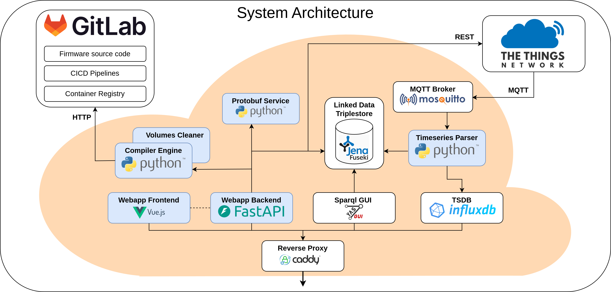

- while the previous chapter was more of a conceptual overview, this chapter will show the technical detail of the developed system and give a broad overview over all of its components
- a number of microservices was developed and deployed during the process and they interact with each other in specified ways. This makes both the whole system and its component portable, scalable and each component can be developed, tested and deployed independently.
- orange cloud called "Cloud Infrastrcuture" in previous chapter is now displayed in detail in the following visualization.

- every block within the orange cloud resembles a microservice, more precise a docker container
- whole system is containerized and managed through docker compose to simply development and ensure consistent environemnt setups. This way, local and cloud deployment can be supported, only differentiating by their configuration.
- White blocks symbolize external images, blue ones are self-developed blocks to implement the needed functionality of the system. These blue ones are explained in greater detail in subsequent sections of this chapter.

- services will be described in order that resembles broad workflow of user:
- System is managed through webapplication (backend via the frontend).
- while creating entities, they are written into the triplestore which acts as the central db
- also the protobuf service gets called whenever a data schema changes to rebuild it
- once sensor is configured, the compiler engine build and returns binaries 
- the newly configured sensor sends data which lands over TTN on the local mqtt broker
- timeseries parser decodes data and writes them into influxdb and triplestore
- data can be queried over sparql editor

reverse proxy
- bundles all services that need to be exposed behind one http/https interface
- especially relevant in production where ports should be limited
- caddy is a light-weight reverse proxy, explained in a later chapter

web application
- central place where users interact with the system
- most other services are hidden behind this, directly called by the backend when needed and to minimize the number of services that access the database
- Is secured, needs authentication and has also role-based authorization
- Backend has a good designed REST interface that frontend consumes and uses
- 

triplestore
- The triplestore is an instance of the jena fuseki and acts as the central database in the system
- users, meta data and timeseries are saved in this database
- as the underlying datamodel is RDF, all entities are identified with an unique URI
- access to the database goes over a SPARL endpoint that implements the SPARQL standard
- the data in the triplestore is structured according to well known ontologies 

protobuf service
- handles all the logic that has to do with protobuf. this way backend can delegate this functionality and the service bundles all logic around protobuf
- generates schemas, compiles nanopb code as well as the binary file descriptor that is needed to decode incoming time series data
- well defined REST interface, all data gets transmitted via it, no direct access to database

compiler engine 
- Is responsible for compiling customized firmware
- has a well defined REST interface that allows configuration of to produced firmware binary
- accesses the bfh gitlab to checkout source code to compile
- has also another container (volume cleaner) that is responsible for making sure that artifacts get deleted after some time, not filling up the volumes

mqtt broker
- mosquitto is a lightweight and open-source mqtt broker that can be easily depyloed via docker

timeseries parser
- a

influxb
- a
 
yasgui
- a

