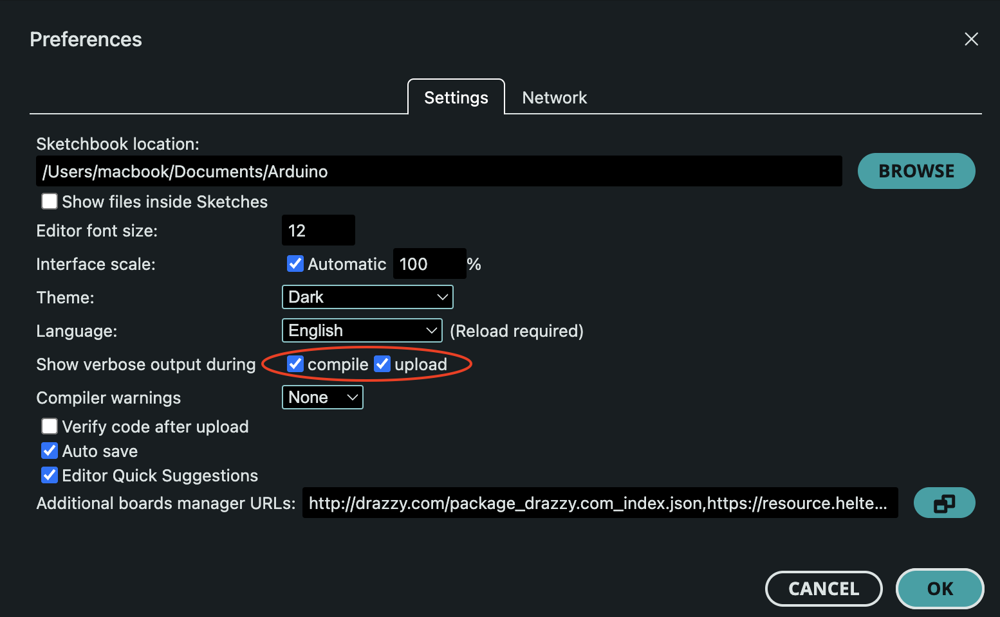
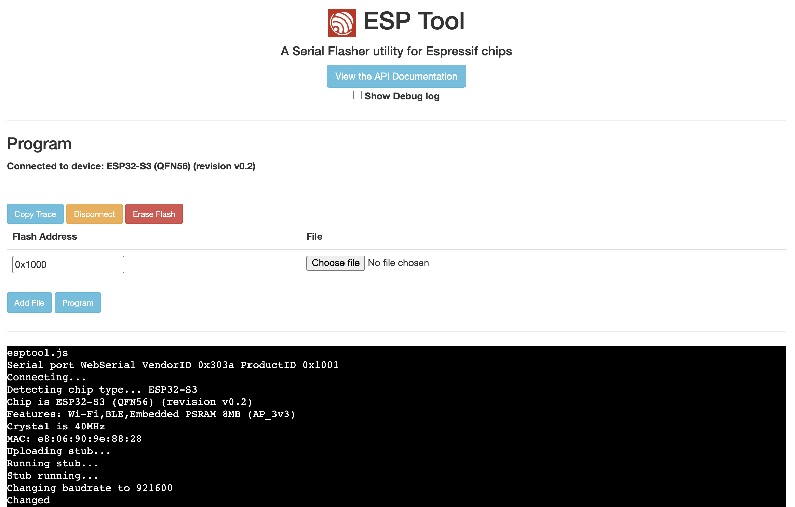
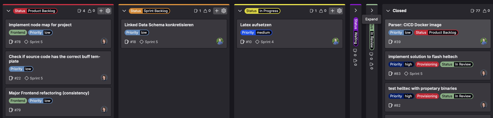
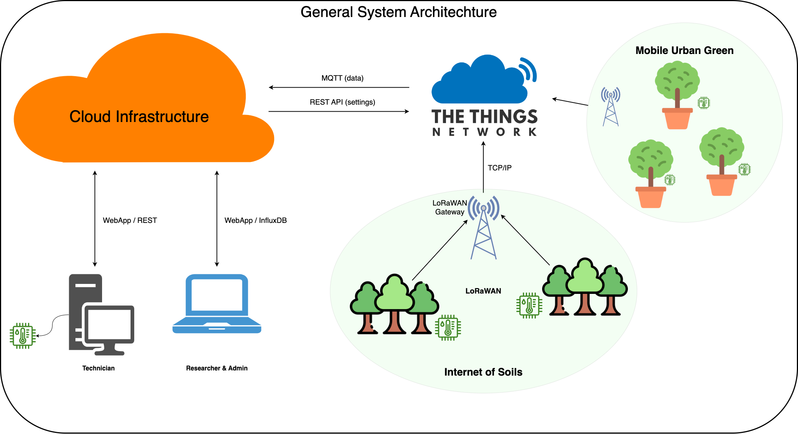
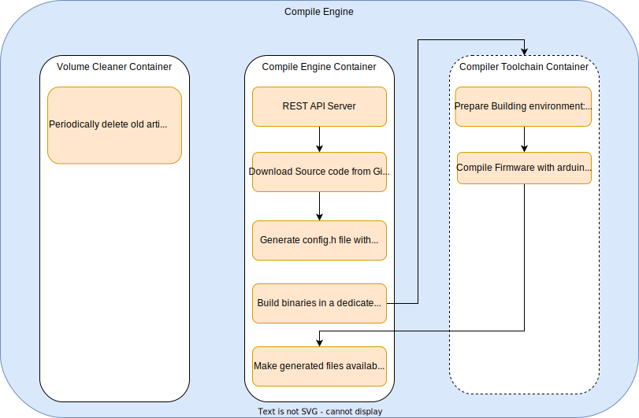
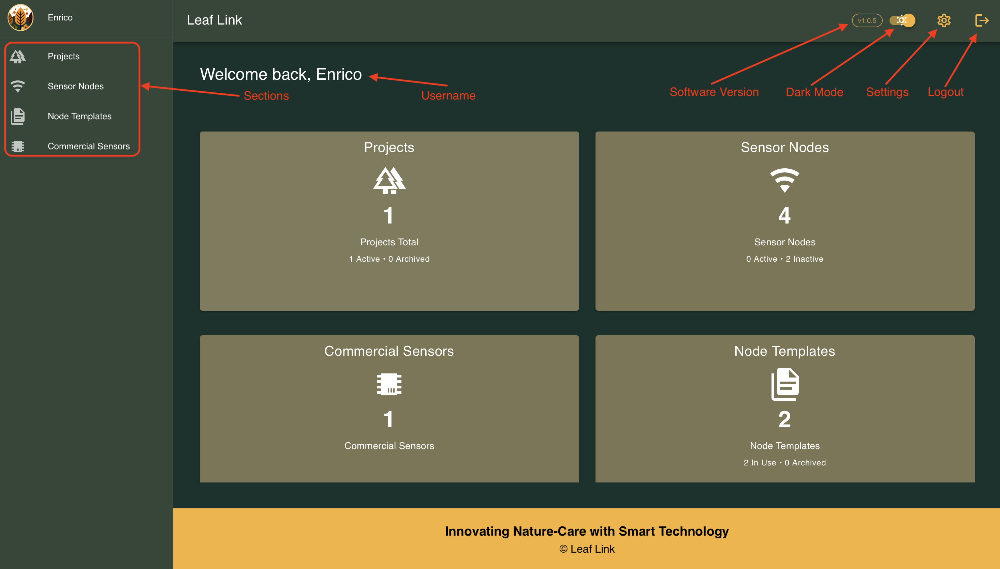
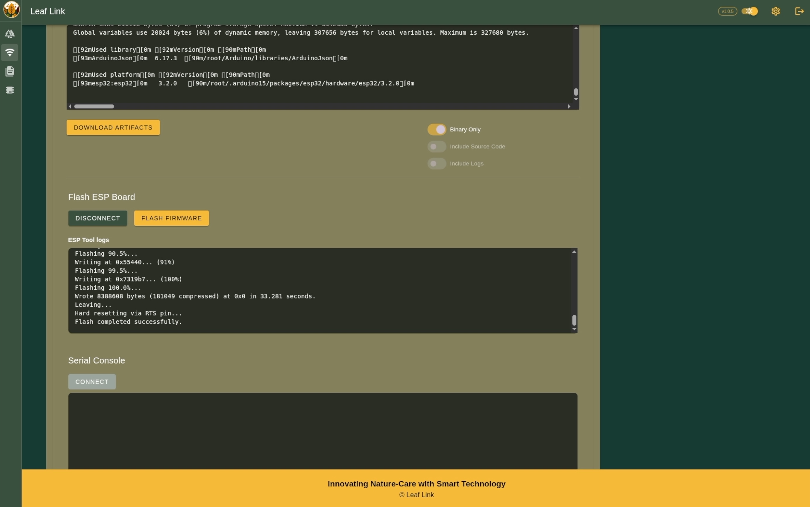

# Abstract 

# Introduction
This chapter introduces the context, objectives, and practical relevance of the thesis. It outlines the typical structure of IoT systems, highlights common challenges, and describes how these are addressed by the proposed infrastructure. In addition, it highlights the practical value of the system for its intended users by describing how it addresses common pain points and improves day-to-day workflows.

## Context & Background
The increasing affordability of sensor hardware and the maturation of low-power wireless communication solutions have significantly lowered the barrier to deploying distributed IoT systems for environmental monitoring and similar applications. These factors enable the large-scale collection of time-series data from remote locations in a cost-effective manner, creating new opportunities for both research and practical use.

### IoT-System Design

A typical IoT application consists of several key components that together enable remote and continuous data collection. These systems generally include:

1. **Remote sensing** of time-based data, using distributed sensor nodes to measure environmental or technical parameters such as temperature, humidity, or pressure at regular intervals.

2. **Wireless transmission**, commonly via technologies like LoRaWAN, WiFi, or cellular networks, which allow data to be sent efficiently from remote locations to a central system.

3. **Persistent storage of data**, typically in time-series databases or cloud storage systems, enabling later access for visualization, analysis, or integration with other tools.

Setting up a basic IoT system, such as the kind outlined above, is relatively straightforward with today’s technologies. However, turning such a setup into a scalable, maintainable, and well-structured project presents a very different set of challenges. Collecting data from a few sensor nodes and storing it in a database is easily achievable using modern microcontrollers, communication protocols, and off-the-shelf software tools. But as the number of devices grows, and as project requirements become more complex, the need for clear structure, automation, and integration becomes essential.

To ensure long-term usability and robustness, several challenges may arise that require careful consideration. For example, data needs to be stored in a consistent and queryable format to support effective analysis. The structure and meaning of transmitted payloads should be clearly defined and adaptable to future changes. It may also become important to keep track of the status and configuration of each deployed sensor node, including firmware versions and activity levels. Furthermore, well-structured operational workflows are essential to minimize complexity and ensure that repeated tasks can be performed consistently and efficiently as the system scales.

### Research Projects at BFH
Two collaborative research projects at the Bern University of Applied Sciences, conducted jointly by the departments AHB and HAFL, illustrate many of the practical challenges associated with managing distributed sensor systems: *Internet of Soils (IoS)* and *Mobile Urban Green (MUG)*.
- **IoS** focuses on measuring soil moisture in protection forests using an autonomous, solar-powered sensor network based on LoRaWAN technology. The goal is to support long-term environmental monitoring by capturing time-series data from remote locations. [37]
- **MUG** builds on insights from IoS and focuses on assessing the cooling effects of trees placed in large movable containers within urban areas. The project combines environmental measurements such as temperature, solar radiation, and water usage with modeling approaches to evaluate and simulate their impact at both the individual tree and neighborhood scale. [38]

Although the two projects differ in focus and context, they share a similar technical foundation regarding sensor hardware, wireless data transmission, and data management workflows. This similarity revealed several recurring issues that limit scalability and maintainability, especially as new deployments introduce variations in hardware, data models, or project-specific requirements.

These two projects not only illustrate the typical structure and challenges of distributed sensing systems, but also form the direct foundation for this thesis. While the goal of the work is to develop a generic and reusable infrastructure, the technical and organizational requirements of IoS and MUG serve as the immediate design context. The platform is therefore developed with the intention of supporting these ongoing research activities at BFH AHB and HAFL, while at the same time being extensible enough to serve similar projects in the future.

## Goal of the Project
The goal of this thesis is to design and implement a generic infrastructure that streamlines the processes involved in managing distributed sensor nodes. While the system is initially developed in the context of academic environmental monitoring projects, its intended scope is much broader. The underlying concepts and components are designed to be flexible and reusable across a wide range of applications that rely on sensor-based data collection, regardless of domain or deployment scale. In particular, the previously discussed issues such as fragmented metadata, manual provisioning steps, and the lack of a defined data format are targeted with concrete technical solutions.

To ensure accessibility and usability, the developed infrastructure is intended to be operated through a web-based user interface. This interface follows established usability principles and aims to make the various workflows intuitive, reducing the technical overhead for researchers and project stakeholders. By providing an integrated and user-friendly platform, the project seeks to simplify day-to-day operations while increasing the reliability and scalability of sensor deployments.

### System Capabilities

A central aspect of the planned infrastructure is the structured management of metadata related to sensor deployments, including all entities and relationships required to describe such systems comprehensively. 
*Projects* serve as top-level containers that group deployments with shared context, enabling the management of multiple independent setups across different locations, time frames, or application domains. Each *sensor node* should be associated with a set of attributes, including hardware type, firmware version, deployment location, and optional metadata such as documentation links. To improve efficiency and consistency, reusable *templates* should support the creation of similar sensor nodes across different projects.

Once a sensor node is defined within the system, it should be automatically provisioned on The Things Network (TTN), which serves as the communication backend for LoRaWAN-based data transmission. During this process, essential credentials such as *DevEUI* or *AppKey* should be generated and stored securely within the system. The goal is to eliminate the need for manual registration steps in the TTN console, reducing the likelihood of errors and ensuring that each node can be uniquely and reliably identified once deployed.

Based on the metadata and provisioning information stored in the system, a tailored firmware should be compiled for each sensor node. The appropriate source code is retrieved from a central GitLab repository, where different firmware variants are maintained. Node-specific configuration values, such as communication keys or feature flags, are injected during the build process using templating techniques. The result of this process should include a ready-to-flash binary file, with compilation logs and generated source code optionally provided for debugging and development purposes. Automating this step helps ensure consistency across firmware builds and minimizes manual intervention during node setup.

Once the firmware has been compiled, it should be transferred onto the physical sensor hardware. This flashing process should be as automated as possible. If supported by the connected hardware and system environment, the flashing could ideally be initiated directly through the developed web application. In cases where full automation is not feasible, a command-line script should be provided as an alternative to manually performing the process in a development environment. The goal is to eliminate the need for tools such as the Arduino IDE and to streamline the setup of new sensor nodes across different platforms.

### Data Handling and Storage

After deployment, each sensor node should begin transmitting time-series data to the system using LoRaWAN. Since the data format may vary across projects or depending on the number and type of measured values, the system should include a centralized parsing mechanism that interprets incoming payloads and transforms them into a standardized internal structure. Parsed data should then be stored in an InfluxDB instance, which is a time-series database well suited for handling high-frequency data streams and is already used in existing research projects. It provides powerful tools for querying, filtering, and visualizing time-series data, making it a practical choice for both development and monitoring purposes.

In addition, all parsed data points should also be persisted in a triplestore, which serves as the primary data storage within the system. These data are represented as Linked Data using the RDF model, and where possible, suitable schemas and ontologies should be applied to support semantic structure and interoperability. This semantic store enables flexible linking of data and metadata, and ensures long-term extensibility across different parts of the project. This dual-storage approach allows both technical users and non-technical stakeholders to access and interpret the data in ways that suit their respective needs.

### Architectural Principles  

Beyond the functional aspects described above, the system should also follow modern software architecture principles to ensure maintainability, flexibility, and long-term viability. On both a high-level architectural and component level, responsibilities should be clearly separated through layered structures or microservice-based patterns. In that way, individual parts can be reused, exchanged, or extended independently. The platform should rely on well-established technologies to ensure reliability and sustainability over time. Additionally, it should be implemented in a portable way, for example through containerization, so that deployments can be performed across different environments with minimal configuration effort.

The system should be designed to be as generic as possible, enabling its use beyond the scope of academic research. It should serve as a flexible foundation for a broad range of IoT applications, including those in industrial or commercial settings. To support future extensibility, the software architecture should follow a modular approach, allowing new or project-specific features to be added without impacting the stability of the core system. Where appropriate, such features should be optional and easily enabled or disabled based on the requirements of a given deployment.

## Value Proposition

The system is intended to significantly reduce the complexity and error-proneness of managing distributed sensor deployments. By centralizing key functionalities and offering a streamlined workflow, it simplifies the provisioning, configuration, and maintenance of sensor nodes across all phases of a project.

A core advantage is the intuitive web-based user interface, which serves as a central platform for managing all entities involved in an IoT deployment. This interface unifies actions that were previously scattered across multiple tools and platforms, making the system more accessible and efficient in everyday use.

All relevant metadata is stored in a single, structured storage. This not only eliminates the need to maintain data across disconnected files and platforms, but also enables seamless access to linked external resources such as device manuals, TTN registrations, or deployment locations. Thanks to the underlying RDF-based data model, the system remains flexible and extensible, supporting future changes in data structures or project requirements. Time-series data is integrated into this structure as well, allowing queries that combine sensor readings with metadata for richer analysis.

The previously manual steps of firmware compilation and flashing will also be simplified. Configuration values such as TTN credentials will be automatically integrated during the build process, eliminating the need to manually look up and copy keys. This reduces the risk of mismatches or incorrect configurations. The TTN console no longer needs to be accessed directly, as all relevant information and actions are available within the system itself, linked to each sensor node.

The system also includes state management features that improve the clarity and usability of the platform. Each entity, such as sensor nodes or projects, can be assigned a status that reflects its current role within the deployment. For example, entities that are no longer in active use can be archived and hidden from the default view, while their data remains fully accessible in the background. In addition, the system indicates whether deployed sensor nodes are still actively transmitting data or have become inactive. This allows users to quickly assess the operational status of all nodes at a glance. For active deployments, the most recent transmitted values are displayed directly in the interface, providing immediate insight into current measurements without the need to navigate through separate data views.

Finally, the platform adopts a generic and modular design that supports both project-specific customization and broader reuse across diverse IoT applications. It lays the foundation for role-based workflows, where users only see actions and data relevant to their responsibilities. This flexibility not only improves usability but also opens the door for broader adoption beyond the original project scope.

Before diving into the concrete system architecture, the next chapter evaluates existing approaches and tools that were considered during the conceptual phase.

# State of Research
This chapter provides an overview of research carried out and available technologies relevant to the project. The focus lies on niche or emerging tools and methods that appeared promising but required feasibility evaluation before adoption. Most of the research was conducted during the conceptual phase, where assessing the practicality and integration potential of such technologies was critical for planning and system design.
## Retrospective: "Internet of Soils - Revised"

This thesis builds directly upon the insights and results of a prior *Project 2* semester assignment, titled *Internet of Soils – Revised* [@project2], which examined the existing sensor architecture used in the *Internet of Soils* and *Mobile Urban Green* research projects. The goal of that work was to identify technical and organizational limitations in areas such as metadata management, data transmission, and system scalability, and to explore potential improvements.

To better understand the current system setup, a fully functional sensor node was reconstructed based on the existing architecture. The prototype included a microcontroller, several analog sensors, an external ADC, and a wireless LoRaWAN connection via The Things Network. Collected data was transmitted to a central backend and processed using a Node-RED pipeline, before being stored in an InfluxDB time-series database. This practical replication enabled a detailed analysis of system behavior and exposed key weaknesses in scalability and maintainability.

Among the identified issues were the use of manually flashed firmware, the reliance on hardcoded transmission keys, the absence of centralized metadata tracking, and the dependency on custom, undocumented binary formats. These aspects proved manageable in small deployments but would create significant friction in larger-scale systems. Additionally, important project data such as calibration files, location metadata, and firmware versions were stored in various unlinked formats and locations.

Based on these findings, the project proposed a conceptual redesign of the infrastructure, focusing on automation, modularity, and data interoperability. Technologies such as RDF, Linked Data, and binary serialization formats like FlatBuffers were evaluated for their potential to streamline data management and improve long-term extensibility. In parallel, several comparable IoT projects and platforms were reviewed to assess whether existing solutions could be adapted to meet the identified requirements. While some promising approaches were found, none fully matched the specific needs and constraints of the BFH research projects, which further motivated the development of a custom infrastructure. These conceptual foundations now serve as a starting point for the work presented in this thesis.

## Programming and Toolchain Analysis for CubeCell
A key requirement of the project was the reuse of existing hardware from previous initiatives. Specifically, the board selected was the Heltec HTCC-AB01, which integrates the ASR6501 chip. The board comes preloaded with an Arduino-compatible bootloader that allows firmware flashing via the Arduino IDE. However, another important requirement was to enable future programming of the board without relying on the Arduino IDE. This made it necessary to find a method for flashing compiled binaries to the board via USB using the original bootloader. As a result, research was conducted into the Heltec CubeCell board, its bootloader behavior, and its available toolchain options.

As described in the official documentation[20], the CubeCell board supports two different bootloaders, one of which is Arduino-compatible. However, as visible in the screenshots provided on the same page, this bootloader is closed-source and not publicly available. Several related issues have already been opened on GitHub, such as [21], where users express concerns about the lack of transparency. In another thread [22], a user even accuses Heltec of violating the GPL license by misusing the GCC compiler. These concerns indicate that Heltec is not interested in open-sourcing its development tools, making it necessary to find a workaround.

To better understand the programming process, the behavior of the Arduino IDE must first be analyzed. Before any code can be compiled for the CubeCell board, the hardware-specific configuration must be installed via the Arduino Board Manager. This manager downloads configuration files from the Heltec GitHub repository [23]. In particular, the get.py script in the tools folder contains the following line:
```python
tools_to_download = load_tools_list(current_dir + '/../package/package_CubeCell_index.template.json', identified_platform)
```
This suggests that the actual download URLs are listed in the package_CubeCell_index.template.json file. Indeed, the json file contains multiple links pointing to Heltec’s download server, such as:
```json
    "url": "https://resource.heltec.cn/download/ASR650x-Arduino-1.2.0-BoardManager.zip",
```
Browsing this file server reveals not only the expected binaries, but also scattered PDF documents, some of which may contain useful technical information.

As far as could be determined, since no official documentation was found, the Arduino IDE relies on three proprietary tools for compiling and flashing firmware onto the board:
- **CubeCellElfTool**: Likely used to convert the compiled hex file into an intermediate format.
- **CubeCellFlash**: Used to flash boards with ASR650x-series chips [24].
- **flash6601**: Used to flash boards with ASR6601-series chips [24].

These tools are provided as binaries for Windows (EXE), macOS, and Linux, but only for x86 CPU architectures. One notable exception is a Raspberry Pi-compatible ARM binary available for the CubeCellFlash tool.
Some fragmented usage instructions can be found in forum posts such as [25] and [26], but no comprehensive official documentation is currently available.

To confirm that the proprietary utilities mentioned earlier are indeed used by the Arduino IDE for compiling and flashing the firmware, and to better understand their function, a test was conducted using the IDE’s verbose logging mode.

A firmware upload was performed with verbose output enabled. The following snippet was extracted from the build log, immediately after the compiled binaries were generated. The output has been trimmed to highlight only the relevant portions of the flashing process:
```
/Users/macbook/Library/Arduino15/packages/CubeCell/tools/CubeCellelftool/0.0.1/CubeCellelftool /Users/macbook/Library/Arduino15/packages/CubeCell/tools/gcc-arm-none-eabi/8-2019-q3/bin/arm-none-eabi-objcopy /Users/macbook/Library/Caches/arduino/sketches/C0F716AC671CF6A6916D9A86A1AFEBF5/sketch_jun6a.ino.elf /Users/macbook/Library/Caches/arduino/sketches/C0F716AC671CF6A6916D9A86A1AFEBF5/sketch_jun6a.ino.hex /Users/macbook/Library/Caches/arduino/sketches/C0F716AC671CF6A6916D9A86A1AFEBF5/CubeCell_Board_REGION_AS923_AS1_RGB_1.cyacd
/Users/macbook/Library/Arduino15/packages/CubeCell/tools/gcc-arm-none-eabi/8-2019-q3/bin/arm-none-eabi-size -A /Users/macbook/Library/Caches/arduino/sketches/C0F716AC671CF6A6916D9A86A1AFEBF5/sketch_jun6a.ino.elf
Sketch uses 23380 bytes (17%) of program storage space. Maximum is 131072 bytes.
"/Users/macbook/Library/Arduino15/packages/CubeCell/tools/CubeCellflash/0.0.1/CubeCellflash" -serial "/dev/cu.usbserial-0001" "/Users/macbook/Library/Caches/arduino/sketches/C0F716AC671CF6A6916D9A86A1AFEBF5/CubeCell_Board_REGION_AS923_AS1_RGB_1.cyacd"
Initialising bootloader.
Silicon ID 0x256a11b5, revision 0.
Verifying rows.
Array 0: first row 34, last row 511.
Starting upload.
Uploading  ( 10 / 100 )
Uploading  ( 20 / 100 )
Uploading  ( 30 / 100 )
Uploading  ( 40 / 100 )
Uploading  ( 50 / 100 )
Uploading  ( 60 / 100 )
Uploading  ( 70 / 100 )
Uploading  ( 80 / 100 )
Uploading  ( 90 / 100 )
Uploading  ( 100 / 100 )
Checksum verifies OK.
Rebooting.
Total upload time 3.07s
```
A more detailed analysis of the build logs revealed that a utility called **CubeCellElfTool** is used to merge the ELF and HEX files into a .cyacd file. Its usage appears to follow the syntax:
```bash
CubeCellelftool <path_to_objcopy> <path_to_elf_file> <path_to_hex_file> <output_cyacd_file>
```
The objcopy utility, part of the GCC toolchain, converts the ELF file into a HEX file, which is then combined with additional metadata into the .cyacd format. Further research indicated that .cyacd stands for Cypress Application Code, a firmware update format originally developed by Cypress (now part of Infineon) for their PSoC (Programmable System-on-Chip) devices. It includes both application code and metadata required by the bootloader for programming flash memory [32]. This suggests that the Heltec CubeCell board might rely on a variant of a Cypress bootloader.

In the second part of the logs, the CubeCellFlash utility was identified as the tool responsible for flashing the generated .cyacd file to the board. Its usage follows the pattern:
```bash
CubeCellflash -serial <serial_port> <path_to_cyacd_file>
```

These findings confirm that CubeCellFlash is the primary flashing utility used in the Arduino toolchain and reveal its exact usage syntax.

With these insights, the team was faced with three options:
- Investigate the bootloader further to determine if it conforms to Cypress standards and whether third-party tools could be used for flashing.
- Reverse engineer the CubeCell utilities to understand their internal workings and re-implement them as open-source tools.
- Use the provided proprietary binaries and integrate them into a custom flashing solution.

The first option was discarded due to the time required for in-depth bootloader analysis. The second option was also initially rejected, but later reconsidered after an accidental misuse of the **CubeCellelftool** triggered a Python traceback, suggesting that the CubeCell utilities are likely packaged Python scripts. A partial decompilation confirmed this, and some source code was recovered. However, fully reverse engineering and integrating the tools into the project was deemed too time-consuming and ultimately abandoned.

The third option was selected as the most practical and time-efficient solution. Despite the drawback of relying on closed-source binaries, raising concerns about transparency and security, it enabled the team to proceed without blocking other parts of the project.

## Webserial
One of the key requirements of the project was to make sensor node programming as simple and automated as possible for the end user. Since the provisioning of sensor nodes is handled via a web application, the idea of flashing firmware directly from the browser emerged as a natural solution. This approach would allow users to program the device without installing any additional software, provided they use a compatible browser.

Before implementing this feature in the web application, a feasibility study was conducted to evaluate available browser APIs and demonstrate a working proof of concept.

To narrow the scope and ensure a focused development effort, the team decided to target a single, widely supported hardware platform rather than attempting to support multiple device types. The chosen architecture was based on the ESP32 with LoRaWAN support. Specifically, the ESP32-S3 XIAO [33] board was selected as the target device. This board is based on the popular ESP32-S3 chip, which is well-suited for IoT applications due to its performance, integrated wireless features, and strong community support. Its compact form factor and affordability also make it ideal for rapid prototyping and testing.

### Browser Serial APIs
A focused investigation was conducted to evaluate available browser APIs for programming an ESP32 device over USB/serial directly from the browser. Among these, Web Serial, currently supported only in Chromium-based browsers such as Chrome, Edge, and Brave, is the most practical option for flashing ESP32 devices without requiring additional software installation [28].

Several alternative APIs were also considered:
- **WebUSB** provides low-level USB access but requires custom USB descriptors and is likewise limited to Chromium-based browsers, excluding Firefox and Safari [29].
- **WebHID** is intended for human interface devices (e.g., keyboards and mice) and is unsuitable for firmware flashing. It also suffers from poor cross-browser support [20].
- **WebBluetooth** is available in both Chromium and Firefox but is not viable for full firmware uploads due to BLE’s limited data rates and small payload sizes [21].

In conclusion, Web Serial remains the most viable browser-based solution for flashing ESP32 devices. However, its restriction to Chromium browsers makes true cross-browser support currently unattainable.

### ESP32 compatible Webserial libraries
A thorough review was conducted to identify JavaScript libraries capable of flashing ESP32 devices via the browser using the Web Serial API[28]. Below is a comparison of three notable projects.

**Adafruit WebSerial ESPTool**
Adafruit WebSerial ESPTool [34] is a polished browser-based flasher built on top of Espressif’s esptool-js. It provides a complete graphical interface supporting multiple ESP32 variants and includes features such as automatic chip detection and baud rate configuration. The project is actively maintained and ideal for users seeking an out-of-the-box solution without writing custom code. However, due to its high level of abstraction, it is less suitable for deep customization or tight integration into complex applications.

**esptool.js**
esptool.js, developed by Toitware[35], was one of the first efforts to port the Python-based esptool.py for use in the browser. Its minimalist design made it easy to embed into lightweight applications. However, it has not been updated in over four years, lacks support for recent ESP32 variants (e.g., ESP32-S3), and has limited documentation. Due to its outdated state, it is not recommended for new projects.

**esptool-js (by Espressif)**
esptool-js[36] is the official JavaScript port of the widely used esptool.py, developed and maintained by Espressif. It brings most of the core functionality of the native CLI tool to the browser and is optimized for integration with the Web Serial API. The library supports modern ESP32 variants (including ESP32-S3), is actively maintained, and serves as the backend for tools like ESP Web Tools. It does not include a graphical interface but provides a reliable and flexible foundation for building custom flashing workflows.

The candidate that best fits the requirements of this project is the official esptool-js from Espressif. It is actively maintained, well documented, and designed for modern Web Serial integration.

As part of the esptool-js repository, Espressif provides a minimal demo web application. This example was used as a proof of concept to validate that the ESP32-S3 XIAO board can be flashed directly from the browser using the Web Serial API. The demo was successfully tested with the XIAO board, confirming that firmware flashing is possible without requiring any additional software installation.

In addition to validation, the demo served as a reference for understanding how the esptool-js library works in practice. It formed the basis for developing a custom integration within the project’s web application. Further implementation details are provided in the [Web Application Frontend](#web-application) section.

## Linked Data --> Linus

## Binary Serialization for IoT Communication

In any system that transmits structured data between components, there must be a clear, unambiguous way to represent and interpret that data. This is particularly relevant in IoT environments, where sensor nodes, gateways, and backend services often run on different platforms and are implemented in different programming languages. To ensure that a measurement recorded on a microcontroller can later be interpreted correctly in a cloud service or analysis tool, the transmitted data must follow a clearly defined format.

Schema-based serialization formats address this problem by explicitly defining the structure and types of data. This makes it possible to validate data automatically, catch errors at compile time, and generate consistent, type-safe code across multiple programming languages. In comparison to textual formats such as JSON or XML, binary serialization formats such as Protocol Buffers additionally offer significant performance advantages [48]. They reduce message size and speed up parsing, which is particularly important in IoT environments with limited bandwidth and processing power.

### Evaluating Binary Format 

To select an appropriate format for this project, several binary serialization libraries were evaluated and compared with regard to their efficiency, tooling support, and suitability for both embedded systems and backend services.

- **Protocol Buffers (Protobuf)** is a widely adopted format developed by Google. It provides a well-documented schema definition language, strong cross-platform tooling, and supports efficient encoding and schema evolution. Its simplicity and broad ecosystem make it especially attractive for general-purpose use [49].

- **Nanopb** is a minimal implementation of Protobuf for embedded systems written in C. It is optimized for extremely constrained environments, requiring less than 10 kB of flash and 1 kB of RAM, and is therefore well suited for microcontroller-based sensor nodes. It omits reflection and advanced runtime features to minimize memory usage [50].

- **FlatBuffers** offers very high performance and supports random access without full deserialization. It is commonly used in latency-sensitive applications like gaming. However, compared to Protobuf, it typically requires more manual steps to build and manage data structures, which can make development more complex in smaller-scale applications.[51].

- **Apache Avro** is schema-based and commonly used in big data platforms. Although powerful, it is less suited for embedded systems due to its design focus on big data infrastructure [52].

- **MessagePack** is a lightweight binary format that aims to be more efficient than JSON while retaining its simplicity and compatibility [53]. However, it does not rely on an explicit schema definition, which can make data validation, versioning, and long-term maintainability more challenging in structured systems.

Based on this evaluation, Protocol Buffers was selected as the binary serialization format for this project. Its strong cross-platform tooling, clear schema definition, and wide adoption make it particularly well suited for scenarios that require structured data exchange across heterogeneous components. The format's ability to generate language-specific code and support schema evolution aligns closely with the architectural goals of the system. [49]

### Protocol Buffers

Protocol Buffers (Protobuf) is a language-agnostic binary serialization format developed by Google. It allows developers to define structured data using a `.proto` schema file, which is then compiled into source code for various programming languages. In this project, edition 2023 is used, which is the most recent version and includes modern syntax improvements and clearer semantics compared to older editions [49].

A Protobuf schema defines data structures called messages. Each message contains one or more typed fields, each identified by a unique tag number. The format supports various scalar types such as `int32`, `uint64`, `bool`, `string`, and `bytes`, as well as nested messages, enumerations, and repeated fields (arrays) [49]. A minimal example looks as follows:

```
message SensorData {
  int64 timestamp = 1;
  float temperature = 2;
  bool active = 3;
}
```

The Protobuf compiler `protoc` is used to generate code in a target language. For instance, running `protoc` with a Python plugin produces a `.py` file that includes data classes and serialization logic. In Python, the generated module embeds the binary representation of the schema and uses metaclasses to dynamically create message classes at runtime. This makes the schema available without needing the `.proto` file at runtime, while still allowing full access to all message types [49].

The table below illustrates how different data types are encoded using Protocol Buffers. Each type handles value representation differently in terms of size and encoding strategy, depending on whether the data is numeric, binary, or structured.

Table: Binary encoding examples for different Protobuf data types.

| Data Type | Value             | Encoding Result (Hex)  | Bytes  | Remarks                      |
|-----------|-------------------|------------------------|--------|------------------------------|
| uint32    | 4                 | 0x04                   | 1      | varint                       |
| sint32    | -4                | 0x07                   | 1      | ZigZag encoding              |
| float     | -4.0              | 0x000080c0             | 4      | fixed-width format           |
| bytes     | "-4"              | 0x2d34                 | 2      | encoded as ASCII             |

Protocol Buffers uses **base-128 variable-length integers (varints)** to efficiently encode numeric types like `uint32` and `sint32`. These varints use only as many bytes as necessary to represent a value. For example, small integers such as `4` or the ZigZag-encoded version of `-4` require only a single byte to transmit. This compression is achieved by packing the 7 least significant bits of each byte into the payload and using the most significant bit to indicate whether more bytes follow. \
Negative integers are handled using **ZigZag encoding**, which maps signed values to unsigned varints in a way that keeps small negative numbers compact [54].

In systems where floating-point precision is not strictly required, decimal values can alternatively be transmitted as scaled integers. For instance, the temperature `21.3 °C` could be encoded as the integer `213`, assuming one decimal digit of precision. This technique can help reduce payload size when only integer varints are used – especially since a `float` in Protobuf always requires exactly 4 bytes, regardless of the actual value. In contrast, small integers typically require only a single byte, making them much more efficient to transmit.

### Runtime Compatibility 

Although Protocol Buffers is designed to support schema evolution, care must be taken to ensure runtime compatibility across different system components. In general, messages encoded with a newer version of the Protobuf library can still be parsed by an older version, as long as the schema changes follow the recommended guidelines (e.g., only adding optional fields, not reusing tag numbers). However, the reverse is not always guaranteed: messages generated by an older version may not be fully understood by newer runtimes if the schema has changed significantly [49].

To ensure stable operation in this project, all components that serialize or deserialize messages use either the same or a compatible runtime version of the Protobuf library. This consistency helps avoid subtle issues during development and ensures that schema changes can be rolled out in a controlled and predictable manner.

# Methods
This chapter describes the methods used to organize and execute the project, including the project methodology, team structure, and chosen technologies. Since the project was carried out in a team of two, a structured approach was essential to avoid blocking progress due to interdependencies. Given the broad scope and limited timeframe, the project followed an iterative, practice-oriented methodology to maximize productivity. This approach allowed for continuous refinements based on supervisor feedback and evolving technical requirements.
## Team Organisation
The project was carried out by a two-person team, which required proactive planning and a clear division of tasks to avoid mutual blocking. The nature of the project allowed for largely independent work streams, which were divided into two main domains: (1) data acquisition and management, and (2) device provisioning, flashing, and monitoring. Additionally, the development of the web application was split between frontend and backend responsibilities, with each team member focusing on one of the two.

After a joint planning and conceptualization phase, where the system architecture and project requirements were defined, each team member assumed roles aligned with their strengths and interests. Tasks were managed using Git branches, with each feature developed independently and later merged into the main branch upon completion. This workflow enabled parallel progress without conflicts.

To maintain alignment, the team held regular internal meetings to discuss progress and synchronize development. A recurring practice called the “marriage” ensured that frontend and backend components were periodically integrated and tested together. Approximately every two weeks, the team also met with the project supervisor and stakeholder to demonstrate the current state of the system and gather feedback. Before these sessions, the latest features were merged, tested, and deployed to the server to provide a working prototype for review. This iterative process supported rapid, incremental improvements.

## Project Management Methodology
Given the complexity and time limitations of the project, a structured yet adaptable project management approach was required. The team followed an iterative, practice-oriented methodology inspired by agile principles, with particular reference to SCRUM [2]. While SCRUM provided a useful framework for organizing work and integrating feedback, it was adapted to fit the context of a small, part-time team.

The project was planned using a combination of milestones and sprints. During the initial conceptual phase, the team gathered and defined the system requirements. Based on those requirements, the team outlined rough milestones representing major project components and their estimated durations. These high-level goals helped assess the feasibility of planned features within the available timeframe. Although flexible, they provided structure and helped maintain overall direction throughout the project.

For short-term planning, the team relied on two-week sprints. At the start of each sprint, the team met to define and assign tasks based on priorities, individual strengths, and workload. A shared Kanban board was used to track progress. New issues, whether created by team members or suggested by stakeholders, were added to the backlog and reviewed during sprint planning. Tasks were labeled and updated throughout the sprint to reflect their current status. This lightweight adaptation of SCRUM enabled steady progress while maintaining flexibility.


A review strategy was also established to ensure that all code changes were peer-reviewed before being merged into the main branch. This practice improved code quality, facilitated knowledge sharing, and helped both team members stay familiar with all parts of the system. Once a developer completed a task, a merge request was created. The merge request could only be merged after review and approval by the other team member. This enforced a clear quality standard and maintained shared ownership of the codebase.

In addition to tracking technical progress, the team implemented simple but effective controlling measures to ensure the project was properly documented. Meeting protocols were maintained to record key decisions and discussions. A shared work journal was used to log who worked on what, when, and how, providing transparency, traceability, and a basis for workload reflection. Both the protocols and the journal can be found in the appendix of this document.

### Milestones

| Milestone                                 | Duration         | Key Objectives                                                                 |
|-------------------------------------------|------------------|--------------------------------------------------------------------------------|
| Concept Phase                          | 3 weeks          | - Propose solution ideas  <br> - Detailed system diagram  <br> - PoC of key technologies  <br> - Data model diagram |
| Infrastructure Setup & Proof of Concept                   | 3 weeks          | - Set up development and production environment  <br> - Live data flow from sensor nodes to triplestore via Flatbuffers  <br> - PoC Compile and flash firmware via browser |
| Webapp Frontend & Backend                     | 4 weeks          | - User authentication  <br> - Frontend UI for data entry and visualization  <br> - Backend as middleware between services  <br> - Implement REST interface |
| End-to-End Testing                     | 2 weeks          | - Integrate all system components and services  <br> - Deployment of the v1 system  <br> - Stakeholder testing |
| Feedback Integration & Optional Features | 2 weeks        | - Adjust or implement components based on feedback  <br> - Technical wrap-up |
| Project Finalization                      | 2 weeks          | - Finalize documentation  <br> - Poster, project book entry, presentation, and video |

## Modern Application Methods
The project followed modern application development principles, drawing inspiration from the Twelve-Factor App methodology [3]. The goal was to build a modular, portable, and maintainable system that could easily be extended or adapted by future organizations. These principles ensured a clean separation of concerns, environment-agnostic deployment, and a consistent developer experience across all components. The following sections describe the key practices adopted during implementation.
### Version Control with Git
The codebase was managed using Git, with a single project repository hosted on BFH’s GitLab instance. This enabled effective version control, collaborative development, and reduced the risk of code loss. Each feature was developed in a dedicated branch and merged into the main branch only after review and approval by the other team member.

Not only the source code, but also all project-related documents, such as documentation, diagrams, and presentation materials, were versioned in the same repository. Non-code files were allowed to be pushed directly to the main branch.

Git tags were used to mark key integration points in the project timeline, especially when the system was successfully deployed to the production server. This tagging allowed for easy rollback if needed. A three-part versioning scheme was adopted:
- The first number indicated major versions (e.g., 0.x.x during development, incremented to 1.0.0 for the first alpha release),
- The second number for minor releases (typically used for new deployments to production), and
- The third number for bugfixes and small patches.

These tags also served as triggers for the CI pipeline, which is discussed in detail in the section [Multistaged GitHub CI Pipeline](#multistaged-github-ci-pipeline).
### Containerized Microservice Architecture
The system was built using a microservice architecture, where each service is dedicated to a specific responsibility within the overall system. This approach promotes modularity, simplifies maintenance, and enables independent development, testing, and deployment of individual components.

Each microservice includes its own configuration and dependencies, allowing it to run in isolation. Services expose RESTful interfaces for communication, making them easy to integrate or replace without affecting the rest of the system. A reverse proxy handles internal routing and load balancing, enabling flexibility in scaling and deployment.

From the start, each service was developed and deployed as a Docker container. Containerization ensures strong isolation between services and simplifies dependency management. It also guarantees consistency across development and production environments by replicating the same runtime conditions. More details about the deployment setup are provided in the [Deployment & Integration](#deployment--integration) section.

Descriptions of the individual services can be found in the [System Architecture](#system-architecture) section.
### Multistaged GitHub CI Pipeline
A clear separation between the build and run stages is a key principle of modern application architecture [3]. In this project, each service was packaged as a custom Docker image. The build stage was fully automated using a GitHub CI pipeline, while the run stage consisted of deploying these images as containers on the production server.

The pipeline is triggered by the creation of a new Git tag. Once triggered, parallel jobs build the Docker images for each service. The resulting images are tagged according to the Git version and pushed to a private container registry hosted on BFH’s GitLab. From there, the server can securely pull and run the containers.

This approach ensures reproducible, versioned deployments and centralized control over image distribution. Using a private registry improves reliability and avoids dependency on public registries. Versioning with Git tags also allows for easy rollbacks in case of errors or regressions.

Because the build stage does not run on the deployment environment, it avoids spreading the full Git repository across multiple systems, reducing the risk of accidental source code leakage. Although this is not critical for this project, since the codebase is not proprietary, it reflects good practice. It’s worth noting, however, that this protection does not apply to services written in interpreted languages, where source code remains accessible within the container.
## Technology Stack
This section provides an overview of the technologies and tools used in the project, along with the reasoning behind their selection. Choices were guided by factors such as developer familiarity, compatibility, community support, and alignment with the project’s goals and constraints.
### MQTT Broker
The team selected Eclipse Mosquitto as the MQTT broker. It is lightweight, widely used in IoT systems, and offers excellent community support. Its reliability and ease of integration made it a good choice. Additionally, the team had prior training with Mosquitto through the IoT specialization course.
### Reverse Proxy
Although several reverse proxy solutions were briefly considered (e.g., NGINX, Traefik), the team opted for Caddy, as the project only required a small number of simple reverse proxy rules. Caddy offers automatic HTTPS, a user-friendly configuration syntax, and minimal maintenance overhead, features that aligned well with the project’s goals and time constraints.
### Time-Series Database
The use of InfluxDB as the time-series database was a requirement defined by the stakeholder from the outset. InfluxDB was already familiar to the stakeholder and provided a good fit for the type and volume of time-series data collected by the system.
### RDF Triplestore
For persistent storage and querying of RDF data, the team evaluated multiple triplestore options and ultimately selected Apache Jena Fuseki. Fuseki is open-source, lightweight, and easy to set up, either as a standalone Docker container or integrated into Java applications via Maven. Compared to alternatives such as Blazegraph, which is no longer actively maintained, or GraphDB Free, which imposes limitations in its free version, Fuseki provided a more reliable and unrestricted solution. Commercial tools like Stardog or Amazon Neptune were also considered but were outside the scope of the project in terms of scale and cost. Fuseki had already been used successfully in a previous project, where it proved effective and simple to work with. The only notable limitation is the lack of built-in role-based access control for managing users and permissions [12].
### SPARQL Query Editor
To enable users to interact with the triplestore, a graphical SPARQL query editor was also required. The team evaluated several tools and selected YASGUI, a widely used and actively maintained editor. YASGUI offers helpful features such as syntax highlighting, validation, and autocompletion [11]. One of its most valuable capabilities is its plugin architecture, which allows for custom extensions, for example, rendering query results directly on a map, making it ideal for enhancing user experience in this project.

### REST Framework
To implement REST services, several frameworks were evaluated with a focus on performance, ease of development, Docker compatibility, and ecosystem maturity. While the programming language was not fixed, the team had experience with Python, Java, Rust, and JavaScript. The following options were considered:
| Framework         | Language    | Pros                                                                                   | Cons                                                                                      |
|------------------|-------------|-----------------------------------------------------------------------------------------|-------------------------------------------------------------------------------------------|
| Express.js        | JavaScript  | - Lightweight and minimalistic  <br> - Large ecosystem and community  <br> - Fast prototyping | - No built-in type safety  <br> - Requires manual setup for validation and documentation [4] |
| Spring Boot       | Java        | - Enterprise-ready features  <br> - Mature ecosystem and tooling  <br> - Integrated validation and DI | - Heavy for small services  <br> - Slower startup time [5] |
| Actix-Web         | Rust        | - High performance and low memory usage  <br> - Strong type safety                      | - Steep learning curve  <br> - Smaller ecosystem  <br> - Less mature tooling [6]          |
| FastAPI           | Python      | - Clean syntax and fast development cycle  <br> - Built-in OpenAPI documentation  <br> - Asynchronous support  <br> - Strong typing with Pydantic | - Slightly lower raw performance compared to Actix or Spring [7] |

FastAPI was ultimately chosen for its balance between developer ergonomics and powerful features. Its automatic documentation generation, async support, and strong typing accelerated development and testing. It also aligned well with the team’s prior experience in Python and the need for quick iteration. All REST-based services in the project, such as the backend of the web application, were implemented using FastAPI and deployed in Docker containers.
### Frontend Framework
Given the requirements for an interactive and maintainable web interface, the use of a modern frontend framework was considered essential. The team evaluated several established frameworks, each with its own strengths and trade-offs:

The team ultimately selected Vue, as it offered the best balance between simplicity and capability for the project’s needs. Additionally, one team member was concurrently taking a university course on JavaScript frameworks, which included Vue, providing valuable hands-on experience during development.

| Framework | Pros                                                                                   | Cons                                                                                   |
|-----------|-----------------------------------------------------------------------------------------|----------------------------------------------------------------------------------------|
| React     | - Very popular  <br> - Large community  <br> - Rich ecosystem of libraries and tools  <br> - Strong documentation | - Large bundle size  <br> - Complex state management  <br> - Steep learning curve [8]  |
| Vue       | - Easy to learn  <br> - Excellent documentation  <br> - Small bundle size  <br> - Good performance               | - Smaller community compared to React  <br> - Fewer third-party libraries [9]          |
| Angular   | - Large community  <br> - Strong tooling  <br> - Robust performance  <br> - Built-in features                    | - Heavy bundle size  <br> - Steep learning curve  <br> - Complex state handling [10]    |

The team ultimately selected Vue, as it offered the best balance between simplicity and capability for the project’s needs. Additionally, one team member was concurrently taking a university course on JavaScript frameworks, which included Vue, providing valuable hands-on experience during development.

An overview of all key technologies used can be found in the system architecture diagram in the [System Architecture](#system-architecture) section. The following sections provide more details on the individual components and their interactions.
# Results
This chapter presents the results of the implementation phase in detail. It provides a comprehensive overview of the developed system and its architecture, and documents all major design decisions to make the development process transparent and reproducible. Key components, services, and their interactions are discussed extensively to illustrate how the final system was constructed. In addition, deployment, integration, and testing aspects are included to complete the picture of the implemented solution.

## High-level System-overview
The system developed in this project is designed to simplify the deployment, configuration, and monitoring of distributed IoT networks. It is intended for use by universities, research institutions, or companies seeking efficient management of sensor-based infrastructures. The architecture is modular and extensible, enabling the integration of new features or services as needed. While the design was guided by the specific case study described in the Introduction chapter, it was intentionally kept flexible to support a broad range of future use cases.

The key components of the system are:
- **Sensor Nodes**: These are embedded hardware devices deployed in outdoor or remote environments to measure real-world phenomena such as soil moisture, temperature, or light. Each sensor node consists of a microcontroller (e.g., ESP32 or CubeCell), one or more sensors, and a communication module,either wired or wireless, depending on the use case. Typically, the node must be programmed with custom firmware prior to deployment, defining its sensing logic and communication behavior.
Once deployed, the nodes operate autonomously and transmit their data to the IoT Gateway. In this project, communication is handled wirelessly via LoRaWAN, a low-power wide-area network (LPWAN) protocol designed for long-range, energy-efficient data transmission,ideal for battery-powered devices in distributed sensor networks.
- **IoT Gateway**: This component serves as a bridge between the sensor nodes and the main cloud infrastructure. It receives data from the sensor nodes and forwards it to the backend system for processing and storage. In a LoRaWAN-based architecture like the one used in this project, the concept of the IoT gateway is split into two layers:
    - **LoRaWAN Gateways** are physical devices distributed across a geographic area. They receive wireless transmissions from sensor nodes using the LoRaWAN protocol and relay them over the internet via standard IP-based protocols.
    - **The Things Network** (TTN) is a global, open LoRaWAN infrastructure that acts as the cloud-based backend for LoRaWAN gateways. It handles device management, message routing, and secure data delivery. TTN receives the sensor data from the gateways and makes it accessible to external systems like ours.
In this system, the backend connects to TTN to receive real-time sensor data. Data is transmitted using the MQTT protocol, a lightweight publish-subscribe messaging protocol designed specifically for low-bandwidth and high-latency IoT networks. Sensor provisioning (i.e., registering device metadata) on the TTN platform is handled through a REST API.
- **Main Cloud Infrastructure**: This is the core of the system where all data processing, storage, and user interaction takes place. It also represents the primary focus of this project. The infrastructure is hosted on BFH’s private cloud and is accessible to users through a web-based application. The system consists of multiple backend services, databases, and interfaces, which are discussed in detail in the following chapters.
- **Users**: The most important component of the system is the user base. The system supports three distinct user roles:
	- **Admin**: Responsible for managing the system and creating or maintaining user accounts.
	- **Technicians**: Handle the deployment and configuration of sensor nodes. Through the web application, they can create projects, provision and flash nodes, and monitor node status.
	- **Researchers**: Access, visualize, and analyze sensor data via the web application. They do not have permissions to modify system configurations or manage devices.

Users interact with the system primarily through a browser-based web application. For advanced data access and querying, two additional interfaces are available:
- **YASGUI SPARQL Editor**, which enables querying the RDF triplestore using SPARQL for semantic or linked data use cases.
- **InfluxDB UI**, which provides time-series data visualization and querying through a graphical interface.

Both of these interfaces are also accessible via the browser, ensuring that all interaction with the system remains software-free and platform-independent.

To summarize the data flow in the system, sensor nodes deployed in the field collect data and transmit it in a standardized format to the IoT gateway. The gateway then forwards this data to the main system over the internet. Within the main system, the data is processed and stored in both a time-series database (InfluxDB) and an RDF triplestore. Users can then access and analyze the data either through the browser-based web application or directly via SPARQL queries (for semantic data) and InfluxDB queries (for time-series data).


## System Architecture (technical) --> Linus

While the previous chapter provided a conceptual overview of the system and its data flow, this section presents the technical implementation of the developed architecture. It introduces all core components of the system and explains how they interact within the cloud-based infrastructure. The aim is to offer a comprehensive overview of the deployed software services and the orchestration mechanisms behind them.

At the heart of the architecture lies a microservice-based design. During the course of this project, a set of lightweight, modular services was developed and deployed to realize the required functionality. These services communicate via clearly defined interfaces and protocols, enabling a clean separation of concerns and ensuring that each component can be developed, tested, and deployed independently. This approach improves maintainability, promotes scalability, and allows for flexible adaptation to future requirements or deployments.

The infrastructure is fully containerized, with every component encapsulated as a dedicated Docker container. This ensures consistent behavior across environments and simplifies system management. To coordinate and orchestrate the various containers, Docker Compose is used. It allows the entire stack to be instantiated with a single command, making both local development and cloud-based deployment straightforward. The only difference between local and remote deployments lies in the configuration, while the overall service topology remains unchanged.

The illustration below visualizes the system architecture in its entirety. It offers a detailed view of what was previously summarized as the "Cloud Infrastructure" in the previous section.


Each block within the orange cloud in the diagram represents a microservice running as an isolated Docker container. The color coding of the blocks reflects their origin and function: white blocks represent third-party or open-source components that have been integrated into the system, whereas blue blocks denote custom-developed services that were specifically implemented as part of this project. These include core functionalities such as protocol conversion, data parsing, firmware compilation, and metadata management. All blue services are discussed in greater detail in the following sections of this chapter.

Together, the services form a cohesive and extensible backend platform that handles everything from sensor data ingestion to storage, metadata modeling, and user interaction. Their composition reflects a deliberate design that emphasizes interoperability, modularity, and robustness in distributed IoT deployments.

## Compiler Engine
The Compiler Engine is a dedicated service within the system responsible for generating firmware customized for individual sensor nodes. It retrieves the source code from a Git repository, enriches it with user-provided configuration data, and compiles the final firmware. The resulting binary is returned to the user, optionally along with the enriched source code and compilation logs.

This service is implemented as a standalone, Dockerized application accessible via a REST API. While its primary use is compiling Arduino-based source code, it was designed to support other toolchains as well. The concept involves containerizing each required toolchain: Docker images for different platforms (e.g., STM32, ESP32, Microchip) can be integrated and passed to the Compiler Engine as needed. This design makes the service extensible for a wide range of embedded development projects.

A notable feature of the Compiler Engine is that it temporarily stores compiled binaries, allowing users to download them later without relying on webhooks or other asynchronous communication methods. To manage resources efficiently, a garbage collection mechanism automatically purges outdated binaries after a defined retention period.

The Compiler Engine is composed of three Docker containers that work together to provide a modular and scalable compilation service.
- **Main Service**: This is the core component of the system and is always running. It exposes a REST API that allows users or external systems to interact with the compiler engine. The main service is responsible for downloading the source code from a GitLab repository using a provided URL and access token, enriching the source code with variables included in the API request, and initiating the compilation process. To compile the source code, the main service dynamically launches a dedicated toolchain container. It also manages temporary storage for the resulting binaries, enriched source code, and compilation logs.
- **Volume Cleaner**: This service runs continuously alongside the main service. Its task is to periodically delete old or unused files, such as previously downloaded repositories or generated binaries, to free up disk space and keep the system clean.
- **Toolchain Container**: This container is created and launched by the main service for each individual build job. It encapsulates the toolchain required to compile the given source code. The specific Docker image used for the toolchain is defined per job, making the system easily adaptable to various platforms such as ESP32, STM32, or Microchip MCUs. Once the compilation finishes, the container is stopped and removed. This design allows the system to support multiple toolchains without changes to the main logic.

This architecture ensures a clean separation of concerns and allows the system to scale or evolve without tightly coupling the compiler logic to the REST interface or storage system.



### Arduino Toolchain
The primary goal of the Compiler Engine is to support compilation of Arduino sketches (source code). To achieve this, a suitable toolchain had to be selected and containerized. The following requirements were identified to guide the evaluation:

- **Headless**: Must run without a graphical interface and support full automation.  
- **Docker Compatibility**: Must be able to operate reliably inside a Docker container.  
- **Library Support**: Should allow installation of libraries via the Arduino Library Manager.  
- **Board Support**: Should support a wide range of Arduino-compatible boards.  
- **Open Source**: Preferably open-source and free to use.

Several existing toolchains were evaluated:

**Arduino IDE**:
- **Pros**:  
	- Official support  
	- Full compatibility with Arduino boards and libraries  
- **Cons**:  
	- GUI-based, not intended for automation  
	- Incompatible with Docker environments [39]  

**PlatformIO**:
- **Pros**:  
	- Broad board and framework support  
	- Advanced features and cross-platform  
- **Cons**:  
	- Designed primarily for interactive development  
	- Docker and headless support are limited or complex [40]  

**Arduino CLI**:
- **Pros**:  
	- Official command-line tool  
	- Built for headless, automated environments  
	- Supports board and library management  
	- Easy to integrate with Docker [41]  
- **Cons**:  
	- Less customizable compared to PlatformIO  

**Makefile-Based Toolchains (e.g., Arduino-Makefile)**:
- **Pros**:  
	- Lightweight and fully customizable  
	- Docker-friendly [42]  
- **Cons**:  
	- Manual board/library setup  
	- No official support  
	- Higher maintenance burden  

Based on these findings, **Arduino CLI** was selected as the most suitable tool for this project. It strikes a good balance between automation support, Docker compatibility, and official maintenance. Its lack of deep customization is not considered a limitation for the project's scope.

Once Arduino CLI was chosen, efforts shifted to containerization. A brief survey of Docker Hub and GitHub revealed multiple Arduino CLI images, but none were actively maintained. The most promising candidate, `solarbotics/arduino-cli` [43], had not been updated in over two years, an unacceptable risk in terms of security and compatibility. Consequently, a custom Docker image was created from scratch.

This custom image ensures control over the build environment and long-term maintainability. To ensure flexibility, the Compiler Engine expects all toolchain images, including the Arduino one, to follow a standardized Docker invocation pattern. This makes it easy to swap in new toolchain containers (e.g., for STM32, ESP32, or Microchip MCUs) without changes to the core service logic.

### Arduino Toolchain Containerization
The base image **debian:stable-slim** was chosen due to the development team’s familiarity with Debian and the fact that the stable-slim tag provides a good balance between image size and system stability.

To install arduino-cli, the steps outlined in the official Arduino documentation were followed. However, since the curl utility, required by the installation script, is not included in the slim version of Debian, it had to be installed explicitly. Additionally, Python was added to the image, as it is required by certain platforms like ESP32.

Once installation was complete, both the APT repositories and curl were removed to reduce image size. Standard mount points were created for volumes, and the container’s default entrypoint was set to return the arduino-cli version. This entrypoint can be overridden to execute any desired arduino-cli command.

To accelerate subsequent compilations, a dedicated cache volume was provisioned. This volume is used by arduino-cli to store downloaded board cores and libraries. Once a board core is installed, it remains available for a defined duration, allowing repeated compilation jobs to reuse existing resources efficiently without redundant downloads.

A minimal configuration for the toolchain was also included, based on a review of the official configuration keys. The configuration details can be found directly in the Dockerfile.

The resulting Docker image can be used with the following command pattern:
```bash
docker run --rm \
  -v <path_to_source_code>:/source \
  -v <path_to_output_folder>:/output \
  -v <path_to_logs>:/logs \
  -v <path_to_cache>:/cache \
  image:tag \
  compile_command
```
Any custom toolchain image must adhere to this volume structure and command format. This ensures the compiler engine remains compatible with multiple toolchains without requiring modification.

A Dockerized arduino-cli environment was successfully built. At this stage, the image is capable of returning the arduino-cli version, confirming that the environment is correctly set up. The next step was to construct the full Docker command used to compile Arduino sketches within the compiler engine. This command relies heavily on environment variables to ensure maximum flexibility and integration with the main service, making it suitable for a wide range of boards and projects.

**Example command used by the compiler engine:**
```bash
mkdir -p /cache/boards /cache/arduino && \
arduino-cli core update-index --additional-urls $BOARDS_URL && \
arduino-cli core install --additional-urls $BOARDS_URL $BOARD_CORE && \
arduino-cli lib install $LIBRARY_LIST && \
arduino-cli compile \
  	--fqbn $BOARD_CORE:$BOARD \
	--output-dir $OUTPUT_FOLDER \
	--log $LOG_FOLDER \
	--verbose \
$SOURCE_FOLDER
```
**Variable Descriptions**:
- **BOARDS_URL**: A comma-separated list of URLs for additional board package indexes (used for third-party board support like Heltec).
- **FQBN_CORE**: The name of the board core to install (e.g., arduino:avr, esp32:esp32).
- **FQBN**: The Fully Qualified Board Name used for compilation (e.g., esp32:esp32:nodemcu-32s).
- **LIBRARY_LIST**: A space-separated list of libraries required by the sketch, installable via the Arduino Library Manager.
- **SOURCE_FOLDER**: Path to the folder containing the Arduino sketch (must include a .ino file).
- **OUTPUT_FOLDER**: Path to the directory where the compiled binary will be saved.
- **LOG_FOLDER**: Path to the directory where compilation logs will be written.

To allow users to define source code dependencies for the compilation process, a build-requirements.yaml file must be placed in the root of the source code directory. This mechanism enables users to explicitly specify required libraries and board support packages, making the build process more robust and deterministic.

This file is then parsed by the compiler engine, and the relevant information is injected into the Arduino CLI command to ensure the correct environment is set up during the build.

Below is an example of what a typical build-requirements.yaml file might contain:
```yaml
board_manager:
  additional_urls:
    - https://resource.heltec.cn/download/package_CubeCell_index.json
  libraries:
  	- ArduinoJson@6.17.3
```

### Main Compiler Engine Service
The core of the compilation infrastructure is a standalone Docker container running a Python-based service. This container exposes a REST API that allows users and other backend systems to trigger firmware build jobs, retrieve the resulting binaries, and optionally access enriched source code or compilation logs.

The service is designed for modularity and automation: it pulls source code from a Git repository, integrates configuration data provided via the API request, and invokes a toolchain-specific Docker image to build the firmware. Build results are stored in docker volumes and made available for a limited time.

The API was implemented using FastAPI, a framework previously assessed in the [Technology Stack](#technology-stack) chapter for its suitability and ease of integration. A lightweight image was built using python:3.10-slim, with only the necessary dependencies installed to minimize image size and startup time.

The result is a service that is both easy to interact with and adaptable to future toolchain expansions, making it suitable for integration into larger automation pipelines.

**Docker Socket Binding vs. Docker-in-Docker (DinD)**

To enable the Python-based compiler service to spawn Docker containers for compilation, two approaches were evaluated: **Docker-in-Docker** (DinD) and **Docker socket binding**.

Docker-in-Docker involves running a separate Docker daemon inside the container. Although this provides strong isolation from the host system, it introduces several disadvantages. It requires the container to run in privileged mode, consumes significantly more resources, and is known to be unstable in production environments.

In contrast, Docker socket binding involves mounting the host’s Docker socket `/var/run/docker.sock` into the container, allowing the application inside to control the host’s Docker engine directly. This is the same mechanism used by the Docker CLI and official SDKs. With access to the socket, a containerized application can start and stop other containers, build images, or retrieve logs, effectively granting full control over the host Docker daemon.

Here is a minimal example using the official Python Docker SDK[44]:
```python
import docker

client = docker.from_env()
client.containers.run("alpine", ["echo", "hello world"])
```

While socket binding is simpler and more resource-efficient than DinD, it introduces significant security concerns: any code running inside the container has unrestricted access to the host Docker engine, effectively equating to root access. Therefore, it must only be used in trusted and isolated environments.[45]

Given these trade-offs, Docker socket binding was selected for this project due to its lower complexity and better performance. However, a dedicated security assessment should be performed in a future development phase to evaluate potential infrastructure risks, this lies outside the scope of the current work.

**Source code download from Gitlab**

The Compiler Engine retrieves the source code directly from GitLab using the GitLab REST API. Instead of cloning the entire repository, which includes version history and unnecessary overhead, the service uses GitLab’s archive endpoint to download a ZIP archive of a specific subdirectory. This significantly reduces the download time and bandwidth usage.

A key feature of the archive endpoint is that it supports specifying a particular version of the code via the **sha** parameter. This can be a commit hash, branch name, or tag. However, it’s important to note that GitLab does not strictly validate this parameter: if an invalid or missing value is provided, the API defaults to the repository’s default branch. This behavior can lead to unintended results and should be carefully considered when issuing a compile request to ensure the correct code version is used.

To access GitLab resources such as source code archives and container images, the service uses a **group-level access token**. This token grants permission to all repositories within the group, meaning all projects that are to be compiled using the default toolchain must reside in the same GitLab group. In the case of this project: InternetOfSoils. This token is stored securely in a **env file**.

For cases where the source code resides outside this group, a custom compilation endpoint is provided. This endpoint allows the user to explicitly supply a repository URL and a personal or project access token, enabling the compilation of arbitrary GitLab-hosted codebases.

**Integration of additional metadata**

An essential feature of the Compiler Engine is its ability to dynamically inject configuration metadata into the source code prior to compilation. This metadata typically includes identifiers such as TTN (The Things Network) credentials and a firmware UUID, but the mechanism is designed to remain fully generic and extensible.

The REST API accepts an optional **config** parameter within the request body. This parameter is defined as an array of key–value pairs. This approach enables maximum flexibility, allowing different builds to be created from the same base code by specifying varying configurations.

During the compilation workflow, the provided configuration is parsed and used to generate a C header file. This file is automatically placed into the source code directory. To ensure the variables are correctly included during compilation, the following line is prepended to the main source file:
```c
#include "config.h"
```
To avoid naming conflicts with existing include guards, the file uses a specific header guard:
```c
#ifndef COMPILER_ENGINE_CONFIG_H
#define COMPILER_ENGINE_CONFIG_H
...
#endif
```
This generated configuration file is not committed back to the Git repository. However, if needed, users can download the enriched version of the source code, including the generated config.h, via a dedicated REST endpoint. This enables reproducibility and debugging without polluting the original codebase. It also facilitates use cases where the same firmware template must be built for multiple deployments, each with unique metadata values.

**API Design and Specification**

An OpenAPI specification[46] was created based on the defined requirements of the compiler engine. This specification served as the blueprint for the system’s REST interface. Using FastAPI’s native support for OpenAPI, the core structure of the application was automatically generated from this specification. The business logic and tooling for the compilation process were implemented manually on top of this structure.

To ensure robust and predictable behavior across all endpoints, the project used Pydantic[47] to define strict request and response schemas. Pydantic leverages Python type hints to enforce validation rules and guarantees well-structured data both at input and output. These models were automatically integrated into the OpenAPI documentation, ensuring synchronization between the live implementation and the generated documentation. This greatly improved reliability, clarity, and maintainability during development.

Several iterations were required to define a clean, capable, and user-friendly API that met the project’s requirements. The final specification includes endpoints for initiating builds, retrieving status updates, and downloading artifacts:
- **POST /build**: Initiate a standard build job
- **POST /generic-build**: Initiate a custom build job with full control over source and toolchain image
- **GET /job/{job_id}/status**: Retrieve the current status of a specific build job
- **GET /job/{job_id}/artifacts**: Download the generated artifacts from a completed job

A typical user workflow involves:
1.	Sending a **POST /build** request with the desired configuration.
2.	Polling **GET /job/{job_id}/status** to monitor progress.
3.	Once the compilation is completed, retrieving results via **GET /job/{job_id}/artifacts**.

### Volume cleaner service

The Compiler Service is designed to retain generated data for a limited period. Once this retention period expires, the service no longer guarantees availability of the artifacts. To ensure proper storage hygiene and avoid unnecessary accumulation of outdated files, a dedicated Volume Cleaner Service was developed. This service automatically delete generated data that has exceeded its intended retention period.

The Volume Cleaner is implemented as a Python script running in a Docker container. It is launched automatically when the main service starts and operates continuously in the background. The script regularly scans the mounted data volumes, such as those used for build outputs, and checks the modification timestamps of the files. If a file exceeds the configured retention period, it is deleted from the volume.

All cleanup operations are logged in a dedicated file stored within the logs volume. This file, **cleaner.log**, is used to track which files have been deleted and when, providing transparency and traceability. To avoid self-deletion, the log file itself is explicitly ignored by the cleaner.

The retention time and cleanup interval can be customized through environment variables, allowing flexible control based on deployment needs or available disk space. This service ensures that the system can remain efficient and reliable over long periods of use without manual intervention.

## Heltec Flashing Utils

As outlined in the research chapter Programming and Toolchain Analysis for CubeCell, the Heltec CubeCell devices used in this project do not support standard USB serial flashing protocols commonly used with microcontrollers like the ESP32. Instead, Heltec provides proprietary binaries for firmware upload, requiring a custom solution to bridge the gap between firmware compilation and device flashing.

To address this, a Python-based utility was developed to integrate these proprietary Heltec tools into a user-friendly flashing workflow. This script enables users to flash binaries downloaded from the web application directly to CubeCell devices via USB, without the need for manual setup or external tools.

The utility guides the user through the process using a simple command-line interface. It begins by detecting available serial ports, then automatically determines the user’s operating system to select the appropriate pre-shipped binary for the task. The compiled firmware is first converted into the .cyacd format using the CubeCellElfTool. Once the conversion is complete, the resulting file is flashed to the board using the CubeCellFlashTool.

The utility is a self-contained, platform-independent command-line tool designed to simplify firmware deployment to CubeCell devices. All necessary binaries for major operating systems are bundled with the script, eliminating the need for additional installations or dependencies. It requires only the path to a directory containing the compiled .elf and .hex files and supports a minimal set of arguments to ensure ease of use. Users can invoke the script with the -h flag to display a help message that outlines the expected input format and available options. The usage is as follows:
```bash
usage: main.py [-h] binary_dir

Heltec firmware flasher

positional arguments:
  binary_dir  Path to the directory containing the ELF and HEX files

options:
  -h, --help  show this help message and exit
```

## Timeseries Parser --> Linus
- fuseki
- influxdb
- parse from schema
- ttn mock
## Webapplication 
### Frontend --> Enrico
## Web Application

The web application serves as a centralized interface for managing the entire lifecycle of the sensor network, ranging from node provisioning and firmware flashing to deployment monitoring and data visualization. To ensure clear separation of concerns and enable independent development, the application is divided into two main components: frontend and backend. The frontend is responsible for the user interface and user interaction, while the backend manages business logic, data handling, and communication with external services such as the Compiler Engine and InfluxDB. These components interact via a REST API, allowing for modularity, maintainability, and flexible deployment.
### Frontend
The frontend of the web application is implemented as a single-page application (SPA) using the Vue.js framework. It adopts the Vuetify component library to provide a consistent design system and accelerate UI development. Application state is managed using Pinia, which offers a reactive and modular store architecture, allowing components to efficiently share and synchronize data.

Communication with the backend occurs via a REST API, enabling real-time interaction and data updates without full page reloads. The project is built and managed using Vite, a modern frontend toolchain that ensures fast development workflows and optimized production builds.
The following sections describe the key features of the frontend interface, its structure, and the deployment approach.

**Architecture and Design**

The frontend application is structured around a single-page (SPA) layout consisting of a login screen and a main interface. Once authenticated, users are presented with a unified layout that includes a header, footer, and navigation drawer. This layout wraps all main views of the application to ensure a consistent user experience across different sections.

The application provides different functionalities depending on the user’s role:
- **Researchers** have read-only access to data and can only change their password.
- **Technicians** can modify system elements (e.g., nodes, sensors) and update their password.
- **Administrators** have full access, including user management capabilities such as creating new accounts.

The core of the application is organized around four main entities:
- **Commercial Sensors**: Commercial Sensors serve as standardized, reusable definitions for real-world sensor types. They are used exclusively for documentation purposes and do not directly influence the behavior of sensor templates or sensor nodes. Instead, they function as centralized metadata containers that help organize and describe sensor characteristics in a consistent and reusable manner across the application. For example, a Commercial Sensor entry could represent a typical temperature sensor, including its expected measurement range (e.g., -40°C to +85°C), unit (°C), and a link to its datasheet. Similarly, a more complex Commercial Sensor could represent an entire meteorological station, listing each measured variable (temperature, humidity, wind speed), the expected ranges for each channel, calibration notes, and even field-specific deployment considerations. By storing this information in a dedicated Commercial Sensor entity, technicians and researchers can avoid redundancy, maintain traceability, and ensure that sensor definitions are consistent throughout the system. This also enables teams to quickly understand which type of hardware a given sensor node is designed to work with, without having to consult scattered documentation or external resources.

- **Sensor Templates**: Sensor Templates act as configuration blueprints that define how a sensor node should behave and how its firmware should be compiled. Each template encapsulates essential information such as the microcontroller platform (e.g., CubeCell, ESP32) and the GitLab repository URL where the firmware is stored. One of the key features of Sensor Templates is the ability to define Configurables—parameter placeholders that must be set individually for each sensor node instantiated from the template. For example, a template might define a configurable called SENDING_INTERVAL, which must then be explicitly set to a concrete value (e.g., 60 seconds) for each sensor node. This enables flexible per-device customization while preserving a shared structural definition. Another critical feature of Sensor Templates is the Node Template Field system. This mechanism defines which specific data points the sensor node is expected to measure and transmit back to the infrastructure. Each field in this data contract includes a name, a Protobuf-compatible data type (e.g., float, int32), an unit (e.g., °C, %), and an optional link to the corresponding Commercial Sensor. This formal contract ensures that the system knows what kind of data to expect from each node and how to process or visualize it. The Protobuf schema generated from this definition can be previewed in the template overview, and the corresponding NanoPB-compatible code can be downloaded by developers to embedded in the source code.
3. **Sensor Nodes**: Sensor Nodes represent the actual IoT devices deployed in the field. Each node is instantiated from a Sensor Template, inheriting its firmware configuration, expected data schema, and associated Commercial Sensors. In addition to this inherited structure, each node stores deployment-specific metadata such as GPS coordinates, altitude and firmware version. These nodes serve as the primary unit for provisioning firmware, tracking deployment status, and monitoring sensor activity. When a new node is created, the backend automatically provisions a corresponding device on the TTN platform. This ensures the node is ready to transmit data using LoRaWAN. A direct link to the device’s TTN management page is available in the node’s overview for easy access. Location data is visualized using an interactive map, allowing users to inspect deployment distribution at a glance. TThe overview also displays two types of Configurables. User-defined Configurables are values that must be set manually for each node—for example, the data transmission interval. These are defined at the template level and filled in per node. System Configurables, on the other hand, are injected automatically by the backend and are common to all nodes. They typically include identifiers and credentials needed for LoRa and TTN communication and do not need to be modified by the user. These system Configurables are required for network-level communication and typically include LoRa and TTN credentials. Their values are pre-filled and managed by the backend to ensure consistency and prevent misconfiguration. To assist developers, a preview of the auto-generated config.h file is shown directly in the UI. This file consolidates both user and system Configurables and is embedded into the source code during compilation. The overview also includes a Firmware Tools section (described in detail in a later chapter), which provides direct access to firmware binaries and flashing utilities. Additionally, the most recent values received from the sensor node are listed alongside timestamps, offering a quick snapshot of the node’s current operational status.

4. **Projects**: Projects act as containers for organizing sensor nodes into meaningful groups. Each project typically corresponds to a field study, deployment site, or research objective. Projects simplify management by grouping related nodes under a shared context and allow researchers to monitor aggregated data. Projects can also store metadata in form of links such as wiki pages, documentation.

Each entity follows a standardized view structure:
- **List View**: Displays a searchable list of items (e.g., all sensor nodes). Allows navigation to detail or create views.
- **Detail View**: Shows all properties of a selected item, with contextual actions (edit, delete).
- **Create View**: Presents a form for adding a new item.
- **Edit View**: Similar to create, but prefilled with existing data for updating.

Additionally, a dashboard view provides a high-level overview of key system metrics, such as the total number of registered sensors, templates, sensor nodes, and projects. This modular architecture allows for scalable feature development, consistent UX patterns, and clean role-based access control.



**Firmawre Tools**
The Firmware Tool section allows users to initiate a compilation job for the selected sensor node. During the build process, logs are displayed in real time, and upon completion, the outcome is shown. If the compilation is successful, artifacts become available for download. Users can choose to download only the binary files or include the compilation logs and enriched source code.

Additionally, for ESP32-based nodes, successful compilation enables firmware flashing directly via the browser using WebSerial. This feature requires a Chromium-based browser. Once a compatible board is connected and a serial port is selected, the flashing process can be launched.

A Serial Monitor is also available independently of the build process. It allows users to connect to an already-programmed board and view its serial output in real time.



**Core Features**
**Development Workflow**
#### Concepts & Components
The most important componets of the application are:
- components: The components are reusable parts of the application. They can be used in multiple views and are the building blocks of the application. The components are stored in the *components* folder. Parts of the application that need to be reused mutiple times in different views should be implemented as components.
- plugins: The plugins are used to add additional functionality to the application. They can be used to add global components, directives or filters. The plugins are stored in the *plugins* folder. The only plugin used in this project is the Vuetify component library.
- router: The router is used to define the routes of the application. The routes are used to navigate between different views of the application. The router is stored in the *router* folder. Redirects, default routes and nested routes can be defined in this file. The router is used to load the views of the application.
- services: The services are used to interact with the backend. They are used to send requests to the backend and handle the responses. The services are stored in the *services* folder. The idea is to have a separate service files for each resource endpoint of the rest api.
- stores: The stores are used to manage the state of the application. They are used to store data that needs to be shared between different components. The stores are stored in the *stores* folder. Static content like application title and slogan are also stored in stores.
- views: The views are the main pages of the application. They are used to display the content of the application. The views are stored in the *views* folder. The views are loaded by the router and are displayed in the routerview. The views can be constructed using multiple components. Each view rappresent a web page.
- App.vue: This is the base view of the application. It acts like a container for the differnet views that can be exchanged. Part of the application that must be present in all views can be implemented in the App.vue file. 
- main.js: Is the application entrypoint. Here the application is initialized and the plugins are loaded. The router is also initialized here.
##### Components library
Altho the developers has already some experience with vue, before the development of the application could start an overview of the newest features and best practices must be established. In order to speed up the development a component library was needed so that the developers don't have to reinvent the wheel and design every single component by theirselfs and can focus on more complex problem. There are multiple approches when it come to use a component library with vue. Some of the most popular component libraries that integrates well with vue are:
- Vuetify: vuetify is a material design component library that is very popular and has a large community. It offers a lot of components and is very easy to use. The downside is that it is quite heavy and can slow down the application.
- Naive UI: naive UI is a newer component library that is very lightweight and offers a lot of components. The downside is that it is not as popular as vuetify and has a smaller community.
- Quasar: quasar is a very powerful component library that offers a lot of components and features. The downside is that it is quite heavy and can slow down the application.
- Tailwind: tailwind is a utility first CSS framework that allows to create custom components. The downside is that it requires more work to create the components and is not as easy to use as the other libraries.

Vuetify was used because of the excellent integration within the vue ecosystem and the ease of use. Some of the more usefull features of vuetify are:
- Theming: Multiple themes with different color palettes can be definited and used interchangeably. This is a very usefull feature that allows to create a dark and light theme for the application hasslefree.
- Ready to use component: The ready to use components of the vuetify library are well documented and easy to use.
##### Main Layout Nesting
Part of the application that must be visibile on all views can be implemnted in the App.vue file. For example header, footer, nav bar and other global components. In our use-case those element must be visibile in almost all views but not on all of them. The login view doest have a footer or a nav bar. For this reason those global elelment can't be implemented in the App.vue. Instead anotehr solution had to be found. The idea is to create a **MainLayout.vue** view. This view act like a wrapper for the other views. much like the App.vue file. The MainLayout.vue file contains the header, footer and nav bar. …the root path '/', and all relevant subroutes are defined as child routes of this path. These child routes are then rendered inside the <router-view /> of MainLayout.vue. This approach ensures that the header, footer, and navigation bar remain consistent across all main views, while only the inner content changes dynamically based on the route. For example, when a user navigates to /projects, the ProjectsView.vue component is loaded within the MainLayout.vue layout. Similarly, navigating to /settings or /commercial-sensor/:id loads their respective views without affecting the layout structure. This setup is especially useful when you want to exclude layout elements (e.g., on the login or error pages). In those cases, separate routes outside the '/' base path can be defined without using MainLayout.vue as their wrapper. This modular routing approach allows flexibility while maintaining a clean and consistent user interface for authenticated or main application views.
// TODO: form component for creating new projects and also for editing existing ones. Authentication with JWT toker stored in auth store.
## references:
- https://pixabay.com/photos/forest-trees-fir-trees-woods-6874717/
- https://pixabay.com/vectors/autumn-forest-nature-simple-trees-8416137/

 Vue can be developed an deployed using the **NPM** utility. A new application can be easly created with this command:``npm create vue@latest``. As for the development enviroment it was choosen to take advantage of the *devcontainer* feature of VSCode. This  ensure a consistent and reproducible development environment. A Dev Container is a Docker-based workspace that includes all the necessary tools, runtimes, and configurations required to build and run the application. The configuration is defined in .devcontainer/ folder, where the devcontainer.json specifies the image, extensions, and workspace setup. When opened in a compatible editor like Visual Studio Code, the project automatically runs inside the container, allowing development to happen in a clean and isolated environment. This approach reduces system dependency issues and makes onboarding new developers easier, as no manual setup is required beyond Docker and VS Code. Additionally multiple configuration files can be added for developing different parts of the project. For example a devcontainer.json for the frontend and one for the backend. This way the developers can choose which part of the project they want to work on and the IDE will automatically set up the right environment. This development enviroment also allow for hot reloading of the code. This means that when the code is changed, the changes are automatically reflected in the browser without the need to refresh the page. This is a very useful feature for development and speeds up the development process a lot.


### Backend --> Linus
### Reverse Proxy --> Enrico
## Protobuf Service --> Linus
## Deployment & Integration --> Enrico
At first the image was built locally and tested. After the tests were successful a gitlab ci/cd pipeline was created to use a gitlab runner to build the image and push it to the gitlab registry. The image is then pulled from the registry by the compiler engine service using a dedicated token. By doing so an up-to-date image is always available in the gilab registry of the project.

### Frontend webserver and reverse proxy
This chapter will explain how the frontend webserver work. Common static webservers are nginx, caddy and apache. Nginx and Caddy can also be used as Reverse Proxy so instead of having two different servers, one serving static content and on front handling reverse proxy, both functionalities can be handled by the same server. This is a good solution for small projects where the overhead of having two different servers is not justified. Caddy is a very good canditate because it also offers tls encryption out of the box and is very easy to configure, also the developers already had some experience deploying caddy.
After the caddy service was added to the compose file, the caddyfile was created. The caddyfile is the configuration file for caddy and it defines how the server should behave. The caddyfile is very easy to read and understand. For testing purposes an index.html file was created and served by caddy. Afterward the reverse proxy rules could be added. This rules just describe which subdomain or path should be routed to which service. Additionally tls with self signed certificates was enabled. The CA had to be self signed because we don't own a public domain. For development purposes some aliases were created so that the services are also available via vpn at a readable hostname.
#### Deployment
The application can be built with the following command: `npm run build`. This will create a new folder called *dist* in the root of the project. This folder contains all the files needed to run the application. The location where the project is exported can be manually set in the vite.config.js file like that:
```javascript
  build: {
    outDir: '../www',
  },
```
For deployment a 2 stages Dockefile was written that in the first stage gets the source code and build it using the node image. The second stage build the final image based on the caddy image. The dist folder generated in the previous stage together with the Caddyfile are copied into the image.
The compose file will automatically build the image and start the container. In a second phase the image will be automatically built using a gitlab ci/cd pipeline. 


- DevOps

## Testing --> Linus
- Conept,

# Discussion

## Summary  

### Achieved goals

### Unachieved goals

### Workload per student

## Conclusion

### Future work
	--build-property build.LORAWAN_AT_SUPPORT=0 \
	--build-property build.band=REGION_EU868 \

#### heltec agent:
Another interesting software is the arduino create agent (also named arduino cloud agent). This is an utility that needs to be locally installed on the host machine that can communicate with the arduino cloud (browser based arduino IDE) and practically giving the possibility to program and debug arduino boards via browser[27]. It's unclear if this software can be used to flash the firmware on the Heltec boards. 
If the arduino create agent can be used for our project, it would simply and speed up the development process. Otherwise a custom solution with a similar approach as the arduino create agent has to be developed.
The idea would be to create an application that exposes a rest api that can be used by the webapplication to send the binary and integrates the propetary flashing tools of heltec to be able to flash the binary on the board. The application should be packaged in a single executable for easy installation.
### Final thoughts

# Bibliography
[1] L. Degen, "Project2: Internet of Soils Revised," unpublished student report, BFH-TI, Biel/Bienne, Jan. 2025.  
[2] K. Schwaber and J. Sutherland, The Scrum Guide: The Definitive Guide to Scrum: The Rules of the Game, Scrum.org, Nov. 2020. [Online]. Available: https://scrumguides.org/  
[3] A. Wiggins, The Twelve-Factor App, Heroku, 2011. [Online]. Available: https://12factor.net/
[4] Express, “Express - Node.js web application framework,” [Online]. Available: https://expressjs.com  
[5] Spring, “Spring Boot,” [Online]. Available: https://spring.io/projects/spring-boot  
[6] Actix Project, “Actix Web,” [Online]. Available: https://actix.rs  
[7] FastAPI, “FastAPI - The modern Python web framework,” [Online]. Available: https://fastapi.tiangolo.com  
[8] Meta, React – A JavaScript library for building user interfaces, 2024. [Online]. Available: https://reactjs.org/
[9] Vue.js, The Progressive JavaScript Framework, 2024. [Online]. Available: https://vuejs.org/
[10] Google, Angular – The modern web developer’s platform, 2024. [Online]. Available: https://angular.io/
[11] Triply B.V., "Yasgui – Triply Documentation," [Online]. Available: https://docs.triply.cc/yasgui/.
[12] The Apache Software Foundation, "Fuseki – Serving RDF data over HTTP," Apache Jena Documentation, [Online] Available: https://jena.apache.org/documentation/fuseki2/.
[19] Heltec Automation, “HTCC-AB01 V2,” [Online]. Available: https://heltec.org/project/htcc-ab01-v2/
[20] Heltec Automation, “Programming CubeCell – HTCC-AM01,” [Online]. Available: https://docs.heltec.org/en/node/asr650x/htcc_am01/programming_cubecell.html
[21] Heltec Automation, “Issue #80: Web Serial not working,” GitHub, [Online]. Available: https://github.com/HelTecAutomation/CubeCell-Arduino/issues/80
[22] Heltec Automation, “Issue #281: Serial Upload Problems,” GitHub, [Online]. Available: https://github.com/HelTecAutomation/CubeCell-Arduino/issues/281
[23] Heltec Automation, “CubeCell-Arduino,” GitHub repository, [Online]. Available: https://github.com/HelTecAutomation/CubeCell-Arduino
[24] Heltec Community Forum, “CubeCell Download Tool for Raspberry Pi,” [Online]. Available: http://community.heltec.cn/t/cubecell-download-tool-for-raspberry-pi/2522/12
[25] Heltec Community Forum, “CubeCellFlash Tool,” [Online]. Available: http://community.heltec.cn/t/cubecellflash-tool/1953/3
[26] Heltec Community Forum, “CubeCell Firmware Upload,” [Online]. Available: http://community.heltec.cn/t/cubecell-firmware-upload/1063
[28] Mozilla Developer Network, “Web Serial API,” [Online]. Available: https://developer.mozilla.org/en-US/docs/Web/API/Web_Serial_API
[29] Mozilla Developer Network, “WebUSB API,” [Online]. Available: https://developer.mozilla.org/en-US/docs/Web/API/USB
[30] Mozilla Developer Network, “WebHID API,” [Online]. Available: https://developer.mozilla.org/en-US/docs/Web/API/WebHID_API
[31] Mozilla Developer Network, “Web Bluetooth API,” [Online]. Available: https://developer.mozilla.org/en-US/docs/Web/API/Web_Bluetooth_API
[32] Infineon Technologies AG, Format of .cyacd File for PSoC 3 or PSoC 5LP Bootloader, Knowledge Base Article, Oct. 2020. [Online]. Available: https://community.infineon.com/t5/Knowledge-Base-Articles/Format-of-cyacd-File-for-PSoC-3-or-PSoC-5LP-Bootloader/ta-p/249707
[33] Seeed Studio, “XIAO ESP32S3 - Supports CircuitPython and Arduino,” [Online]. Available: https://wiki.seeedstudio.com/XIAO_ESP32S3_Getting_Started/
[34] Adafruit, “Adafruit WebSerial ESPTool,” GitHub, [Online]. Available: https://github.com/adafruit/Adafruit_WebSerial_ESPTool
[35] Toit.io, “Flash your ESP32 from the Browser Using Web Serial,” Medium, [Online]. Available: https://medium.com/the-toit-take/flash-your-esp32-from-the-browser-using-web-serial-5eccb1483b9c
[36] Espressif, “esptool-js,” GitHub, [Online]. Available: https://github.com/espressif/esptool-js
[37] Berner Fachhochschule, "Internet of Soils – Vernetzte Bodenfeuchtesensorik in Schutzwäldern," [Online]. Available: https://www.bfh.ch/en/research/research-projects/2022-288-394-015/.
[38] Berner Fachhochschule, "Mobile Urban Green – Kühleffekte von mobilen Stadtbäumen," [Online]. Available: https://www.bfh.ch/de/forschung/forschungsprojekte/2023-527-998-470/.
[39] Arduino, “Arduino IDE,” [Online]. Available: https://www.arduino.cc/en/software  
[40] PlatformIO, “PlatformIO Documentation,” [Online]. Available: https://docs.platformio.org  
[41] Arduino, “Arduino CLI,” [Online]. Available: https://arduino.github.io/arduino-cli  
[42] Sudar, “Arduino Makefile,” [Online]. Available: https://github.com/sudar/Arduino-Makefile  
[43] solarbotics, “solarbotics/arduino-cli,” Docker Hub, [Online]. Available: https://hub.docker.com/r/solarbotics/arduino-cli [Accessed: Jun. 4, 2025].
[44] Docker Inc., “Docker SDK for Python,” [Online]. Available: https://docker-py.readthedocs.io/en/stable/
[45] R. MacDonald, “The Dangers of Docker.sock,” Rory’s Blog, Mar. 6, 2016. [Online]. Available: https://raesene.github.io/blog/2016/03/06/The-Dangers-Of-Docker.sock/
[46] OpenAPI Specification, version 3.1.0, Swagger.io. [Online]. Available: https://swagger.io/specification/ [Accessed: Jun. 4, 2025].
[47] Pydantic Documentation. pydantic-dev, [Online]. Available: https://docs.pydantic.dev/latest/ [Accessed: 4-Jun-2025].
[48] M. Raza, “JSON vs Protobuf vs Avro – Serialization Showdown,” Auth0 Blog, 2018. [Online]. Available: https://auth0.com/blog/beating-json-performance-with-protobuf/.
[49] Google, “Protocol Buffers,” [Online]. Available: https://protobuf.dev/.
[50] J. Palmu, “Nanopb – Protocol Buffers for Embedded Systems,” [Online]. Available: https://jpa.kapsi.fi/nanopb/.
[51] Google, “FlatBuffers: Memory Efficient Serialization Library,” [Online]. Available: https://google.github.io/flatbuffers/.
[52] Apache Software Foundation, “Apache Avro,” [Online]. Available: https://avro.apache.org/.
[53] MessagePack Project, “MessagePack: It’s like JSON. But fast and small.,” [Online]. Available: https://msgpack.org/.
[54] Google, "Protocol Buffers: Encoding," protobuf.dev, 2023. [Online]. Available: https://protobuf.dev/programming-guides/encoding/.

# Declaration of authorship
## Who did what?
### Enrico
- Methods
- Research heltec
- Research webserial
- High Level system overview
- Compiler Engine

