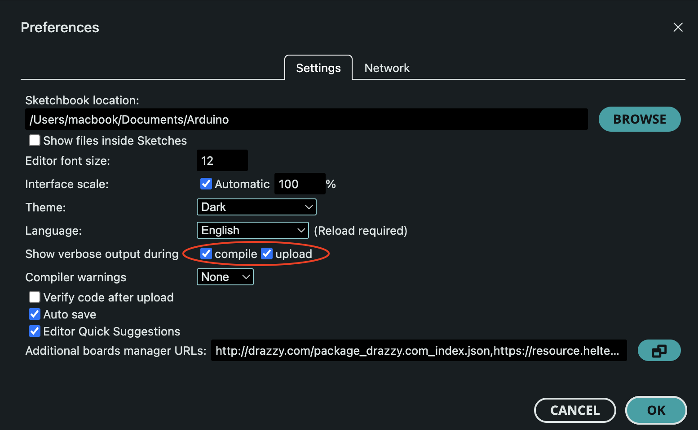
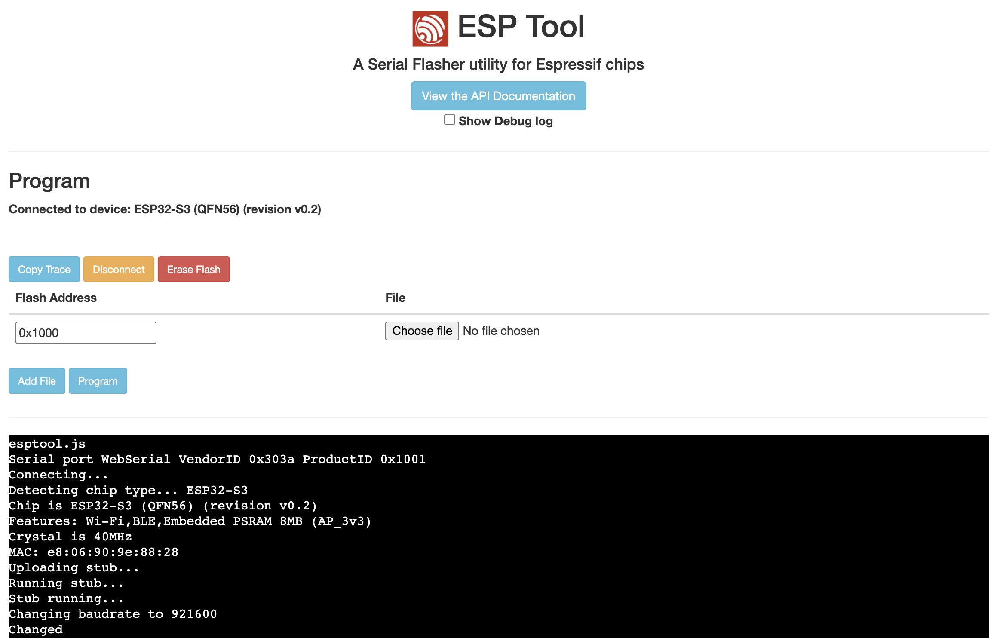
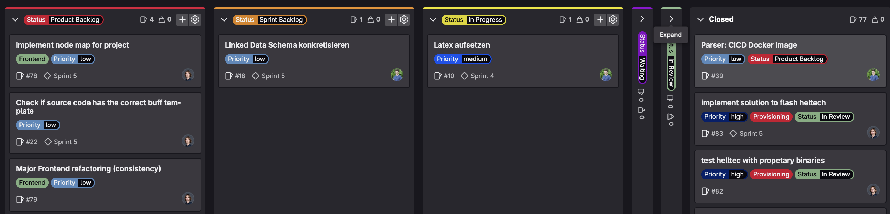
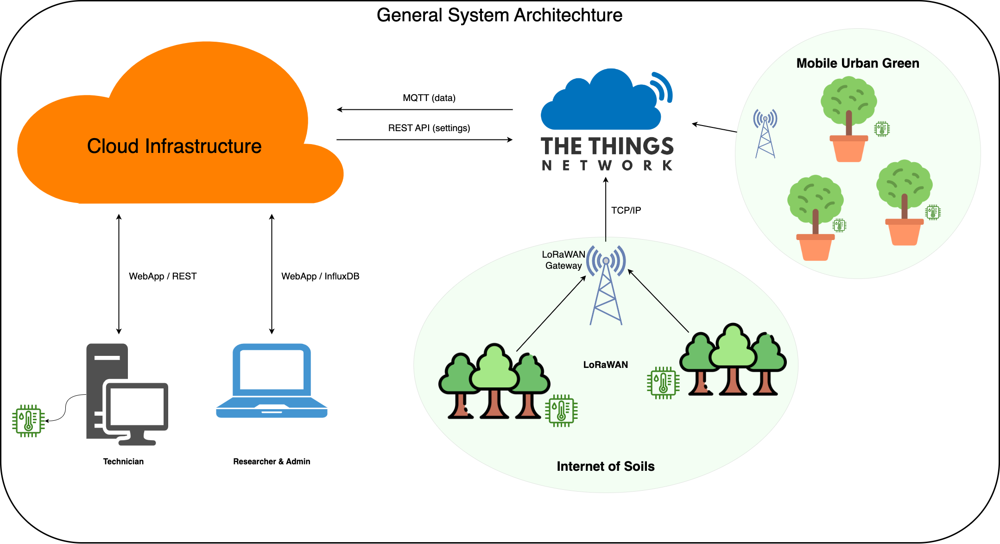
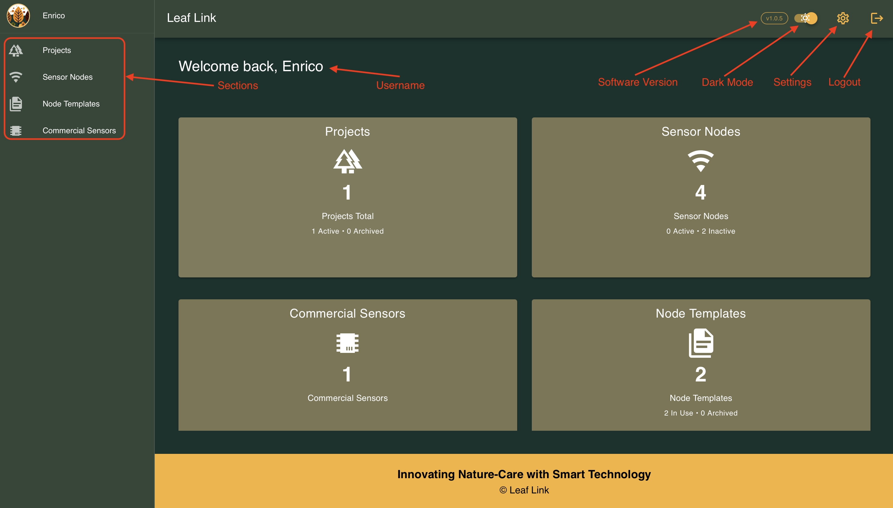
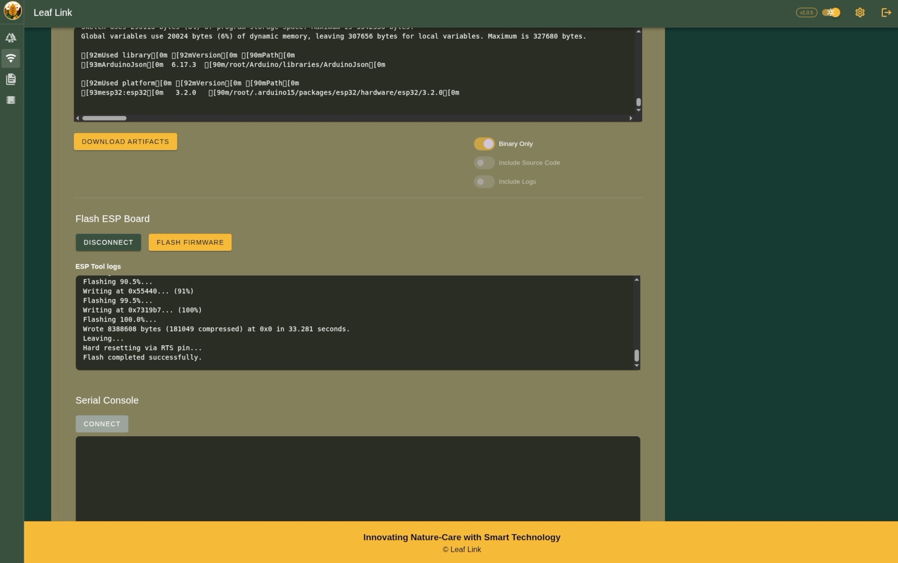
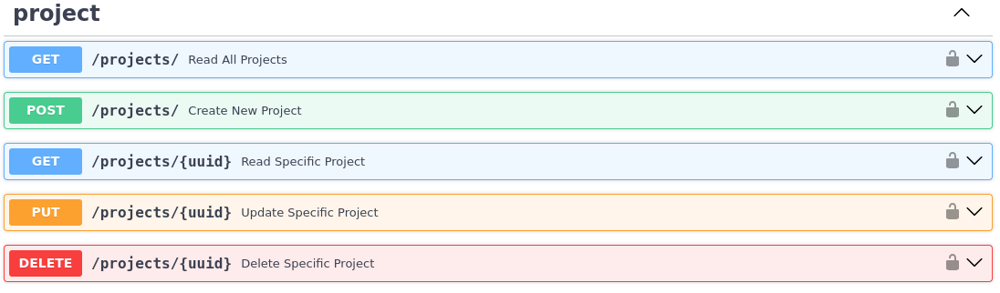
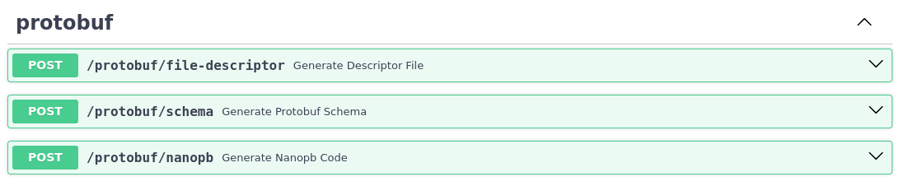

---
author:
- Enrico Cirignaco
- Linus Degen
title: 'Infrastructure for Sensor Management'
date: '02.07.2025'
lang: en-GB
toc: true

citeproc: true
cite-method: biblatex
bibliography: bibliography.bib
csl: ieee.csl
link-citations: true
nocite: |
  @*

header-includes:
- |
  ```{=latex}
  ```


documentclass: bfhthesis
classoption:
- a4paper
- monolingual
- twoside=false
- bibliography=totoc
- listof=totoc
top-level-division: chapter
numbersections: true
toc-depth: 2
secnumdepth: 2

fontsize: 12pt

# dpi: 300

colorlinks: true
linkcolor: BFH-Gray
filecolor: BFH-Gray
citecolor: BFH-Gray
urlcolor: BFH-Gray
toccolor: BFH-Gray
---

\newpage

<!-- Chapter 0: Abstract -->
\chapter*{Abstract}

<!-- Chapter 1: Introduction -->
\chapter{Introduction}

This chapter introduces the context, objectives, and practical relevance of the thesis. It outlines the typical structure of *Distributed IoT Systems*, highlights common challenges, and describes how these are addressed by the proposed system. Furthermore, it highlights the system's practical value by showing how it addresses user difficulties and improves workflows.

# Context & Background
The increasing affordability of sensor hardware and the advancement of low-power wireless communication technologies have made it significantly easier to deploy Distributed IoT Systems. These factors enable the large-scale collection of time-series data from remote locations in a cost-effective manner, creating new opportunities for both research and practical use.

## Distributed IoT System Design

A typical Distributed IoT System consists of several key components that together enable remote and continuous data collection. Following a generalized architecture model often used in the field, such a system typically includes:

1. **Sensor Nodes**: These are edge devices, often embedded systems, that directly interface with sensors and/or actuators to collect raw data. They process this data and transmit useful information. A single sensor node can host multiple sensors and/or actuators connected via various interfaces.

2. **Local Network (Sensor/Actuator Network - SAN)**: This network connects all sensor nodes to an IoT gateway. It can utilize a variety of wired or wireless technologies, such as LoRaWAN, WiFi, or cellular networks, depending on the specific application requirements.

3. **IoT Gateway**: As the name suggests, this component serves as the gateway between the local IoT system and the external world, typically the Internet. It is usually an embedded device capable of supporting both the local network technology and the IP protocol, enabling seamless communication and data transfer to central systems.

This generalized architecture, adapted from common frameworks, provides a foundational understanding for building such systems [@project2-cirie1].

Setting up a basic Distributed IoT System is relatively straightforward with today’s technologies. However, transforming such a setup into a scalable, maintainable, and well-structured project presents a very different set of challenges. While collecting data from a few sensor nodes is easily achievable, as the number of devices grows and project requirements become more complex, several challenges arise that require careful consideration. \
For example, data needs to be stored in a consistent and queryable format to support effective analysis. The structure and meaning of transmitted payloads should be clearly defined and adaptable to future changes. It also becomes crucial to track the status and configuration of each deployed sensor node, including firmware versions and activity levels. Furthermore, well-structured operational workflows are essential to minimize complexity and ensure repeated tasks can be performed consistently and efficiently as the system scales.

## Research Projects at BFH
Two collaborative research projects at the Bern University of Applied Sciences highlight practical challenges in managing Distributed IoT Systems. These projects, *Internet of Soils (IoS)* and *Mobile Urban Green (MUG)*, are conducted jointly by the department of Architecture, Wood and Civil Engineering (AHB) and the department of Agricultural, Forest and Food Sciences (HAFL).

- **IoS** focuses on monitoring and analyzing soil moisture in protection forests using a Distributed IoT System based on LoRaWAN technology. The goal is to support long-term environmental monitoring by collecting time-series data from remote locations. [@bfh-ios]
- **MUG** builds on insights from IoS and focuses on assessing the cooling effects of trees placed in large, mobile planters within urban areas. The project combines environmental measurements such as temperature, solar radiation, and water usage with modeling approaches to evaluate and simulate their impact at both the individual tree and neighborhood scale. [@bfh-mug]

Although the two projects differ in focus and context, they share a similar technical foundation in their underlying architecture, particularly concerning sensor hardware, wireless data transmission, and data management workflows. This shared technical foundation revealed several recurring issues that limit scalability and maintainability, especially as new deployments introduce variations in hardware, data models, or project-specific requirements.

These two projects serve as the direct foundation for this thesis by illustrating the typical structure and challenges of Distributed IoT Systems. Building upon the limitations identified in IoS and MUG, a preceding semester assignment, *Internet of Soils – Revised* [@project2-degel2], specifically examined their existing sensor architecture. \
This prior work revealed critical technical and organizational issues in metadata management, data transmission, and system scalability, thereby confirming the need for a more robust and streamlined infrastructure. The findings from *Project 2* directly shaped the requirements for the system developed in this thesis. The system is designed to support ongoing research activities at BFH AHB and HAFL, and is built to be easily extendable for similar future projects.

# Goal of the Project
The goal of this thesis is to design and implement a generic system that streamlines the processes involved in managing Distributed IoT Systems. Although developed within the context of academic environmental monitoring projects, its intended scope is much broader. The underlying concepts and components are designed to be flexible and reusable across a wide range of applications that rely on sensor-based data collection, regardless of domain or deployment scale. \
In particular, the previously discussed issues such as fragmented metadata, manual provisioning steps, and the lack of a defined data format are targeted with concrete technical solutions.

## System Capabilities

Based on the insights gained from *Project 2*, the infrastructure aims to streamline the documentation, commissioning, and operation of sensors. It is designed to build upon existing sensor hardware and integrate with established development processes. This infrastructure intends to provide the following core capabilities:

1. **Centralized Management of Sensor Attributes**: This capability involves the central management of relevant sensor attributes. This includes information such as device type, deployment location, sensor hardware specifications, and firmware details. It also aims to allow for the linking of additional information, such as calibration data or photographic documentation.

2. **Integration with The Things Network (TTN)**: The system will include an interface to The Things Network (TTN) for LoRaWAN-based sensor connectivity. This interface will enable both the provisioning of sensors and the reception of measurement data.

3. **Automated Firmware Build System**: An automated build system will be developed to compile sensor-specific firmware. This system will retrieve appropriate releases from the BFH-GitLab repository based on the sensor attributes, make necessary adaptations (e.g., value replacement using templating), and compile a firmware image.

4. **Automated Firmware Programming Mechanism**: A mechanism for programming the compiled firmware onto the sensors will be implemented. The process is intended to be largely automated: ideally, a new sensor will be registered with all relevant attributes, automatically triggering TTN registration and firmware compilation. The sensor would then only need to be connected to a computer for the firmware to be programmed, ideally without the need for manual steps or the Arduino IDE.

An appealing and user-friendly web interface will be developed to facilitate the workflows for attribute management and TTN integration.

## Data Handling and Storage

Beyond the core system capabilities, the infrastructure also aims to manage and store all collected data effectively. Measurement data received via TTN will be stored as **Linked Data (RDF)**, potentially using suitable schemas and ontologies for time-series data where possible. A triplestore will be used for this purpose. \
Furthermore, the existing data acquisition process using InfluxDB will be maintained, ensuring compatibility with current research practices. This dual-storage approach aims to provide both semantically rich, interconnected data and efficient time-series access.

## Architectural Principles  

Beyond the functional aspects, the system is designed to adhere to fundamental software architecture principles to ensure its long-term viability and effectiveness. Key principles include: The design will emphasize a modular approach with a clear separation of concerns, ensuring that different functionalities (such as attribute management, communication interfaces, or data storage) are distinctly separated. \
This promotes maintainability and allows for independent development or future extensions of individual components. To address the limitations identified in existing Distributed IoT Systems during *Project 2*, the architecture will prioritize robustness and reliability, ensuring consistent operation and data integrity. \
Furthermore, the system is designed to be highly extensible and flexible, allowing for the integration of new features, hardware types, or project-specific requirements without impacting the core functionality; this is particularly supported by the use of adaptable data models like Linked Data.

While primarily functional, the system also aims to provide an intuitive and user-friendly experience, especially through its web interface, thereby reducing technical overhead for users. Finally, where appropriate, the system will leverage well-established and proven technologies to ensure sustainability, interoperability, and long-term support. This foundational architectural approach supports the system's ability to serve as a flexible basis for diverse Distributed IoT System applications, extending beyond its initial academic context.

# Value Proposition

For users and researchers managing Distributed IoT Systems, the infrastructure developed in this thesis will deliver several tangible benefits, significantly improving their workflows and research outcomes.

Firstly, users will experience a significant **reduction in manual effort** by centralizing metadata and automating routine workflows. This means less time spent on tedious tasks such as sensor setup, firmware programming, and data preparation, allowing researchers to focus more on their core scientific activities.

Secondly, researchers can trust in the long-term usability and **shareability of their data**. By adopting Linked Data principles, the system ensures that data is not only interoperable and easily integrated with other tools but also adheres to FAIR principles (Findable, Accessible, Interoperable, Reusable) [@fair-principles], facilitating collaboration and future research utilization.

Thirdly, the system's modular and extensible architecture ensures **long-term relevance** and adaptability. Users can be confident that the infrastructure will evolve with future research needs and technological advancements, allowing them to avoid costly and time-consuming re-infrastructuring efforts and providing a flexible foundation for diverse IoT applications.

Finally, users will benefit from higher quality, more reliable data. The system addresses common issues like inconsistent data formats and manual errors, ensuring that the data they rely on for analysis is consistently trustworthy. Furthermore, improved state management of sensor nodes simplifies diagnostics and maintenance, leading to more consistent and **uninterrupted data streams**.

<!-- Chapter 2: Introduction -->
\chapter{State of Research}

This chapter provides an overview of research carried out and available technologies relevant to the project. The focus lies on niche or emerging tools and methods that appeared promising but required feasibility evaluation before adoption. Most of the research was conducted during the conceptual phase, where assessing the practicality and integration potential of such technologies was critical for planning and system design.

# Retrospective: "Internet of Soils - Revised"

This thesis builds directly upon the insights and results of a prior *Project 2* semester assignment, titled *Internet of Soils – Revised* [@project2-degel2], which examined the existing sensor architecture used in the *Internet of Soils* and *Mobile Urban Green* research projects. The goal of that work was to identify technical and organizational limitations in areas such as metadata management, data transmission, and system scalability, and to explore potential improvements.

To better understand the current system setup, a fully functional sensor node was reconstructed based on the existing architecture. The prototype included a microcontroller, several analog sensors, an external ADC, and a wireless LoRaWAN connection via The Things Network. Collected data was transmitted to a central backend and processed using a Node-RED pipeline, before being stored in an InfluxDB time-series database. This practical replication enabled a detailed analysis of system behavior and exposed key weaknesses in scalability and maintainability.

Among the identified issues were the use of manually flashed firmware, the reliance on hardcoded transmission keys, the absence of centralized metadata tracking, and the dependency on custom, undocumented binary formats. These aspects proved manageable in small deployments but would create significant friction in larger-scale systems. Additionally, important project data such as calibration files, location metadata, and firmware versions were stored in various unlinked formats and locations.

Based on these findings, the project proposed a conceptual redesign of the infrastructure, focusing on automation, modularity, and data interoperability. Technologies such as RDF, Linked Data, and binary serialization formats like FlatBuffers were evaluated for their potential to streamline data management and improve long-term extensibility. In parallel, several comparable IoT projects and platforms were reviewed to assess whether existing solutions could be adapted to meet the identified requirements. While some promising approaches were found, none fully matched the specific needs and constraints of the BFH research projects, which further motivated the development of a custom infrastructure. These conceptual foundations now serve as a starting point for the work presented in this thesis.

# Programming and Toolchain Analysis of the CubeCell Board
A key requirement of the project was to reuse existing hardware from previous initiatives. Specifically, the board selected was the Heltec HTCC-AB01, which integrates the ASR6501 chip. The board comes preloaded with an Arduino-compatible bootloader that allows firmware programming via the Arduino IDE. However, another important requirement was to enable future programming of the board without relying on the Arduino IDE. This made it necessary to find a method for programming compiled binaries to the board. As a result, research was conducted into the Heltec CubeCell board, its bootloader behavior, and its available toolchain options.

As described in the official documentation[@heltec-am01], the CubeCell board supports two different bootloaders, one of which is Arduino-compatible. However, as visible in the screenshots provided on the same page, this bootloader is closed-source and not publicly available. Several related issues have already been discussed on GitHub, such as [@heltec-issue80], where users express concerns about the lack of transparency. In another thread [heltec-issue281], a user even accuses Heltec of violating the GPL license by misusing the GCC compiler. These concerns indicate that Heltec is not interested in open-sourcing its development tools, making it necessary to find a workaround.

To better understand the programming process, the behavior of the Arduino IDE must first be analyzed. Before any code can be compiled for the CubeCell board, the hardware-specific configuration must be installed via the Arduino Board Manager. This manager downloads configuration files from the Heltec GitHub repository [@heltec-cubecell-github]. In particular, the get.py script in the tools folder contains the following line:
```python
tools_to_download = load_tools_list(current_dir + '/../package/package_CubeCell_index.template.json', identified_platform)
```
This suggests that the actual download URLs are listed in the package_CubeCell_index.template.json file. Indeed, the json file contains multiple links pointing to Heltec’s download server, such as:
```json
    "url": "https://resource.heltec.cn/download/ASR650x-Arduino-1.2.0-BoardManager.zip",
```
Browsing this file server reveals not only the expected binaries, but also scattered PDF documents, some of which may contain useful technical information.

As far as could be determined, since no official documentation was found, the Arduino IDE relies on three proprietary tools for compiling and programming firmware onto the board:

- **CubeCellElfTool**: Used to convert the compiled hex file into an intermediate format.
- **CubeCellFlash**: Used to flash boards with ASR650x-series chips [@heltec-cubecell-download-tool].
- **flash6601**: Used to flash boards with ASR6601-series chips [@heltec-cubecell-download-tool].

These tools are provided as binaries for Windows (EXE), macOS, and Linux, but only for x86 CPU architectures. One notable exception is a Raspberry Pi-compatible ARM binary available for the CubeCellFlash tool.
Some fragmented usage instructions can be found in forum posts such as [@heltec-cubecellflash-tool] and [@heltec-cubecell-firmware-upload], but no comprehensive official documentation is currently available.

To confirm that the proprietary utilities mentioned earlier are indeed used by the Arduino IDE for compiling and programming the firmware, and to better understand their function, a test was conducted using the IDE’s verbose logging mode.



A firmware upload was performed with verbose output enabled. The following snippet was extracted from the build log, immediately after the compiled binaries were generated. The output has been trimmed to highlight only the relevant portions of the programming process:
```
/Users/macbook/Library/Arduino15/packages/CubeCell/tools/CubeCellelftool/0.0.1/CubeCellelftool /Users/macbook/Library/Arduino15/packages/CubeCell/tools/gcc-arm-none-eabi/8-2019-q3/bin/arm-none-eabi-objcopy /Users/macbook/Library/Caches/arduino/sketches/C0F716AC671CF6A6916D9A86A1AFEBF5/sketch_jun6a.ino.elf /Users/macbook/Library/Caches/arduino/sketches/C0F716AC671CF6A6916D9A86A1AFEBF5/sketch_jun6a.ino.hex /Users/macbook/Library/Caches/arduino/sketches/C0F716AC671CF6A6916D9A86A1AFEBF5/CubeCell_Board_REGION_AS923_AS1_RGB_1.cyacd
/Users/macbook/Library/Arduino15/packages/CubeCell/tools/gcc-arm-none-eabi/8-2019-q3/bin/arm-none-eabi-size -A /Users/macbook/Library/Caches/arduino/sketches/C0F716AC671CF6A6916D9A86A1AFEBF5/sketch_jun6a.ino.elf
Sketch uses 23380 bytes (17%) of program storage space. Maximum is 131072 bytes.
"/Users/macbook/Library/Arduino15/packages/CubeCell/tools/CubeCellflash/0.0.1/CubeCellflash" -serial "/dev/cu.usbserial-0001" "/Users/macbook/Library/Caches/arduino/sketches/C0F716AC671CF6A6916D9A86A1AFEBF5/CubeCell_Board_REGION_AS923_AS1_RGB_1.cyacd"
Initialising bootloader.
Silicon ID 0x256a11b5, revision 0.
Verifying rows.
Array 0: first row 34, last row 511.
Starting upload.
Uploading  ( 10 / 100 )
Uploading  ( 20 / 100 )
Uploading  ( 30 / 100 )
Uploading  ( 40 / 100 )
Uploading  ( 50 / 100 )
Uploading  ( 60 / 100 )
Uploading  ( 70 / 100 )
Uploading  ( 80 / 100 )
Uploading  ( 90 / 100 )
Uploading  ( 100 / 100 )
Checksum verifies OK.
Rebooting.
Total upload time 3.07s
```
A more detailed analysis of the build logs revealed that the **CubeCellElfTool** utility is used to merge the ELF and HEX files into a .cyacd file. Its usage appears to follow the syntax:
```bash
CubeCellelftool <path_to_objcopy> <path_to_elf_file> <path_to_hex_file> <output_cyacd_file>
```
The objcopy utility, part of the GCC toolchain, converts the ELF file into a HEX file, which is then combined with additional metadata into the .cyacd format. Further research indicated that .cyacd stands for Cypress Application Code, a firmware update format originally developed by Cypress (now part of Infineon) for their PSoC (Programmable System-on-Chip) devices. It includes both application code and metadata required by the bootloader for programming flash memory [@infineon-cyacd]. This suggests that the Heltec CubeCell board might rely on a variant of a Cypress bootloader.

In the second part of the logs, the CubeCellFlash utility was identified as the tool responsible for programming the generated .cyacd file to the board. Its usage follows the pattern:
```bash
CubeCellflash -serial <serial_port> <path_to_cyacd_file>
```

These findings confirm that CubeCellFlash is the primary programming utility used in the Arduino toolchain and reveal its exact usage syntax.

With these insights, the team was faced with three options:
1. Investigate the bootloader further to determine if it conforms to Cypress standards and whether third-party tools could be used for programming.
2. Reverse engineer the CubeCell utilities to understand their internal workings and re-implement them as open-source tools.
3.  Use the provided proprietary binaries and integrate them into a custom programming solution.

The first option was discarded due to the time required for in-depth bootloader analysis. The second option was also initially rejected, but later reconsidered after an accidental misuse of the **CubeCellelftool** triggered a Python traceback, suggesting that the CubeCell utilities are likely packaged Python scripts. A partial decompilation confirmed this assumption, and some source code was recovered. However, fully reverse engineering and integrating the tools into the project was deemed too time-consuming and ultimately abandoned.

The third option was selected as the most practical and time-efficient solution. Despite the drawback of relying on closed-source binaries, raising concerns about transparency and security, it enabled the team to proceed without blocking other parts of the project.

# Webserial
One of the key requirements of the project was to make sensor node programming as simple and automated as possible for the end user. Since the provisioning of sensor nodes is handled via a web application, the idea of programming firmware directly from the browser emerged as a natural solution. This approach would allow users to program the device without installing any additional software, provided they use a compatible browser.

Before implementing this feature in the web application, a feasibility study was conducted to evaluate available browser APIs and demonstrate a working proof of concept.

To narrow the scope and ensure a focused development effort, the team decided to target a single, widely supported hardware platform rather than attempting to support multiple device types. The chosen architecture was based on the ESP32 Board with LoRaWAN support. Specifically, the ESP32-S3 XIAO [@seeed-xiao-esp32s3] board was selected as the target device. This board is based on the popular ESP32-S3 chip, which is well-suited for IoT applications due to its performance, integrated wireless features, and strong community support. Its compact form factor and affordability also make it ideal for rapid prototyping and testing.

## Browser Serial APIs
A focused investigation was conducted to evaluate available browser APIs for programming an ESP32 device over USB/serial directly from the browser.
Several alternative APIs were also considered:

- **WebUSB** provides low-level USB access but requires custom USB descriptors and is likewise limited to Chromium-based browsers, excluding Firefox and Safari [@webusb].
- **WebHID** is intended for human interface devices (e.g., keyboards and mice) and is unsuitable for firmware programming. It also suffers from poor cross-browser support [@webhid].
- **WebBluetooth** is available in both Chromium and Firefox but is not viable for full firmware uploads due to BLE’s limited data rates and small payload sizes [@webbluetooth].

Among these, Web Serial, currently supported only in Chromium-based browsers such as Chrome, Edge, and Brave, is the most practical option for programming ESP32 devices without requiring additional software installation[@webserial]. However, its restriction to Chromium browsers makes true cross-browser support currently unattainable.

## ESP32 compatible Webserial libraries
A thorough review was conducted to identify JavaScript libraries capable of programming ESP32 devices via the browser using the Web Serial API[@webserial]. Below is a comparison of three notable projects.

### Adafruit WebSerial ESPTool
Adafruit WebSerial ESPTool [@adafruit-webserial-esptool] is a polished browser-based programmer built on top of Espressif’s esptool-js. It provides a complete graphical interface supporting multiple ESP32 variants and includes features such as automatic chip detection and baud rate configuration. The project is actively maintained and ideal for users seeking an out-of-the-box solution without writing custom code. However, due to its high level of abstraction, it is less suitable for deep customization or tight integration into complex applications.

### esptool.js
esptool.js, developed by Toitware[@toit-webserial], was one of the first efforts to port the Python-based esptool.py for use in the browser. Its minimalist design made it easy to embed into lightweight applications. However, it has not been updated in over four years, lacks support for recent ESP32 variants (e.g., ESP32-S3), and has limited documentation. Due to its outdated state, it is not recommended for new projects.

### esptool-js (by Espressif)
esptool-js[@esptool-js] is the official JavaScript port of the widely used esptool.py, developed and maintained by Espressif. It brings most of the core functionality of the native CLI tool to the browser and is optimized for integration with the Web Serial API. The library supports modern ESP32 variants (including ESP32-S3), is actively maintained. It does not include a graphical interface but provides a reliable and flexible foundation for building custom programming workflows.

The candidate that best fits the requirements of this project is the official esptool-js from Espressif. It is actively maintained, well documented, and designed for modern Web Serial integration.

As part of the esptool-js repository, Espressif provides a minimal demo web application. This example was used as a proof of concept to validate that the ESP32-S3 XIAO board can be programmed directly from the browser using the Web Serial API. The demo was successfully tested with the ESP32 XIAO board, confirming that firmware programming is possible without requiring any additional software installation.

In addition to validation, the demo served as a reference for understanding how the esptool-js library works in practice. It formed the basis for developing a custom integration within the project’s web application. Further implementation details are provided in the [Web Application Frontend](#webapp-frontend) section.



# Linked Data

The term Linked Data denotes a set of best practices for publishing and interconnecting structured data on the Web. According to Bizer et al., these practices have led in the past three years to the emergence of a global data space containing billions of assertions, commonly referred to as the Web of Data [@linked-data-story].

At its core, Linked Data uses four principles, originally formulated by Tim Berners‑Lee, as a basic recipe for exposing and linking data using existing Web infrastructure [@linked-data-story]:

1. **Use URIs to identify resources**. Every entity, such as a sensor, a location, or a measurement, is assigned a globally unique and persistent URI.

2. **Use HTTP URIs**. These URIs should be dereferenceable, meaning that they can be accessed via the HTTP protocol.

3. **Provide structured data**. When a URI is dereferenced, it should return useful information in standardized, machine-readable formats such as RDF or JSON-LD.

4. **Include links to other URIs**. This enables discovery of related data and supports the construction of a broader knowledge graph.

These simple yet powerful guidelines enable data providers to publish information in a way that is not only accessible but also inherently linkable. This emphasis on interlinking is what fundamentally sets Linked Data apart from earlier approaches to Web-based data sharing, such as static data dumps or traditional web services. By extending the Web’s hyperlink architecture to structured data through the use of URIs, HTTP, RDF, and semantic links between resources, Linked Data facilitates the construction of a decentralized, scalable, and machine-readable knowledge graph. This graph-based structure supports advanced data integration, semantic interoperability and exploratory analysis across diverse domains. At the core of this approach lies the *Resource Description Framework* (RDF), which serves as the fundamental data model for Linked Data applications.

RDF is a standard for representing structured information in a formal and machine-readable way. It organizes data as triples, each consisting of a subject, predicate and object. This structure allows for the expression of simple statements about resources. Each element of a triple is typically identified by a Uniform Resource Identifier (URI) or a literal value, making the data unambiguous and interoperable. RDF supports multiple serialization formats such as Turtle, RDF/XML and JSON-LD, which offer flexibility for different systems and integration needs. The underlying concepts and structure of RDF are formally defined in the W3C RDF 1.1 specification [@rdf-concepts].

## Justification for Using Linked Data

Our sensor management platform is designed to support a wide range of independent projects, each of which may involve different types and quantities of sensor nodes. These projects often have no shared context, resulting in highly diverse data formats, metadata structures and additional informations. Consequently, the underlying data infrastructure must be capable of handling heterogeneous and evolving datasets in a consistent and interoperable way. Traditional rigid data models quickly reach their limits in such environments.

The use of RDF enables us to describe entities such as sensors, observed phenomena and spatial relationships in a structured and machine-readable way. For instance, a sensor can be represented by a triple stating that it "is located at" a specific place, with both the sensor and the location identified by URIs. This model not only facilitates semantic querying but also allows the system to evolve dynamically as new types of metadata or sensors are introduced. Through SPARQL, complex queries can be performed without needing to redesign the data schema.

A further advantage of Linked Data is its ability to seamlessly integrate distributed knowledge sources. In our platform, relevant metadata such as data sheets, calibration data or manufacturer specifications are often stored externally and exist in a variety of formats. Rather than importing and replicating these documents, Linked Data enables us to reference them directly via persistent URIs. This avoids duplication and enables scalable metadata enrichment.

In contrast to relational databases such as MariaDB or PostgreSQL, which rely on fixed schemas and lack native support for semantic relationships, RDF-based triple stores offer a more adaptable solution. They are inherently suited to scenarios where data structures are not known in advance or change frequently over time. The ability to link internal datasets with external ontologies further enhances interoperability and long-term maintainability.

Considering the need to manage diverse data structures, adapt to evolving project requirements and integrate distributed metadata, Linked Data proves to be a robust and future-oriented foundation for our sensor infrastructure. Its semantic flexibility supports consistent modeling across different projects, while enabling seamless integration with external ontologies and data sources. This approach not only enhances interoperability but also ensures that the platform remains maintainable and extensible as new use cases emerge.

## Usage of existing Schemas and Ontologies

In the context of Linked Data, schemas and ontologies are essential tools for adding semantic structure and meaning to data. While these terms are often used interchangeably, they differ in scope and expressiveness. A schema typically defines the structure and types of data entities, similar to a data model, whereas an ontology provides a richer semantic framework that includes relationships, constraints and inference rules. Ontologies can express not only what data exists but also how entities relate to one another and what logical conclusions can be derived from the data.

The World Wide Web Consortium (W3C) has established standards for semantic modeling with RDF Schema (RDFS) and the Web Ontology Language (OWL). RDFS extends RDF by introducing basic vocabulary for defining classes, properties and hierarchies [@rdf-schema]. OWL goes further by supporting more complex constructs such as class equivalence, property restrictions and logical axioms. These features enable semantic reasoning and consistency checking across datasets. Semantic reasoning allows new knowledge to be inferred from existing data, while validation mechanisms can help ensure data integrity and coherence [@owl-features].

A domain-specific example of such an ontology is the SOSA (Sensor, Observation, Sample, and Actuator) ontology, developed by the W3C Spatial Data on the Web Working Group [@ssn-ontology]. SOSA is specifically designed to describe sensors, the observations they make, and the processes and platforms involved. It is well-aligned with the needs of IoT applications, where metadata about sensor deployments, measurement procedures and observed properties must be consistently modeled. In our platform, SOSA concepts are used to represent sensor nodes, their deployments in the field and the observations they produce. This enables consistent semantic annotation of sensor metadata and supports data integration across different types of sensing systems. \
The following diagram from the official ontology description by W3C offers a concret overview over all classes and relationships that are described within SOSA [@ssn-ontology]:


The following example shows how a sensor and an observation would be described and linked with the SOSA ontology. The example is written in the Turtle format, a compact and human-readable syntax specifically designed for RDF graphs, making it easier to read and write semantic data.

```turtle
@prefix sosa: <http://www.w3.org/ns/sosa/> .
@prefix ex: <http://example.org/> .
@prefix xsd: <http://www.w3.org/2001/XMLSchema#> .

ex:TempSensor1 a sosa:Sensor ;
  sosa:madeObservation ex:Observation1 .

ex:Observation1 a sosa:Observation ;
  sosa:observedProperty ex:Temperature ;
  sosa:hasSimpleResult "22.5"^^xsd:float ;
  sosa:resultTime "2025-06-10T10:05:00Z"^^xsd:dateTime ;
  sosa:madeBySensor ex:TempSensor1 .

ex:Temperature a sosa:ObservableProperty .
```

In addition to SOSA, general-purpose vocabularies such as Schema.org are useful for modeling contextual metadata. Schema.org is widely used to describe common entities like people, places, organizations and events [@schema-org]. While SOSA captures the technical aspects of sensing, Schema.org can provide additional descriptive context, such as the institution operating a sensor or the geographic location where it is deployed. These complementary vocabularies allow for both domain-specific precision and broader semantic interoperability. In our platform, we use the Schema.org vocabulary to describe contextual information about sensor deployments, such as the projects in which they are used:

```turtle
@prefix schema: <https://schema.org/> .
@prefix ex: <http://example.org/> .

ex:InternetOfSoils a schema:Project ;
  schema:name "Internet of Soils" ;
  schema:alternateName "IoS" ;
  schema:description "A project to monitor soil moisture in protection forests." ;
```

Using well-established ontologies provides several concrete advantages. First, they are typically developed and maintained by expert communities, ensuring conceptual clarity and practical relevance. Second, they enable semantic alignment across datasets, allowing data to be linked meaningfully across systems that follow the same ontological models. This is a core strength of Linked Data: enabling the integration of decentralized data sources through shared semantic structures. Furthermore, leveraging existing ontologies accelerates development, reduces modeling errors and supports long-term maintainability of data systems.

## Triple Stores and Semantic Querying

To store and query RDF data efficiently, our platform uses a triple store, a type of database specifically designed for managing RDF triples. Unlike relational databases, triple stores are optimized for semantic data structures and enable powerful querying based on graph patterns. One widely used triple store implementation is Apache Jena Fuseki, which provides a SPARQL endpoint for querying and updating RDF data.

SPARQL (SPARQL Protocol and RDF Query Language) is the standard query language for RDF. It allows for expressive queries that match patterns of subjects, predicates and objects. The following example demonstrates a simple SPARQL query that retrieves all temperature values observed by a specific sensor:

```sparql
PREFIX sosa: <http://www.w3.org/ns/sosa/>
PREFIX ex: <http://example.org/>

SELECT ?result ?time WHERE {
  ?observation a sosa:Observation ;
         sosa:madeBySensor ex:TempSensor1 ;
         sosa:hasSimpleResult ?result ;
         sosa:resultTime ?time .
}
```

This query returns a list of all observations made by `TempSensor1`, along with their recorded values and timestamps. SPARQL enables flexible data exploration and is a core tool in working with semantic sensor data.

By integrating Linked Data technologies into our platform, we gain a flexible, scalable and semantically rich data architecture. RDF and established ontologies like SOSA and Schema.org allow us to model complex sensor infrastructures in a consistent and extensible way. Triple stores and SPARQL provide the foundation for querying and integrating diverse datasets across independent projects. This approach not only simplifies the management of heterogeneous sensor metadata but also opens up new possibilities for data reuse, interoperability and long-term system evolution.

# Binary Serialization for IoT Communication

In any system that exchanges structured data between components, there must be a clear, unambiguous way to represent and interpret that data. This is particularly relevant in IoT environments, where sensor nodes, gateways, and applications often run on different platforms and are implemented in different programming languages. To ensure that a measurement recorded on a microcontroller can later be interpreted correctly in a cloud service or analysis tool, the transmitted data must follow a clearly defined format.

Schema-based serialization formats address this problem by explicitly defining the structure and types of data. This makes it possible to validate data automatically, catch errors at compile time, and generate consistent, type-safe code across multiple programming languages. In comparison to textual formats such as JSON or XML, binary serialization formats such as Protocol Buffers additionally offer significant performance advantages [@protobuf-performance]. They reduce message size and speed up parsing, which is particularly important in IoT environments with limited bandwidth and processing power.

## Evaluating Binary Format 

To select an appropriate framework for this project, several binary serialization libraries were evaluated and compared with regard to their efficiency, tooling support, and suitability for both embedded systems and application services.

- **Protocol Buffers (Protobuf)** is a widely adopted format developed by Google. It provides a well-documented schema definition language, strong cross-platform tooling, and supports efficient encoding and schema evolution. Its simplicity and broad ecosystem make it especially attractive for general-purpose use [@protobuf].

- **Nanopb** is a minimal implementation of Protobuf for embedded systems written in C. It is optimized for extremely constrained environments, requiring less than 10 kB of flash and 1 kB of RAM, and is therefore well suited for microcontroller-based sensor nodes. It omits reflection and advanced runtime features to minimize memory usage [@nanopb].

- **FlatBuffers** offers very high performance and supports random access without full deserialization. It is commonly used in latency-sensitive applications like gaming. However, compared to Protobuf, it typically requires more manual steps to build and manage data structures, which can make development more complex in smaller-scale applications.[@flatbuffers].

- **Apache Avro** is schema-based and commonly used in big data platforms. Although powerful, it is less suited for embedded systems due to its focus on big data infrastructure [@avro].

- **MessagePack** is a lightweight binary format that aims to be more efficient than JSON while retaining its simplicity and compatibility [@messagepack]. However, it does not rely on an explicit schema definition, which can make data validation, versioning, and long-term maintainability more challenging in structured systems.

Based on this evaluation, **Protocol Buffers** and its specialized implementation **Nanopb** were jointly selected as the binary serialization formats for this project. Protocol Buffers provides the robust, cross-platform schema definition and code generation crucial for application services and general data exchange. Nanopb, on the other hand, is the highly optimized C implementation of Protobuf specifically designed for the resource-constrained embedded systems of the sensor nodes. This dual approach leverages the strengths of the Protobuf ecosystem for both heterogeneous components: its clear schema definition and wide adoption for structured data exchange across various services, and Nanopb's efficiency and minimal footprint for the microcontrollers. The format's ability to generate language-specific code and support schema evolution aligns closely with the architectural goals of the system. [@protobuf; @nanopb]

## Protocol Buffers

Protocol Buffers (Protobuf) is a language-agnostic binary serialization format developed by Google. It allows developers to define structured data using a `.proto` schema file, which is then compiled into source code for various programming languages. In this project, edition 2023 is used, which is the most recent version and includes modern syntax improvements and clearer semantics compared to older editions [@protobuf].

A Protobuf schema defines data structures called messages. Each message contains one or more typed fields, each identified by a unique tag number. The format supports various scalar types such as `int32`, `uint64`, `bool`, `string`, and `bytes`, as well as nested messages, enumerations, and repeated fields (arrays) [@protobuf]. A minimal example looks as follows:

```
message SensorData {
  int64 timestamp = 1;
  float temperature = 2;
  bool active = 3;
}
```

The Protobuf compiler `protoc` is used to generate code in a target language. For instance, running `protoc` with a Python plugin produces a `.py` file that includes data classes and serialization logic. In Python, the generated module embeds the binary representation of the schema and uses metaclasses to dynamically create message classes at runtime. This makes the schema available without needing the `.proto` file at runtime, while still allowing full access to all message types [@protobuf].

The table below illustrates how different data types are encoded using Protocol Buffers. Each type handles value representation differently in terms of size and encoding strategy, depending on whether the data is numeric, binary, or structured.

Table: Binary encoding examples for different Protobuf data types.

| Data Type | Value             | Encoding Result (Hex)  | Bytes  | Remarks                      |
|-----------|-------------------|------------------------|--------|------------------------------|
| uint32    | 4                 | 0x04                   | 1      | varint                       |
| sint32    | -4                | 0x07                   | 1      | ZigZag encoding              |
| float     | -4.0              | 0x000080c0             | 4      | fixed-width format           |
| bytes     | "-4"              | 0x2d34                 | 2      | encoded as ASCII             |

Protocol Buffers uses **base-128 variable-length integers (varints)** to efficiently encode numeric types like `uint32` and `sint32`. These varints use only as many bytes as necessary to represent a value. For example, small integers such as `4` or the ZigZag-encoded version of `-4` require only a single byte to transmit. This compression is achieved by packing the 7 least significant bits of each byte into the payload and using the most significant bit to indicate whether more bytes follow. \
Negative integers are handled using **ZigZag encoding**, which maps signed values to unsigned varints in a way that keeps small negative numbers compact [@protobuf-encoding].

In systems where floating-point precision is not strictly required, decimal values can alternatively be transmitted as scaled integers. For instance, the temperature `21.3 °C` could be encoded as the integer `213`, assuming one decimal digit of precision. This technique can help reduce payload size when only integer varints are used – especially since a `float` in Protobuf always requires exactly 4 bytes, regardless of the actual value. In contrast, small integers typically require only a single byte, making them much more efficient when transmitting data.

## Runtime Compatibility 

Although Protocol Buffers is designed to support schema evolution, care must be taken to ensure runtime compatibility across different system components. In general, messages encoded with a newer version of the Protobuf library can still be parsed by an older version, as long as the schema changes follow the recommended guidelines (e.g., only adding optional fields, not reusing tag numbers). However, the reverse is not always guaranteed: messages generated by an older version may not be fully understood by newer runtimes if the schema has changed significantly [@protobuf].

To ensure stable operation in this project, all components that serialize or deserialize messages use either the same or a compatible runtime version of the Protobuf library. This consistency helps avoid subtle issues during development and ensures that schema changes can be rolled out in a controlled and predictable manner.

<!-- Chapter 3: Methods -->
\chapter{Methods}

This chapter describes the methods used to organize and execute the project, including the project methodology, team structure, and chosen technologies. Since the project was carried out in a team of two, a structured approach was essential to avoid blocking progress due to interdependencies. Given the broad scope and limited timeframe, the project followed an iterative, practice-oriented methodology to maximize productivity. This approach allowed for continuous refinements based on supervisor feedback and evolving technical requirements.

# Team Organisation
The project was carried out by a two-person team, which required proactive planning and a clear division of tasks to avoid mutual blocking. The nature of the project allowed for largely independent work streams, which were divided into two main domains: (1) data acquisition and management, and (2) device provisioning, programming, and monitoring. Additionally, the development of the web application was split between frontend and backend responsibilities, with each team member focusing on one of the two.

After a joint planning and conceptualization phase, where the system architecture and project requirements were defined, each team member assumed roles aligned with their strengths and interests. Tasks were managed using Git branches, with each feature developed independently and later merged into the main branch upon completion. This workflow enabled parallel progress without conflicts.

To maintain alignment, the team held regular internal meetings to discuss progress and synchronize development. A recurring practice called the “marriage” ensured that frontend and backend components were periodically integrated and tested together. Approximately every two weeks, the team also met with the project supervisor and stakeholder to demonstrate the current state of the system and gather feedback. Before these sessions, the latest features were merged, tested, and deployed to the server to provide a working prototype for review. This iterative process supported rapid, incremental improvements.

# Project Management Methodology
Given the complexity and time limitations of the project, a structured yet adaptable project management approach was required. The team followed an iterative, practice-oriented methodology inspired by agile principles, with particular reference to SCRUM [@scrumguide]. While SCRUM provided a useful framework for organizing work and integrating feedback, it was adapted to fit the context of a small, part-time team.

The project was planned using a combination of milestones and sprints. During the initial conceptual phase, the team gathered and defined the system requirements. Based on those requirements, the team outlined rough milestones representing major project components and their estimated durations. These high-level goals helped assess the feasibility of planned features within the available timeframe. Although flexible, they provided structure and helped maintain overall direction throughout the project.

For short-term planning, the team relied on two-week sprints. At the start of each sprint, the team met to define and assign tasks based on priorities, individual strengths, and workload. A shared Kanban board was used to track progress. Kanban is a visual workflow management method that enabled transparent tracking of tasks from conception to completion [@kanban]. New issues, whether created by team members or suggested by stakeholders, were added to the backlog and reviewed during sprint planning. Tasks were labeled and updated throughout the sprint to reflect their current status. This lightweight adaptation of SCRUM enabled steady progress while maintaining flexibility.



To maintain high code quality and foster shared understanding, a peer code review strategy was implemented. All code changes required review and approval from the other team member before being merged into the main branch. This practice, initiated through a merge request upon task completion, not only ensured a clear quality standard but also facilitated knowledge sharing and helped both developers stay familiar with all parts of the system.

In addition to tracking technical progress, the team implemented simple but effective controlling measures to ensure the project was properly documented. Meeting protocols were maintained to record key decisions and discussions. A shared work journal was used to log who worked on what, when, and how. This provided transparency, traceability, and a basis for workload reflection. Both the [meeting protocols](#chap:meeting-protocols) and the [work journal](#chap:work-journal) can be found in the appendix of this document.

## Milestones

With the project's requirements established, development proceeded through clearly defined milestones. The following table presents an overview of each milestone, including its duration and key objectives.

Table: Overview of project milestones with associated timelines and goals

+-------------------------------------------+----------------+-------------------------------------------------------------------+
| Milestone                                 | Duration       | Key Objectives                                                    |
+===========================================+================+===================================================================+
| Concept Phase                             | 3 weeks        | - Propose solution ideas                                          |
|                                           |                | - Detailed system diagram                                         |
|                                           |                | - PoC of key technologies                                         |
|                                           |                | - Data model diagram                                              |
+-------------------------------------------+----------------+-------------------------------------------------------------------+
| Infrastructure Setup & Proof of Concept   | 3 weeks        | - Set up development and production environment                   |
|                                           |                | - Live data flow from sensor nodes to triplestore via Flatbuffers |
|                                           |                | - PoC: Compile and programm firmware via browser                  |
+-------------------------------------------+----------------+-------------------------------------------------------------------+
| Webapp Frontend & Backend                 | 4 weeks        | - User authentication                                             |
|                                           |                | - Frontend UI for data entry and visualization                    |
|                                           |                | - Backend as middleware between services                          |
|                                           |                | - Implement REST interface                                        |
+-------------------------------------------+----------------+-------------------------------------------------------------------+
| End-to-End Testing                        | 2 weeks        | - Integrate all system components and services                    |
|                                           |                | - Deployment of the v1 system                                     |
|                                           |                | - Stakeholder testing                                             |
+-------------------------------------------+----------------+-------------------------------------------------------------------+
| Feedback Integration & Optional Features  | 2 weeks        | - Adjust or implement components based on feedback                |
|                                           |                | - Technical wrap-up                                               |
+-------------------------------------------+----------------+-------------------------------------------------------------------+
| Project Finalization                      | 2 weeks        | - Finalize documentation                                          |
|                                           |                | - Poster, project book entry, presentation, and video             |
+-------------------------------------------+----------------+-------------------------------------------------------------------+

# Modern Application Methods
The project followed modern application development principles, drawing inspiration from the Twelve-Factor App methodology [@twelvefactor]. The goal was to build a modular, portable, and maintainable system that could easily be extended or adapted by future organizations. These principles ensured a clean separation of concerns, environment-agnostic deployment, and a consistent developer experience across all components. The following sections describe the key practices adopted during implementation.

## Version Control with Git
The codebase was managed using Git, with a single project repository hosted on BFH’s GitLab instance. This enabled effective version control, collaborative development, and reduced the risk of code loss. Each feature was developed in a dedicated branch and merged into the main branch only after review and approval by the other team member.

Not only the source code, but also all project-related documents, such as documentation, diagrams, and presentation materials, were versioned in the same repository. Non-code files were allowed to be pushed directly to the main branch, as they rarely lead to merge conflicts and typically don't require peer review.

Git tags were used to mark key integration points in the project timeline, especially when the system was successfully deployed to the production server. This tagging allowed for easy rollback if needed. A three-part versioning scheme was adopted, following the principles of Semantic Versioning [@semver]:

- The first number indicated major versions (e.g., 0.x.x during development, incremented to 1.0.0 for the first alpha release),
- The second number for minor releases (typically used for new deployments to production), and
- The third number for bugfixes and small patches.

These tags also served as triggers for the CI pipeline, which is discussed in detail in the section [Multistaged GitHub CI Pipeline](#multistaged-github-ci-pipeline).

## Containerized Microservice Architecture
The system was built using a microservice architecture, where each service is dedicated to a specific responsibility within the overall system. This approach promotes modularity, simplifies maintenance, and enables independent development, testing, and deployment of individual components.

Each microservice includes its own configuration and dependencies, allowing it to run in isolation. Services expose RESTful interfaces for communication, making them easy to integrate or replace without affecting the rest of the system. A reverse proxy handles internal routing, enabling flexibility in scaling and deployment.

From the start, each service was developed and deployed as a Docker container. Containerization ensures strong isolation between services and simplifies dependency management. It also guarantees consistency across development and production environments by replicating the same runtime conditions. More details about the deployment setup are provided in the [Deployment & Integration](#deployment-integration) section.

Descriptions of the individual services can be found in the [System Architecture](#system-architecture) section.

## CI/CD Pipeline and Deployment Strategy
A clear separation between the build and deployment phases is a key principle of modern application architecture [@twelvefactor]. In this project, each service was packaged as a custom Docker image. The build phase was fully automated using a GitHub CI pipeline, while the deployment phase consisted of deploying these images as containers on the production server.

The pipeline is triggered by the creation of a new Git tag. Once triggered, parallel jobs build the Docker images for each service. This dedicated build server is also responsible for building images for the appropriate target architectures. The resulting images are tagged according to the Git version and pushed to a private container registry hosted on BFH’s GitLab. From there, the server can securely pull the images and run the containers.

This approach ensures reproducible, versioned deployments and centralized control over image distribution. Using a private registry improves reliability and avoids dependency on public registries. Versioning with Git tags also allows for easy rollbacks in case of errors or regressions.

Because the build phase does not run on the deployment environment, it avoids spreading the full Git repository across multiple systems, reducing the risk of accidental source code leakage. Although this is not a critical point for this project, since the codebase is not proprietary, it reflects good practice. It’s worth noting, however, that this protection does not apply to services written in interpreted languages, where source code remains accessible within the container.

# Technology Stack
This section provides an overview of the technologies and tools used in the project, along with the reasoning behind their selection. Choices were guided by factors such as developer familiarity, compatibility, community support, open-source availability, and alignment with the project’s goals and constraints.

## MQTT Broker
The team selected Eclipse Mosquitto as the MQTT broker. It is lightweight, widely used in IoT systems, and offers excellent community support. Its reliability and ease of integration made it a good choice. Additionally, the team had prior training with Mosquitto through the IoT specialization course [@mosquitto].

## Reverse Proxy
Although several reverse proxy solutions were briefly considered (e.g., NGINX, Traefik), the team opted for Caddy, as the project only required a small number of simple reverse proxy rules. Caddy offers automatic HTTPS, a user-friendly configuration syntax, and minimal maintenance overhead, features that aligned well with the project’s goals and time constraints [@caddy].

## Time-Series Database
The use of InfluxDB as the time-series database was a requirement defined by the stakeholder from the outset. InfluxDB was already familiar to the stakeholder and provided a good fit for the type and volume of time-series data collected by the system.

## RDF Triplestore
For persistent storage and querying of RDF data, the team evaluated multiple triplestore options and ultimately selected Apache Jena Fuseki. Fuseki is open-source, lightweight, and easy to set up, either as a standalone Docker container or integrated into Java applications via Maven. Compared to alternatives such as Blazegraph, which is no longer actively maintained, or GraphDB Free, which imposes limitations in its free version, Fuseki provided a more reliable and unrestricted solution. \
While commercial tools like Stardog or Amazon Neptune were briefly surveyed to provide a broader overview, they were not considered viable options due to the project's scale and cost constraints. Fuseki had already been used successfully in a previous project, where it proved effective and simple to work with. The only notable limitation is the lack of built-in role-based access control for managing users and permissions [@fuseki].

## SPARQL Query Editor
To enable users to interact with the triplestore, a graphical SPARQL query editor was also required. The team evaluated several tools and selected YASGUI, a widely used and actively maintained editor. YASGUI offers helpful features such as syntax highlighting, validation, and autocompletion [@yasgui]. One of its most valuable capabilities is its plugin architecture, which allows for custom extensions, for example, rendering query results directly on a map, making it ideal for enhancing user experience in this project.

## REST Framework
To implement REST services, several frameworks were evaluated with a focus on performance, ease of development, Docker compatibility, and ecosystem maturity. While the programming language was not fixed, the team had experience with Python, Java, Rust, and JavaScript. The following options were considered:

| Framework         | Language    | Pros                                                                                   | Cons                                                                                      |
|------------------|-------------|-----------------------------------------------------------------------------------------|-------------------------------------------------------------------------------------------|
| Express.js        | JavaScript  | - Lightweight and minimalistic  <br> - Large ecosystem and community  <br> - Fast prototyping | - No built-in type safety  <br> - Requires manual setup for validation and documentation [@express] |
| Spring Boot       | Java        | - Enterprise-ready features  <br> - Mature ecosystem and tooling  <br> - Integrated validation and DI | - Heavy for small services  <br> - Slower startup time [@springboot] |
| Actix-Web         | Rust        | - High performance and low memory usage  <br> - Strong type safety                      | - Steep learning curve  <br> - Smaller ecosystem  <br> - Less mature tooling [@actix]          |
| FastAPI           | Python      | - Clean syntax and fast development cycle  <br> - Built-in OpenAPI documentation  <br> - Asynchronous support  <br> - Strong typing with Pydantic | - Slightly lower raw performance compared to Actix or Spring [@fastapi] |

FastAPI was ultimately chosen for its balance between developer ergonomics and powerful features. Its automatic documentation generation, async support, and strong typing accelerated development and testing. It also aligned well with the team’s prior experience in Python and the need for quick iteration. All REST-based services in the project, most notably the backend of the web application, were implemented using FastAPI and deployed in Docker containers.

## Frontend Framework
Given the requirements for an interactive and maintainable web interface, the use of a modern frontend framework was considered essential. The team evaluated several established frameworks, each with its own strengths and trade-offs:

| Framework | Pros                                                                                   | Cons                                                                                   |
|-----------|-----------------------------------------------------------------------------------------|----------------------------------------------------------------------------------------|
| React     | - Very popular  <br> - Large community  <br> - Rich ecosystem of libraries and tools  <br> - Strong documentation | - Large bundle size  <br> - Complex state management  <br> - Steep learning curve [@react]  |
| Vue       | - Easy to learn  <br> - Excellent documentation  <br> - Small bundle size  <br> - Good performance               | - Smaller community compared to React  <br> - Fewer third-party libraries [@vuejs]          |
| Angular   | - Large community  <br> - Strong tooling  <br> - Robust performance  <br> - Built-in features                    | - Heavy bundle size  <br> - Steep learning curve  <br> - Complex state handling [@angular]    |

The team ultimately selected Vue, as it offered the best balance between simplicity and capability for the project’s needs. This decision was further supported by the team's combined expertise: one member already had strong prior experience with the framework, while the other was concurrently gaining valuable hands-on experience through a university course on JavaScript frameworks, which included Vue.

An overview of all key technologies used can be found in the system architecture diagram in the [System Architecture](#system-architecture) section. The following sections provide more details on the individual components and their interactions.

<!-- Chapter 4: Results -->
\chapter{Results}

This chapter presents the results of the implementation phase in detail. It provides a comprehensive overview of the developed system and its architecture, and documents all major design decisions to make the development process transparent and reproducible. Key components, services, and their interactions are discussed extensively to illustrate how the final system was constructed. In addition, deployment, integration, and testing aspects are included to complete the picture of the implemented solution.

# High-level System-overview
The system developed in this project is designed to simplify the deployment, configuration, and monitoring of distributed IoT networks. It is intended for use by universities, research institutions, or companies seeking efficient management of sensor-based infrastructures. The architecture is modular and extensible, enabling the integration of new features or services as needed. While the design was guided by the specific case study described in the Introduction chapter, it was intentionally kept flexible to support a broad range of future use cases.

The key components of the system are:

- **Sensor Nodes**: These are embedded hardware devices deployed in outdoor or remote environments to measure real-world phenomena such as soil moisture, temperature, or light. Each sensor node consists of a microcontroller (e.g., ESP32 or CubeCell), one or more sensors, and a communication module,either wired or wireless, depending on the use case. Typically, the node must be programmed with custom firmware prior to deployment, defining its sensing logic and communication behavior.
Once deployed, the nodes operate autonomously and transmit their data to the IoT Gateway. In this project, communication is handled wirelessly via LoRaWAN, a low-power wide-area network (LPWAN) protocol designed for long-range, energy-efficient data transmission,ideal for battery-powered devices in distributed sensor networks.
- **IoT Gateway**: This component serves as a bridge between the sensor nodes and the main cloud infrastructure. It receives data from the sensor nodes and forwards it to the backend system for processing and storage. In a LoRaWAN-based architecture like the one used in this project, the concept of the IoT gateway is split into two layers:
    + **LoRaWAN Gateways** are physical devices distributed across a geographic area. They receive wireless transmissions from sensor nodes using the LoRaWAN protocol and relay them over the internet via standard IP-based protocols.
    + **The Things Network** (TTN) is a global, open LoRaWAN infrastructure that acts as the cloud-based backend for LoRaWAN gateways. It handles device management, message routing, and secure data delivery. TTN receives the sensor data from the gateways and makes it accessible to external systems like ours.
In this system, the backend connects to TTN to receive real-time sensor data. Data is transmitted using the MQTT protocol, a lightweight publish-subscribe messaging protocol designed specifically for low-bandwidth and high-latency IoT networks. Sensor provisioning (i.e., registering device metadata) on the TTN platform is handled through a REST API.
- **Main Cloud Infrastructure**: This is the core of the system where all data processing, storage, and user interaction takes place. It also represents the primary focus of this project. The infrastructure is hosted on BFH’s private cloud and is accessible to users through a web-based application. The system consists of multiple backend services, databases, and interfaces, which are discussed in detail in the following chapters.

- **Users**: The most important component of the system is the user base. The system supports three distinct user roles:
  - **Admin**: Responsible for managing the system and creating or maintaining user accounts.
  - **Technicians**: Handle the deployment and configuration of sensor nodes. Through the web application, they can create projects, provision and programm nodes, and monitor node status.
  - **Researchers**: Access, visualize, and analyze sensor data via the web application. They do not have permissions to modify system configurations or manage devices.

Users interact with the system primarily through a browser-based web application. For advanced data access and querying, two additional interfaces are available:

- **YASGUI SPARQL Editor**, which enables querying the RDF triplestore using SPARQL for semantic or linked data use cases.
- **InfluxDB UI**, which provides time-series data visualization and querying through a graphical interface.

Both of these interfaces are also accessible via the browser, ensuring that all interaction with the system remains software-free and platform-independent.

To summarize the data flow in the system, sensor nodes deployed in the field collect data and transmit it in a standardized format to the IoT gateway. The gateway then forwards this data to the main system over the internet. Within the main system, the data is processed and stored in both a time-series database (InfluxDB) and an RDF triplestore. Users can then access and analyze the data either through the browser-based web application or directly via SPARQL queries (for semantic data) and InfluxDB queries (for time-series data).



# System Architecture

While the previous chapter provided a conceptual overview of the system and its data flow, this section presents the technical implementation of the developed architecture. It introduces all core components of the system and explains how they interact within the cloud-based infrastructure. The aim is to offer a comprehensive overview of the deployed software services and the orchestration mechanisms behind them.

At the heart of the architecture lies a microservice-based design. During the course of this project, a set of lightweight, modular services was developed and deployed to realize the required functionality. These services communicate via clearly defined interfaces and protocols, enabling a clean separation of concerns and ensuring that each component can be developed, tested, and deployed independently. This approach improves maintainability, promotes scalability, and allows for flexible adaptation to future requirements or deployments.

The infrastructure is fully containerized, with every component encapsulated as a dedicated Docker container. This ensures consistent behavior across environments and simplifies system management. To coordinate and orchestrate the various containers, Docker Compose is used. It allows the entire stack to be instantiated with a single command, making both local development and cloud-based deployment straightforward. The only difference between local and remote deployments lies in the configuration, while the overall service topology remains unchanged.

The illustration below visualizes the system architecture in its entirety. It offers a detailed view of what was previously summarized as the "Cloud Infrastructure" in the previous section.


Each block within the orange cloud in the diagram represents a microservice running as an isolated Docker container. The color coding of the blocks reflects their origin and function: white blocks represent third-party or open-source components that have been integrated into the system, whereas blue blocks denote custom-developed services that were specifically implemented as part of this project. These include core functionalities such as protocol conversion, data parsing, firmware compilation, and metadata management. All blue services are discussed in greater detail in the following sections of this chapter.

Together, the services form a cohesive and extensible backend platform that handles everything from sensor data ingestion to storage, metadata modeling, and user interaction. Their composition reflects a deliberate design that emphasizes interoperability, modularity, and robustness in distributed IoT deployments.

The following part of this chapter provides a brief description of each service, following the typical sequence of user interaction. Starting with the creation and management of system entities through the web application, the process continues with automated schema generation, firmware compilation, and sensor configuration. As data is transmitted from the field, it is decoded, stored, and made available for querying. Each service contributes a distinct function within this workflow and is introduced in the following paragraphs.

**Reverse Proxy:**  The reverse proxy acts as a single public entry point to the system, bundling all externally exposed services behind one unified HTTP/HTTPS interface. This is particularly relevant in production environments where port exposure should be minimized and controlled. It also simplifies routing, centralizes TLS certificate management, and enables domain-based access to the individual components. By abstracting the internal structure, the reverse proxy improves security and makes deployment more maintainable. The system uses Caddy, a lightweight and automated reverse proxy, which is described in more detail in a later chapter.

**Web Application:**  The web application serves as the central interface through which users interact with the system. It consists of a frontend built with Vue.js and a backend implemented using python FastAPI, providing a clear separation of concerns between presentation and business logic. The backend exposes a RESTful API consumed by the frontend to perform actions such as creating and editing entities, managing sensor nodes, and visualizing data. To ensure security and maintainability, most microservices are not directly accessible from outside the system. Instead, the backend selectively communicates with other internal services to delegate specific tasks, such as compiling firmware or generating data schemas. This architectural decision helps to reduce the overall complexity and potential attack surface of the system. Access to the web application is protected through user authentication and role-based authorization, ensuring that only permitted actions are available to each user group.

**Triplestore:**  The triplestore is implemented using an instance of Apache Jena Fuseki and serves as the central database of the system. It stores all relevant information including user accounts, sensor metadata, and the complete set of timeseries data. Write access to the triplestore is strictly controlled and limited to two internal services: the backend and the timeseries parser.

All entities are stored in RDF format and identified by unique URIs, enabling consistent referencing throughout the system. Access to the triplestore is provided via a SPARQL endpoint, which is used for both internal queries and external access through the integrated SPARQL editor. Fuseki was chosen for its robustness, standard compliance, and ease of integration into the containerized service architecture. It plays a central role in unifying heterogeneous data within a semantically structured environment.

**Protobuf Service:**  The Protobuf Service encapsulates all functionality related to Protocol Buffers within the system. It provides a central interface for generating schema definitions, compiling code using the nanopb framework, and creating binary file descriptors that are essential for decoding incoming timeseries data. By isolating this functionality in a dedicated service, the backend can delegate all protobuf-related tasks without having to manage the associated complexity directly.

Communication with the service is handled exclusively through a well-defined REST interface. All relevant input and output data is transmitted via this API, and the service operates without direct access to any database or external state. This design promotes separation of concerns, simplifies backend logic, and ensures that all protobuf-related operations are consistently handled in a single, reusable component.

**Compiler Engine:**  The Compiler Engine is responsible for generating customized firmware binaries based on user-defined configurations. It exposes a REST interface through which requests can specify the target hardware and desired configuration parameters. Upon receiving a request, the service accesses the BFH GitLab repository to clone the relevant source code and compiles it accordingly. To ensure that the system remains clean and resource-efficient, an auxiliary container periodically deletes old build artifacts, preventing the accumulation of unused files and preserving disk space. This setup allows for flexible, automated firmware generation while keeping the system maintainable over time.

**MQTT Broker:**  The system includes a local MQTT broker based on Eclipse Mosquitto, a lightweight and widely adopted open-source broker that is well-suited for containerized environments. To meet the project’s specific requirements, a custom Docker image was created, extending the official one. This custom image allows dynamic credential configuration at runtime through environment variables – a limitation in the official image that was addressed by the project team. The broker itself is configured to mirror the credentials and topic structure of the MQTT interface provided by The Things Network, enabling seamless integration with TTN’s uplink messages.

Using a local MQTT broker in addition to the external TTN broker follows a widely recommended best practice in IoT system design. It acts as a unified internal entry point for all MQTT clients and services, allowing them to subscribe to sensor data without depending directly on external infrastructure. This architectural decision also prepares the system for integration with alternative LoRaWAN providers. For example, providers like Swisscom LPN offer data delivery exclusively via Webhooks rather than MQTT. In such cases, an internal transformation service could receive the Webhook data and publish it to the local broker in the same format as TTN messages. This way, the rest of the system remains unchanged and continues to interact solely with the local MQTT broker, ensuring consistency and reducing integration complexity.

**Timeseries Parser:**  The Timeseries Parser is a passive service that subscribes to the local MQTT broker and listens for incoming sensor data. Upon receiving a message, it fetches the current protobuf file descriptor from the triplestore, which contains all defined message schemas in a single binary file. Based on the originating sensor node, the parser selects the correct message type from within the descriptor and decodes the binary payload accordingly. The extracted data is then written to two targets: InfluxDB for efficient time-series storage and the triplestore using the SOSA ontology to semantically represent the observations. The service does not expose a public API and reacts exclusively to incoming MQTT messages, making it an isolated but essential component for real-time data processing.

**InfluxDB:**  InfluxDB is a time-series database used for storing all incoming sensor data in a format optimized for time-based queries and analysis. All data is written into a single bucket, following InfluxDB’s internal model of measurements, tags, fields, and timestamps. The database exposes its web interface via the reverse proxy, allowing researchers to easily browse and visualize data without additional tools. Its selection was driven by stakeholder requirements, as InfluxDB was already in use in earlier research projects and offered a proven solution for time-series data handling.

**YASGUI:**  YASGUI is a browser-based SPARQL editor used to query the triplestore and explore its contents. It is exposed via the reverse proxy, making it accessible without additional software installation. Through YASGUI, users can write and execute SPARQL queries to retrieve metadata, link contextual information, and aggregate time-series observations. This enables complex analysis directly on the RDF graph and supports cross-domain exploration of the semantically structured data. The editor offers features such as syntax highlighting and query history, which facilitate working with larger or more advanced queries.

The system architecture consists of modular and containerized services, each fulfilling a specific role in data acquisition, processing, and interaction. By combining open-source tools with custom components and clearly defined interfaces, the system remains flexible, maintainable, and ready for future extension. This architectural foundation supports the implementation and operation of the developed platform and is further examined in the following chapters.

# Compiler Engine
The Compiler Engine is a dedicated service within the system responsible for generating firmware customized for individual sensor nodes. It retrieves the source code from a Git repository, enriches it with user-provided configuration data, and compiles the final firmware. The resulting binary is returned to the user, optionally along with the enriched source code and compilation logs.

This service is implemented as a standalone, Dockerized application accessible via a REST API. While its primary use is compiling Arduino-based source code, it was designed to support other toolchains as well. The concept involves containerizing each required toolchain: Docker images for different platforms (e.g., STM32, ESP32, Microchip) can be integrated and passed to the Compiler Engine as needed. This design makes the service extensible for a wide range of embedded development projects.

A notable feature of the Compiler Engine is that it temporarily stores compiled binaries, allowing users to download them later without relying on webhooks or other asynchronous communication methods. To manage resources efficiently, a garbage collection mechanism automatically purges outdated binaries after a defined retention period.

The Compiler Engine is composed of three Docker containers that work together to provide a modular and scalable compilation service.

- **Main Service**: This is the core component of the system and is always running. It exposes a REST API that allows users or external systems to interact with the compiler engine. The main service is responsible for downloading the source code from a GitLab repository using a provided URL and access token, enriching the source code with variables included in the API request, and initiating the compilation process. To compile the source code, the main service dynamically launches a dedicated toolchain container. It also manages temporary storage for the resulting binaries, enriched source code, and compilation logs.
- **Volume Cleaner**: This service runs continuously alongside the main service. Its task is to periodically delete old or unused files, such as previously downloaded repositories or generated binaries, to free up disk space and keep the system clean.
- **Toolchain Container**: This container is created and launched by the main service for each individual build job. It encapsulates the toolchain required to compile the given source code. The specific Docker image used for the toolchain is defined per job, making the system easily adaptable to various platforms such as ESP32, STM32, or Microchip MCUs. Once the compilation finishes, the container is stopped and removed. This design allows the system to support multiple toolchains without changes to the main logic.

This architecture ensures a clean separation of concerns and allows the system to scale or evolve without tightly coupling the compiler logic to the REST interface or storage system.


## Arduino Toolchain
The primary goal of the Compiler Engine is to support compilation of Arduino sketches (source code). To achieve this, a suitable toolchain had to be selected and containerized. The following requirements were identified to guide the evaluation:

- **Headless**: Must run without a graphical interface and support full automation.  
- **Docker Compatibility**: Must be able to operate reliably inside a Docker container.  
- **Library Support**: Should allow installation of libraries via the Arduino Library Manager.  
- **Board Support**: Should support a wide range of Arduino-compatible boards.  
- **Open Source**: Preferably open-source and free to use.

Several existing toolchains were evaluated:

Table: Comparison of different arduino toolchains

+-----------------------------------+-------------------------------------------------------------------+--------------------------------------------------------------------+
| Tool                              | Pros                                                              | Cons                                                               |
+===================================+===================================================================+====================================================================+
| Arduino IDE                       | - Official support                                                | - GUI-based                                                        |
|                                   | - Full compatibility with Arduino boards and libraries            | - Incompatible with Docker environments [@arduino-cli]             |
+-----------------------------------+-------------------------------------------------------------------+--------------------------------------------------------------------+
| PlatformIO                        | - Broad board and framework support                               | - Designed primarily for interactive development                   |
|                                   | - Advanced features and cross-platform                            | - Docker and headless support are limited or complex [@platformio] |
+-----------------------------------+-------------------------------------------------------------------+--------------------------------------------------------------------+
| Arduino CLI                       | - Official command-line tool                                      | - Less customizable compared to PlatformIO                         |
|                                   | - Built for headless, automated environments                      |                                                                    |
|                                   | - Supports board and library management                           |                                                                    |
|                                   | - Easy to integrate with Docker [@arduino-cli]                    |                                                                    |
+-----------------------------------+-------------------------------------------------------------------+--------------------------------------------------------------------+
| Makefile-Based Toolchains         | - Lightweight and fully customizable                              | - Manual board/library setup                                       |
| (e.g., Arduino-Makefile)          | - Docker-friendly [@arduino-makefile]                             | - No official support                                              |
|                                   |                                                                   | - Higher maintenance burden                                        |
+-----------------------------------+-------------------------------------------------------------------+--------------------------------------------------------------------+


Based on these findings, **Arduino CLI** was selected as the most suitable tool for this project. It strikes a good balance between automation support, Docker compatibility, and official maintenance. Its lack of deep customization is not considered a limitation for the project's scope.

Once Arduino CLI was chosen, efforts shifted to containerization. A brief survey of Docker Hub and GitHub revealed multiple Arduino CLI images, but none were actively maintained. The most promising candidate, `solarbotics/arduino-cli` [solarbotics-arduino-cli], had not been updated in over two years, an unacceptable risk in terms of security and compatibility. Consequently, a custom Docker image was created from scratch.

This custom image ensures control over the build environment and long-term maintainability. To ensure flexibility, the Compiler Engine expects all toolchain images, including the Arduino one, to follow a standardized Docker invocation pattern. This makes it easy to swap in new toolchain containers (e.g., for STM32, ESP32, or Microchip MCUs) without changes to the core service logic.

## Arduino Toolchain Containerization
The base image **debian:stable-slim** was chosen due to the development team’s familiarity with Debian and the fact that the stable-slim tag provides a good balance between image size and system stability.

To install arduino-cli, the steps outlined in the official Arduino documentation were followed. However, since the curl utility, required by the installation script, is not included in the slim version of Debian, it had to be installed explicitly. Additionally, Python was added to the image, as it is required by certain platforms like ESP32.

Once installation was complete, both the APT repositories and curl were removed to reduce image size. Standard mount points were created for volumes, and the container’s default entrypoint was set to return the arduino-cli version. This entrypoint can be overridden to execute any desired arduino-cli command.

To accelerate subsequent compilations, a dedicated cache volume was provisioned. This volume is used by arduino-cli to store downloaded board cores and libraries. Once a board core is installed, it remains available for a defined duration, allowing repeated compilation jobs to reuse existing resources efficiently without redundant downloads.

A minimal configuration for the toolchain was also included, based on a review of the official configuration keys. The configuration details can be found directly in the Dockerfile.

The resulting Docker image can be used with the following command pattern:
```bash
docker run --rm \
  -v <path_to_source_code>:/source \
  -v <path_to_output_folder>:/output \
  -v <path_to_logs>:/logs \
  -v <path_to_cache>:/cache \
  image:tag \
  compile_command
```
Any custom toolchain image must adhere to this volume structure and command format. This ensures the compiler engine remains compatible with multiple toolchains without requiring modification.

A Dockerized arduino-cli environment was successfully built. At this stage, the image is capable of returning the arduino-cli version, confirming that the environment is correctly set up. The next step was to construct the full Docker command used to compile Arduino sketches within the compiler engine. This command relies heavily on environment variables to ensure maximum flexibility and integration with the main service, making it suitable for a wide range of boards and projects.

**Example command used by the compiler engine:**
```bash
mkdir -p /cache/boards /cache/arduino && \
arduino-cli core update-index --additional-urls $BOARDS_URL && \
arduino-cli core install --additional-urls $BOARDS_URL $BOARD_CORE && \
arduino-cli lib install $LIBRARY_LIST && \
arduino-cli compile \
    --fqbn $BOARD_CORE:$BOARD \
  --output-dir $OUTPUT_FOLDER \
  --log $LOG_FOLDER \
  --verbose \
$SOURCE_FOLDER
```

**Variable Descriptions**:

- **BOARDS_URL**: A comma-separated list of URLs for additional board package indexes (used for third-party board support like Heltec).
- **FQBN_CORE**: The name of the board core to install (e.g., arduino:avr, esp32:esp32).
- **FQBN**: The Fully Qualified Board Name used for compilation (e.g., esp32:esp32:nodemcu-32s).
- **LIBRARY_LIST**: A space-separated list of libraries required by the sketch, installable via the Arduino Library Manager.
- **SOURCE_FOLDER**: Path to the folder containing the Arduino sketch (must include a .ino file).
- **OUTPUT_FOLDER**: Path to the directory where the compiled binary will be saved.
- **LOG_FOLDER**: Path to the directory where compilation logs will be written.

To allow users to define source code dependencies for the compilation process, a build-requirements.yaml file must be placed in the root of the source code directory. This mechanism enables users to explicitly specify required libraries and board support packages, making the build process more robust and deterministic.

This file is then parsed by the compiler engine, and the relevant information is injected into the Arduino CLI command to ensure the correct environment is set up during the build.

Below is an example of what a typical build-requirements.yaml file might contain:
```yaml
board_manager:
  additional_urls:
    - https://resource.heltec.cn/download/package_CubeCell_index.json
  libraries:
    - ArduinoJson@6.17.3
```

## Main Compiler Engine Service
The core of the compilation infrastructure is a standalone Docker container running a Python-based service. This container exposes a REST API that allows users and other backend systems to trigger firmware build jobs, retrieve the resulting binaries, and optionally access enriched source code or compilation logs.

The service is designed for modularity and automation: it pulls source code from a Git repository, integrates configuration data provided via the API request, and invokes a toolchain-specific Docker image to build the firmware. Build results are stored in docker volumes and made available for a limited time.

The API was implemented using FastAPI, a framework previously assessed in the [Technology Stack](#technology-stack) chapter for its suitability and ease of integration. A lightweight image was built using python:3.10-slim, with only the necessary dependencies installed to minimize image size and startup time.

The result is a service that is both easy to interact with and adaptable to future toolchain expansions, making it suitable for integration into larger automation pipelines.

**Docker Socket Binding vs. Docker-in-Docker (DinD)**

To enable the Python-based compiler service to spawn Docker containers for compilation, two approaches were evaluated: **Docker-in-Docker** (DinD) and **Docker socket binding**.

Docker-in-Docker involves running a separate Docker daemon inside the container. Although this provides strong isolation from the host system, it introduces several disadvantages. It requires the container to run in privileged mode, consumes significantly more resources, and is known to be unstable in production environments.

In contrast, Docker socket binding involves mounting the host’s Docker socket `/var/run/docker.sock` into the container, allowing the application inside to control the host’s Docker engine directly. This is the same mechanism used by the Docker CLI and official SDKs. With access to the socket, a containerized application can start and stop other containers, build images, or retrieve logs, effectively granting full control over the host Docker daemon.

Here is a minimal example using the official Python Docker SDK[@docker-sdk-python]:
```python
import docker

client = docker.from_env()
client.containers.run("alpine", ["echo", "hello world"])
```

While socket binding is simpler and more resource-efficient than DinD, it introduces significant security concerns: any code running inside the container has unrestricted access to the host Docker engine, effectively equating to root access. Therefore, it must only be used in trusted and isolated environments.[@docker-dangers]

Given these trade-offs, Docker socket binding was selected for this project due to its lower complexity and better performance. However, a dedicated security assessment should be performed in a future development phase to evaluate potential infrastructure risks, this lies outside the scope of the current work.

**Source code download from Gitlab**

The Compiler Engine retrieves the source code directly from GitLab using the GitLab REST API. Instead of cloning the entire repository, which includes version history and unnecessary overhead, the service uses GitLab’s archive endpoint to download a ZIP archive of a specific subdirectory. This significantly reduces the download time and bandwidth usage.

A key feature of the archive endpoint is that it supports specifying a particular version of the code via the **sha** parameter. This can be a commit hash, branch name, or tag. However, it’s important to note that GitLab does not strictly validate this parameter: if an invalid or missing value is provided, the API defaults to the repository’s default branch. This behavior can lead to unintended results and should be carefully considered when issuing a compile request to ensure the correct code version is used.

To access GitLab resources such as source code archives and container images, the service uses a **group-level access token**. This token grants permission to all repositories within the group, meaning all projects that are to be compiled using the default toolchain must reside in the same GitLab group. In the case of this project: InternetOfSoils. This token is stored securely in a **env file**.

For cases where the source code resides outside this group, a custom compilation endpoint is provided. This endpoint allows the user to explicitly supply a repository URL and a personal or project access token, enabling the compilation of arbitrary GitLab-hosted codebases.

**Integration of additional metadata**

An essential feature of the Compiler Engine is its ability to dynamically inject configuration metadata into the source code prior to compilation. This metadata typically includes identifiers such as TTN (The Things Network) credentials and a firmware UUID, but the mechanism is designed to remain fully generic and extensible.

The REST API accepts an optional **config** parameter within the request body. This parameter is defined as an array of key–value pairs. This approach enables maximum flexibility, allowing different builds to be created from the same base code by specifying varying configurations.

During the compilation workflow, the provided configuration is parsed and used to generate a C header file. This file is automatically placed into the source code directory. To ensure the variables are correctly included during compilation, the following line is prepended to the main source file:
```c
#include "config.h"
```
To avoid naming conflicts with existing include guards, the file uses a specific header guard:
```c
#ifndef COMPILER_ENGINE_CONFIG_H
#define COMPILER_ENGINE_CONFIG_H
...
#endif
```
This generated configuration file is not committed back to the Git repository. However, if needed, users can download the enriched version of the source code, including the generated config.h, via a dedicated REST endpoint. This enables reproducibility and debugging without polluting the original codebase. It also facilitates use cases where the same firmware template must be built for multiple deployments, each with unique metadata values.

**API Design and Specification**

An OpenAPI specification[@openapi-specification] was created based on the defined requirements of the compiler engine. This specification served as the blueprint for the system’s REST interface. Using FastAPI’s native support for OpenAPI, the core structure of the application was automatically generated from this specification. The business logic and tooling for the compilation process were implemented manually on top of this structure.

To ensure robust and predictable behavior across all endpoints, the project used Pydantic[@pydantic] to define strict request and response schemas. Pydantic leverages Python type hints to enforce validation rules and guarantees well-structured data both at input and output. These models were automatically integrated into the OpenAPI documentation, ensuring synchronization between the live implementation and the generated documentation. This greatly improved reliability, clarity, and maintainability during development.

Several iterations were required to define a clean, capable, and user-friendly API that met the project’s requirements. The final specification includes endpoints for initiating builds, retrieving status updates, and downloading artifacts:

- **POST /build**: Initiate a standard build job
- **POST /generic-build**: Initiate a custom build job with full control over source and toolchain image
- **GET /job/{job_id}/status**: Retrieve the current status of a specific build job
- **GET /job/{job_id}/artifacts**: Download the generated artifacts from a completed job

A typical user workflow involves:

1.	Sending a **POST /build** request with the desired configuration.
2.	Polling **GET /job/{job_id}/status** to monitor progress.
3.	Once the compilation is completed, retrieving results via **GET /job/{job_id}/artifacts**.

## Volume cleaner service

The Compiler Service is designed to retain generated data for a limited period. Once this retention period expires, the service no longer guarantees availability of the artifacts. To ensure proper storage hygiene and avoid unnecessary accumulation of outdated files, a dedicated Volume Cleaner Service was developed. This service automatically delete generated data that has exceeded its intended retention period.

The Volume Cleaner is implemented as a Python script running in a Docker container. It is launched automatically when the main service starts and operates continuously in the background. The script regularly scans the mounted data volumes, such as those used for build outputs, and checks the modification timestamps of the files. If a file exceeds the configured retention period, it is deleted from the volume.

All cleanup operations are logged in a dedicated file stored within the logs volume. This file, **cleaner.log**, is used to track which files have been deleted and when, providing transparency and traceability. To avoid self-deletion, the log file itself is explicitly ignored by the cleaner.

The retention time and cleanup interval can be customized through environment variables, allowing flexible control based on deployment needs or available disk space. This service ensures that the system can remain efficient and reliable over long periods of use without manual intervention.

# Heltec Programming Utils

As outlined in the research chapter Programming and Toolchain Analysis for CubeCell, the Heltec CubeCell devices used in this project do not support standard USB serial programming protocols commonly used with microcontrollers like the ESP32. Instead, Heltec provides proprietary binaries for firmware upload, requiring a custom solution to bridge the gap between firmware compilation and device programming.

To address this, a Python-based utility was developed to integrate these proprietary Heltec tools into a user-friendly programming workflow. This script enables users to programm binaries downloaded from the web application directly to CubeCell devices via USB, without the need for manual setup or external tools.

The utility guides the user through the process using a simple command-line interface. It begins by detecting available serial ports, then automatically determines the user’s operating system to select the appropriate pre-shipped binary for the task. The compiled firmware is first converted into the .cyacd format using the CubeCellElfTool. Once the conversion is complete, the resulting file is programmed to the board using the CubeCellFlashTool.

The utility is a self-contained, platform-independent command-line tool designed to simplify firmware deployment to CubeCell devices. All necessary binaries for major operating systems are bundled with the script, eliminating the need for additional installations or dependencies. It requires only the path to a directory containing the compiled .elf and .hex files and supports a minimal set of arguments to ensure ease of use. Users can invoke the script with the -h flag to display a help message that outlines the expected input format and available options. The usage is as follows:
```bash
usage: main.py [-h] binary_dir

Heltec firmware Programmer

positional arguments:
  binary_dir  Path to the directory containing the ELF and HEX files

options:
  -h, --help  show this help message and exit
```

# Webapp-Frontend
The frontend of the web application is implemented as a single-page application (SPA) using the Vue.js framework. Serving as the centralized interface for managing the entire lifecycle of the sensor network, it handles everything from node provisioning and firmware programming to deployment monitoring and data visualization. It adopts the Vuetify component library to provide a consistent design system and accelerate UI development. Application state is managed using Pinia, which offers a reactive and modular store architecture, allowing components to efficiently share and synchronize data.

Communication with the backend occurs via a REST API, enabling real-time interaction and data updates without full page reloads. The project is built and managed using Vite, a modern frontend toolchain that ensures fast development workflows and optimized production builds.
The following sections describe the key features of the frontend interface, its structure, and the deployment approach.

## Architecture and Design
Although the development team was already experienced with Vue.js, the project began with a review of current best practices and recent advancements in the Vue ecosystem. A key priority was choosing a component library to accelerate UI development and allow the team to focus on the application's core logic.

Several options were considered:

- **Vuetify**: Mature and feature-rich with great Vue integration; slightly heavy but ideal for fast development.
- **Naive UI**: Lightweight and modern, but limited by a smaller ecosystem.
- **Quasar**: Powerful and full-featured, but more complex than necessary.
- **Tailwind CSS**: Flexible utility-first styling, though slower for building full components.

Vuetify was ultimately selected due to its robust feature set and seamless integration within the Vue ecosystem. 
The application structure follows Vue 3 best practices, designed to be modular, maintainable, and easily extensible. The key components of the project structure include:

- **components**: Contains reusable UI elements used across different views.
- **plugins**: Hosts application-wide plugins; in this project, primarily the Vuetify setup.
- **router**: Manages the navigation and routing logic, including nested routes and redirects.
- **services**: Encapsulates the logic for interacting with backend APIs, separated by resource.
- **stores**: Implements global state management using Pinia, storing shared data like authentication status, static content, and application settings.
- **views**: Defines the main pages of the application, each representing a distinct route and composed of multiple components.
- **App.vue**: The root component of the application, initializing the base layout.
- **main.js**: The entry point of the application, where plugins and the router are initialized.

For state management, the team used Pinia, the official state library for Vue 3. Pinia provides a simple and modular API that supports reactivity and efficient state sharing across components, making it ideal for handling data such as user sessions and shared resources.
Communication with the backend is handled via a REST API, with authentication managed through JSON Web Tokens (JWT). The JWT is securely stored in the Pinia store, enabling persistent sessions and controlled access to protected resources.

**Main Layout Nesting**
In Vue applications, shared elements such as headers, footers, and navigation bars are often placed directly in App.vue. However, in this project, these elements are required on most, but not all views. For instance, the login page intentionally omits both the footer and navigation bar. As a result, placing these components in App.vue would make it difficult to exclude them on specific routes. To solve this, a dedicated MainLayout.vue component was created. This layout acts as a wrapper for all authenticated or primary views of the application. It includes the shared interface components (header, footer, nav bar) and wraps the dynamic content using `<router-view />`. All primary routes (such as /projects) are defined as child routes of the root path '/'. Each of these child routes is rendered within the MainLayout.vue wrapper, ensuring consistent UI structure while dynamically loading the corresponding view. For routes like the login page or error views, where no layout elements should be displayed, standalone routes are defined outside of the MainLayout.vue context. This modular routing structure offers flexibility and enforces a clean separation between public and authenticated parts of the interface, while keeping the core UI consistent where needed.

## Core Features
The frontend application is structured around a single-page (SPA) layout consisting of a login screen and a main interface. Once authenticated, users are presented with a unified layout that includes a header, footer, and navigation drawer. This layout wraps all main views of the application to ensure a consistent user experience across different sections.

The application provides different functionalities depending on the user’s role:

- **Researchers** have read-only access to data and can only change their password.
- **Technicians** can modify system elements (e.g., nodes, sensors) and update their password.
- **Administrators** have full access, including user management capabilities such as creating new accounts.

The core of the application is organized around four main entities:

1. **Commercial Sensors**: Commercial Sensors serve as standardized, reusable definitions for real-world sensor types. They are used exclusively for documentation purposes and do not directly influence the behavior of sensor templates or sensor nodes. Instead, they function as centralized metadata containers that help organize and describe sensor characteristics in a consistent and reusable manner across the application. For example, a Commercial Sensor entry could represent a typical temperature sensor, including its expected measurement range (e.g., -40°C to +85°C), unit (°C), and a link to its datasheet. Similarly, a more complex Commercial Sensor could represent an entire meteorological station, listing each measured variable (temperature, humidity, wind speed), the expected ranges for each channel, calibration notes, and even field-specific deployment considerations. By storing this information in a dedicated Commercial Sensor entity, technicians and researchers can avoid redundancy, maintain traceability, and ensure that sensor definitions are consistent throughout the system. This also enables teams to quickly understand which type of hardware a given sensor node is designed to work with, without having to consult scattered documentation or external resources.

2. **Sensor Templates**: Sensor Templates act as configuration blueprints that define how a sensor node should behave and how its firmware should be compiled. Each template encapsulates essential information such as the microcontroller platform (e.g., CubeCell, ESP32) and the GitLab repository URL where the firmware is stored. One of the key features of Sensor Templates is the ability to define Configurables, parameter placeholders that must be set individually for each sensor node instantiated from the template. For example, a template might define a configurable called SENDING_INTERVAL, which must then be explicitly set to a concrete value (e.g., 60 seconds) for each sensor node. This enables flexible per-device customization while preserving a shared structural definition. Another critical feature of Sensor Templates is the Node Template Field system. This mechanism defines which specific data points the sensor node is expected to measure and transmit back to the infrastructure. Each field in this data contract includes a name, a Protobuf-compatible data type (e.g., float, int32), an unit (e.g., °C, %), and an optional link to the corresponding Commercial Sensor. This formal contract ensures that the system knows what kind of data to expect from each node and how to process or visualize it. The Protobuf schema generated from this definition can be previewed in the template overview, and the corresponding NanoPB-compatible code can be downloaded by developers to embedded in the source code.

3.  **Sensor Nodes**: Sensor Nodes represent the actual IoT devices deployed in the field. Each node is instantiated from a Sensor Template, inheriting its firmware configuration, expected data schema, and associated Commercial Sensors. In addition to this inherited structure, each node stores deployment-specific metadata such as GPS coordinates, altitude and firmware version. These nodes serve as the primary unit for provisioning firmware, tracking deployment status, and monitoring sensor activity. When a new node is created, the backend automatically provisions a corresponding device on the TTN platform. This ensures the node is ready to transmit data using LoRaWAN. A direct link to the device’s TTN management page is available in the node’s overview for easy access. Location data is visualized using an interactive map, allowing users to inspect deployment distribution at a glance. TThe overview also displays two types of Configurables. User-defined Configurables are values that must be set manually for each node, for example, the data transmission interval. These are defined at the template level and filled in per node. System Configurables, on the other hand, are injected automatically by the backend and are common to all nodes. They typically include identifiers and credentials needed for LoRa and TTN communication and do not need to be modified by the user. These system Configurables are required for network-level communication and typically include LoRa and TTN credentials. Their values are pre-filled and managed by the backend to ensure consistency and prevent misconfiguration. To assist developers, a preview of the auto-generated config.h file is shown directly in the UI. This file consolidates both user and system Configurables and is embedded into the source code during compilation. The overview also includes a Firmware Tools section (described in detail in a later chapter), which provides direct access to firmware binaries and programming utilities. Additionally, the most recent values received from the sensor node are listed alongside timestamps, offering a quick snapshot of the node’s current operational status.

4. **Projects**: Projects act as containers for organizing sensor nodes into meaningful groups. Each project typically corresponds to a field study, deployment site, or research objective. Projects simplify management by grouping related nodes under a shared context and allow researchers to monitor aggregated data. Projects can also store metadata in form of links such as wiki pages, documentation.

Each entity follows a standardized view structure:
- **List View**: Displays a searchable list of items (e.g., all sensor nodes). Allows navigation to detail or create views.
- **Detail View**: Shows all properties of a selected item, with contextual actions (edit, delete).
- **Create View**: Presents a form for adding a new item.
- **Edit View**: Similar to create, but prefilled with existing data for updating.

Additionally, a dashboard view provides a high-level overview of key system metrics, such as the total number of registered sensors, templates, sensor nodes, and projects. This modular architecture allows for scalable feature development, consistent UX patterns, and clean role-based access control.



**Firmware Tools**

The Firmware Tool section allows users to initiate a compilation job for the selected sensor node. During the build process, logs are displayed in real time, and upon completion, the outcome is shown. If the compilation is successful, artifacts become available for download. Users can choose to download only the binary files or include the compilation logs and enriched source code.

Additionally, for ESP32-based nodes, successful compilation enables firmware programming directly via the browser using WebSerial. This feature requires a Chromium-based browser. Once a compatible board is connected and a serial port is selected, the programming process can be launched.

A Serial Monitor is also available independently of the build process. It allows users to connect to an already-programmed board and view its serial output in real time.


## Development Workflow
Vue applications can be developed and deployed using NPM, which simplifies setup and dependency management. NPM (Node Package Manager) is the standard tool for managing JavaScript packages in Node.js-based projects. A new project can be initialized using:
```bash
npm create vue@latest
```
To ensure a consistent and reproducible development environment across machines, the project uses Dev Containers, a feature of Visual Studio Code. A Dev Container is a Docker-based workspace that encapsulates all required tools, runtimes, and extensions. The configuration is defined in the .devcontainer directory, with the devcontainer.json specifying the container image and setup details. When opened in VS Code, the project runs automatically inside this container, eliminating environment inconsistencies and simplifying onboarding. Developers only need Docker and VS Code installed.

The frontend is built using Vite, a modern build tool that offers fast startup times and hot module replacement (HMR), allowing developers to preview code changes in real time without refreshing the page. This results in a more efficient and responsive development process.

To install dependencies:
 ```bash
npm install
```
To run the application locally:
```bash
npm run dev
```
When running inside the Dev Container, the following command exposes the application to external devices:
```bash
npm run dev -- --host 0.0.0.0
```

# Webapp-Backend

Following the discussion of the web application's user-facing components, this chapter shifts focus to the backend service specifically. This service acts as the central interface for the frontend, providing all necessary data and processing capabilities via a well-defined REST API. It forms the other half of the web application, working in conjunction with the frontend to manage the sensor network's lifecycle. While the frontend is responsible solely for presentation, this dedicated backend orchestrates the complex interactions between various other internal and external services, managing everything from data persistence and sensor provisioning to firmware compilation and security.

This chapter details the architectural decisions, key components, and underlying principles that govern the design of the webapp-backend service. It explores the chosen framework, FastAPI, and its application in structuring the project, managing data models, and implementing robust security measures. Additionally, the chapter highlights how this backend integrates with other essential services like the Triplestore, Compiler Engine, and The Things Network (TTN) to realize the system's comprehensive functionality. The aim is to provide a concise yet thorough understanding of the backend's role as the system's operational backbone.

## Architectural Principles and Design

The backend service's architecture is primarily inspired by the well-established Model-View-Controller (MVC) pattern, though adapted to the specific characteristics of a RESTful API service developed with FastAPI. This approach was chosen to enforce a strict separation of concerns, ensuring that each part of the system -- handling HTTP requests, business logic, and data access -- operates independently. This modularity enhances maintainability, simplifies testing, and allows for clearer development responsibilities.

### MVC-Inspired Structure

While MVC is traditionally applied to applications with a graphical user interface, its core principles of separating data, presentation, and control logic are highly beneficial for backend services. In this context, the backend service aligns with MVC as follows:

- **Models**: Handled by Pydantic models, which define the structure and validation rules for data throughout the application, including API requests/responses and internal data representations.
- **Views (in a REST context)**: Represented by the Routers, which expose the RESTful API endpoints. They are solely responsible for receiving HTTP requests, delegating tasks to services, and returning HTTP responses. They do not contain business logic.
- **Controllers**: Embodied by the Services layer, which encapsulates the core business logic. These services process requests, interact with repositories for data persistence, and orchestrate complex workflows.

This structure contrasts with frameworks like Spring Boot, which explicitly enforce MVC with annotations and predefined component types. Spring Boot's clear conventions and robust ecosystem provide a strong guiding hand for developers, ensuring consistent project layouts and simplifying dependency management. While FastAPI offers more flexibility and is less opinionated about project structure, the project deliberately adopted an MVC-inspired separation to achieve similar benefits regarding clarity and maintainability. The recommendations from the FastAPI documentation regarding "Bigger Applications" were leveraged to establish a scalable and organized codebase.

### Project-Root Structure

The backend service adopts a clear, modular project structure. At its root level, several key files manage the application's core setup and configuration:

- `main.py`: This is the application's entry point. It initializes the FastAPI application, includes the various API routers (endpoints), and configures cross-origin resource sharing (CORS) to allow secure communication with the frontend.
- `config.py`: Centralizes all application configurations. Utilizing the pydantic_settings library (formerly part of Pydantic), this module handles settings such as the JWT secret key, initial administrator credentials, and connection details for external services like the Triplestore, Compiler Engine, Protobuf Service, and The Things Network (TTN). Configuration values are primarily read from environment variables, allowing for flexible deployment across different environments (e.g., Docker containers or direct command-line execution), while also defining sensible default values where appropriate. These configurations can then be seamlessly injected into other classes and services.
- `constants.py`: Stores application-wide constants that are used across multiple modules, promoting consistency and reducing magic numbers or strings within the codebase.
- `dependencies.py`: Crucial for implementing dependency injection, a core pattern used throughout the backend. This module defines reusable components like database repositories, business services, and utility functions that can be efficiently provided to other parts of the application, typically on a per-request basis.

Beyond these foundational files, the architecture is further divided into dedicated directories, each encapsulating a specific concern of the application, such as data models, API endpoints, business logic, and data access.

## Dependency Injection

The backend service extensively leverages the Dependency Injection (DI) pattern, a core concept inspired by frameworks like Spring Boot. DI is crucial for achieving modularity and testability by decoupling components. Instead of objects creating or managing their own dependencies, these dependencies are "injected" into them by an external entity, typically the framework itself. In Spring Boot, this is managed by the Inversion of Control (IoC) container, which instantiates and provides single instances of beans (objects) where needed [@spring-boot-di].

FastAPI implements DI on a request-based level. This means that for each incoming API request, FastAPI's dependency injection system instantiates the necessary objects (e.g., repositories, services, utility functions) and provides them to the route handlers. This ensures that each request operates with its own dedicated set of dependencies, avoiding potential state conflicts and simplifying concurrency management.

The dependencies.py module plays a central role in this pattern. It defines reusable components that can be efficiently provided across the application. When a Router (API endpoint) requires a service or repository, it declares this need using FastAPI's Depends() construct. This instructs FastAPI to provide an instance of the specified dependency. Furthermore, nested dependency injection is employed: services themselves can declare their need for repositories or other utility functions via Depends(), creating a clear, hierarchical dependency graph. This structured approach simplifies the setup and teardown of resources per request, contributing significantly to the backend's robustness and maintainability.

The following code snippet exemplifies how FastAPI's dependency injection system operates. Here, the get_auth_service function serves as a dependency provider. It declares its need for a UserRepository instance, which is itself provided by get_user_repository using Depends(). FastAPI automatically resolves and injects these dependencies when get_auth_service is called within a route handler. This mechanism ensures that components receive their necessary collaborators without explicit instantiation, simplifying the overall architecture and facilitating testability.

```python
def get_auth_service(
    user_repository: UserRepository = Depends(get_user_repository),
) -> AuthService:
    return AuthService(user_repository)
```

## Data Models

The `models` directory is central to defining the data structures used throughout the backend service. It houses all Pydantic models, which are crucial for ensuring data integrity, providing automatic type validation, and clearly defining the application's API contracts. Pydantic's strength lies in its ability to automatically validate data types, both when receiving data via API requests and when initializing models internally. It supports a wide range of standard Python data types, alongside specialized `BaseModels` like `HttpUrl` and `Optional` fields, enabling robust and flexible data definitions.

A key design principle here is the use of distinct model formats for different purposes:

- **Creation Models (DTOs)**: These are slim Data Transfer Objects specifically designed for receiving data from the frontend. They only include the fields necessary for creating a new entity, ensuring a clean and precise API input.
- **Response Models**: These define the structure of data sent back to the frontend. They are carefully curated to expose only the relevant information, preventing the accidental exposure of internal or sensitive fields.
- **Database Models**: Used internally for representing entities stored in the Triplestore. These might contain additional fields or relationships not exposed directly via the API.

This clear separation ensures a well-defined and secure API, where external clients only interact with the necessary data. The models frequently incorporate Enums for fields with predefined choices, promoting consistency and making these types explicit within the API documentation and frontend.

The backend service manages the following core business entities, each represented by a set of these Pydantic models:

**Users**: This model defines user accounts within the system, which are central to its security and operational integrity. User accounts are differentiated by specific roles that control their access and permissions across the application, ensuring that only authorized actions are performed. These roles are fundamental for authenticating users and enforcing granular access control. Furthermore, every creation or update of an entity within the system automatically logs the initiating user, ensuring full traceability and accountability. The defined roles within the system are:

- **Researcher**: Has read-only access to all data and can only modify their own password.
- **Technician**: Possesses write access to system elements such as nodes and sensors, and can manage associated metadata. They also have password modification capabilities.
- **Administrator**: Holds full access, including the ability to manage user accounts, create new users, and oversee all system configurations. 

**Projects**: Serve as logical containers for grouping related sensor nodes, typically representing field studies, deployment sites, or research initiatives. They also store metadata like links to documentation.

**Commercial Sensors**: Represent standardized, reusable definitions of real-world sensor types. These are primarily for documentation, detailing characteristics like measurement ranges, units, and links to datasheets, thereby ensuring consistent sensor descriptions across the system.

**Node Templates**: Act as blueprints for configuring sensor nodes and their firmware. They define the microcontroller platform, GitLab repository URLs, and customizable `Configurables` (parameter placeholders like `SENDING_INTERVAL`). Crucially, they also specify the `Node Template Field` system, which formally outlines the data points a sensor is expected to measure, including name, Protobuf-compatible data type, and unit.

**Sensor Nodes**: Represent the actual IoT devices deployed in the field. Each node is instantiated from a `Sensor Template` and stores deployment-specific metadata such as GPS coordinates and firmware versions. Upon creation, the backend automatically provisions a corresponding device on The Things Network (TTN). Nodes manage both user-defined Configurables (set per node) and system-injected Configurables (for LoRa/TTN credentials). They also display the latest sensor readings and provide access to firmware programming tools.

## Routers

The routers directory encapsulates the API endpoints of the backend service, aligning with the "Views" component in the MVC-inspired architecture. These modules are exclusively responsible for defining the RESTful API and handling incoming HTTP requests and outgoing responses. Their role is purely an interface layer: they receive requests, validate input using Pydantic models, delegate complex processing to the services layer, and format the results back for the client as HTTP responses.

A key principle of the routers is their strict separation of concerns. They contain no business logic themselves, acting purely as a thin wrapper. This ensures the API definition remains clean, predictable, and focused on its role as a communication contract. For example, a simple router might define an endpoint to retrieve a user's details:

```python
router = APIRouter(prefix="/users", tags=["Users"])

@router.get("/{uuid}", response_model=UserOut)
async def read_specific_user(uuid: UUID, 
                             _: UserInDB = Depends(require_roles_or_owner([RoleEnum.ADMIN], check_ownership=True)),
                             auth_service: AuthService = Depends(get_auth_service)) -> UserOut:
    try:
        return auth_service.find_user_uuid(uuid)
    except NotFoundError as err:
        raise HTTPException(status_code=status.HTTP_404_NOT_FOUND, detail=str(err))
```

This example showcases a more complex router definition. It utilizes a UUID as a path parameter, leveraging Pydantic's automatic type validation for robust input handling. Crucially, the _: parameter, combined with Depends(require_roles_or_owner(...)), demonstrates the implementation of role-based authorization and ownership checking. This dependency ensures that only users holding the ADMIN role, or the user who is the owner of the requested resource, are granted access to this specific endpoint. Furthermore, the try...except block illustrates robust error handling: a custom NotFoundError raised by the AuthService when a user is not found, is caught and directly translated into an HTTP 404 Not Found response, providing clear and standardized feedback to the client.

FastAPI automatically generates OpenAPI documentation based on these defined endpoints and their associated Pydantic models. This documentation, exposed via the /docs endpoint, serves as a crucial contract for frontend developers, clearly outlining the expected request and response structures. It also provides an interactive UI (Swagger UI) invaluable for testing and debugging API interactions directly within the browser, significantly streamlining the development and integration process.

The following screenshot, illustrates all available endpoints for the `Project` entity, which largely reflect the standardized set of RESTful operations provided for other entities within the system.



## Services

The `services` directory forms the core of the backend's business logic, functioning as the "Controllers" in the adapted MVC pattern. Each service encapsulates a distinct domain or functionality, processing complex requests, orchestrating workflows, and coordinating interactions between various other system components and external APIs. This rigorous separation ensures that all business rules are centralized, consistent, and independent of specific data storage technologies or the presentation layer. Services are responsible for validating business logic, performing transformations, and managing the overall state relevant to their domain. They serve as the central point for executing complex operations that span across multiple data entities or involve calls to other microservices within the overall system architecture (e.g., the Compiler Engine or Protobuf Service) or external platforms.

### Core Service Functionalities

Services within this layer are responsible for managing the core entities and business processes of the application. These services act as central orchestrators, applying complex business rules and validations to ensure data integrity and consistency. They coordinate operations across multiple data repositories, handle intricate state transitions for entities, and manage audit trails or logging to track changes over time.

Furthermore, these services often serve as clients to other internal microservices, delegating specific tasks such as code compilation or data transformation to dedicated components. This fosters a decoupled and scalable architecture where business logic is centralized, allowing for robust validation and complex data manipulation before information is persisted or exposed via the API.

### TTN-Service

The TTN-Service is a critical component solely dedicated to interacting with The Things Network (TTN) platform through its official API. Its primary responsibilities are the automated provisioning and de-provisioning of LoRaWAN end devices on the TTN application. This service encapsulates all necessary interactions with TTN's various server components, ensuring that sensor nodes can securely join and operate within the LoRaWAN network.

The device provisioning functionality automates the process of registering a new sensor node on TTN. This involves a four-step sequence of API calls to TTN's distinct server components:

- **Identity Server (IS)**: The initial step registers the device's fundamental identifiers, including device_id, DevEUI, and JoinEUI, alongside its version information and network addresses. This creates the device's entry in TTN's central registry.
- **Join Server (JS)**: Following registration on the Identity Server, the Join Server is updated with cryptographic keys, specifically the AppKey. This key is essential for the Over-the-Air Activation (OTAA) process, allowing the device to securely join the LoRaWAN network.
- **Network Server (NS)**: This step configures the device's network-specific settings, including LoRaWAN version, physical layer version, and frequency plan. It ensures the device can communicate correctly with the LoRaWAN network infrastructure.
- **Application Server (AS)**: Finally, the Application Server is configured for the device. While less complex for device creation, it is a crucial component for handling uplink and downlink messages, ensuring sensor data reaches the application.

Each step in this process involves generating unique, random hexadecimal keys (like `DevEUI` and `AppKey`) and securely transmitting them to TTN, thereby fully preparing the device for LoRaWAN communication.

The device de-provisioning functionality handles the complete removal of a sensor node from the TTN platform. This process mirrors the creation steps but in reverse order, ensuring that all device entries are cleanly removed from TTN's server components. It involves deleting the device from the Application Server, Network Server, Join Server, and finally the Identity Server. This systematic approach ensures that no orphaned device configurations remain on the TTN platform after a sensor node is decommissioned from the system.

For robust development and testing, the TTN-Service implements a feature flag mechanism. This design allows the system to easily switch between a real TTN integration for production or end-to-end tests and a mock service for isolated unit and integration tests, eliminating dependencies on external networks. This flexibility is achieved through Python interfaces, specifically by defining an abstract base class. Both, the actual implementation interacting with TTN, and the mock implementation inherit from this abstract class. During dependency injection, the system automatically receives the correct TTN-Service instance based on the configured feature flag, thanks to this clear contract defined by the abstract class.

### Compilation Service

The CompilationService acts as a crucial orchestrator between the backend and an external Compiler Engine. Its primary role is to manage the firmware compilation process for sensor nodes. This service serves mainly as a wrapper, translating requests from the backend into a format suitable for the Compiler Engine's API.

Crucially, before initiating a build job, the CompilationService gathers all necessary information from the backend's data store. It retrieves details about the specific sensor node and its associated node template, such as Git repository URLs, firmware tags, board configurations, and custom sensor node configurations. This consolidated data is then sent to the Compiler Engine, which handles the actual compilation process. The CompilationService also provides functionalities to query the status of a build job and retrieve generated artifacts, including compiled binaries, source code, or logs. This ensures a seamless flow from sensor node definition to deployable firmware.


### Error Handling and Custom Exceptions

The services layer extensively utilizes custom exceptions, which are defined in the utils/ folder. This approach provides a precise and semantic way to signal specific business-level error conditions from deep within the application logic. Instead of relying on generic error codes or boolean flags, custom exceptions convey precisely what went wrong, making debugging and error handling significantly more efficient for both developers and consuming clients.

These custom exceptions are designed to be caught by the routers layer, where they are then consistently translated into appropriate HTTP status codes, as previously discussed. This mapping ensures a standardized API response for various error scenarios. The following table illustrates the mapping between common custom exceptions and their corresponding HTTP status codes:

| Exception Name       | Status Code | Status Name  |
|----------------------|-------------|--------------|
| NotFoundException    | 404         | Not Found    |
| ExternalServiceError | 502         | Bad gateway  |
| AuthenticationError  | 401         | Unauthorized |
| AuthorizationError   | 403         | Forbidden    |
| EmailAlreadyExists   | 409         | Conflict     |

## Data Repositories

Repositories function as an **abstraction layer** between the backend's business logic (services) and the data storage (Triplestore). Their core responsibility is to manage **CRUD (Create, Read, Update, Delete) operations** for specific entities, ensuring that services don't directly interact with raw SPARQL queries. This separation of concerns promotes a cleaner architecture and enhances maintainability.

The flow of data involves a transformation: **Python objects** (defined by **Pydantic models**) from the service layer are converted into **RDF triples** for storage in the Triplestore (Apache Jena Fuseki). Conversely, data retrieved from the Triplestore as RDF triples is parsed back into corresponding Python objects.


### Semantic Data Modeling and Ontologies

The system leverages several established ontologies to define the structure and meaning of stored data, ensuring semantic interoperability and consistency:

* **Schema.org (schema):** Used for general descriptive properties applicable across various domains, such as `schema:name` for entity names and `schema:url` for linking to external resources (e.g., datasheets). It also models core entities like `schema:Project` or `schema:Person` (User accounts).
* **SOSA (sosa):** Essential for representing **sensor observations and measurements**. This includes `sosa:Sensor` for sensor devices, `sosa:Observation` for individual readings, and `sosa:hasSimpleResult` for the literal measured value.
* **BFH Custom Ontology (bfh):** For specific attributes and relationships not covered by existing general-purpose ontologies, a custom namespace (`http://data.bfh.ch/`) was defined. This includes entity types like `bfh:SensorNode` or `bfh:CommercialSensor`, and properties such as `bfh:state` (for system states), `bfh:gitlabRef` (for linking to GitLab repositories), and `bfh:hasLogEntry` (for associating logbook entries).
* **XML Schema Definition (XSD):** Employed for defining the **datatypes** of literal values, ensuring type consistency for data such as `xsd:dateTime` for timestamps.

It's important to note that these ontologies, including the custom BFH namespace, offer a much broader range of properties and classes than those specifically mentioned here. The listed examples illustrate their core usage within this system. These ontologies enable a rich, interconnected graph of data. For instance, a **SensorNode** is modeled as a `bfh:SensorNode`, incorporating `schema:name`, `bfh:state`, and relationships to associated **`bfh:NodeTemplate`** (via `bfh:usesNodeTemplate`) and **`schema:Project`** (via `bfh:partOfProject`) entities, as well as linking to `sosa:Observation` instances it has made.

To ensure consistency and semantic correctness, **Python `Enum` types** are persisted as **RDF URIs** in the Triplestore. This is achieved by having all relevant Enums inherit from an `RDFEnumMixin`. This mixin automatically generates a unique RDF URI for each enum member, based on a defined base URI and the enum's name and value. For example, an enum member representing a specific state would be stored as a URI like `http://data.bfh.ch/SensorNodeStateEnum/ACTIVE`. The `rdf_uri` property facilitates this conversion:

```python
class RDFEnumMixin:
    # ...
    @property
    def rdf_uri(self) -> str:
        return f'{self._rdf_base_uri}{self.__class__.__name__}/{self.value}'
```

This approach ensures that enum values are semantically well-defined and can be consistently resolved within the graph.

### Implementing Repository Operations

Each repository class is dedicated to a specific entity (e.g., `SensorNodeRepository`) and contains methods for **CRUD operations**. These methods encapsulate the logic for constructing and executing **SPARQL queries** against the Triplestore. The `rdflib` library is used to programmatically construct RDF graphs before serializing them into N-Triples format for insertion into the Triplestore.

#### Creating Entities (INSERT DATA)

When creating a new entity, the repository method converts the Python object into a comprehensive set of RDF triples. These triples are then serialized and inserted into the Triplestore using an `INSERT DATA` query. The following simplified example from the `SensorNodeRepository` demonstrates this process:

```python
# Simplified example for creating a SensorNode
from rdflib import Graph, URIRef, Literal, RDF

def create_sensor_node(self, sensor_node: SensorNodeDB) -> SensorNodeDB:
    g = Graph()
    sensor_uri = URIRef(f"http://data.bfh.ch/sensorNodes/{sensor_node.uuid}")

    g.add((sensor_uri, RDF.type, URIRef(self.bfh + "SensorNode")))
    g.add((sensor_uri, URIRef(self.schema + "name"), Literal(sensor_node.name)))
    g.add((sensor_uri, URIRef(self.bfh + "state"), URIRef(sensor_node.state.rdf_uri)))
    # ... additional triples for relationships and other properties
    
    query = f"""INSERT DATA {{ {g.serialize(format='nt')} }}"""
    self.triplestore_client.update(query)
    return self.find_sensor_node_by_uuid(sensor_node.uuid)
```

This snippet illustrates how `rdflib.Graph` builds the RDF representation. Each property of the Python object translates into an RDF triple using defined URIs from `schema.org` or the custom BFH ontology. Notice how `sensor_node.state.rdf_uri` is used to store the enum value as a URI.

#### Reading Entities (SELECT Queries)

For **reading data**, `SELECT` queries are formulated to retrieve specific triples based on given criteria, typically an entity's unique identifier. The process involves executing the SPARQL query and then parsing the results back into the corresponding Pydantic data models.

Reading complex entities often requires multiple `SELECT` queries to gather all related information, as demonstrated by `find_sensor_node_by_uuid`:

```python
# Simplified example for reading a SensorNode
def find_sensor_node_by_uuid(self, uuid: UUID) -> SensorNodeDB | None:
    sensor_uri = f"<http://data.bfh.ch/sensorNodes/{uuid}>"

    sparql_query = f"""
    PREFIX schema: <http://schema.org/>
    PREFIX bfh: <http://data.bfh.ch/>

    SELECT ?name ?state ?templateUri ?projectUri
    WHERE {{
        {sensor_uri} a bfh:SensorNode ;
                    schema:name ?name ;
                    bfh:state ?state ;
                    bfh:usesNodeTemplate ?templateUri ;
                    bfh:partOfProject ?projectUri .
    }}
    """
    result = self.triplestore_client.query(sparql_query)
    # ... manual parsing of result into SensorNodeDB object,
    #     including conversion of URI for 'state' back to Python Enum
    return sensor_node # once fully populated
```

The `find_sensor_node_by_uuid` method highlights the need for SPARQL queries to reconstruct a complex Python object. The raw dictionary-like results are manually parsed and mapped back into the Pydantic models. Notably, the `from_rdf_uri` class method of the `RDFEnumMixin` is used to convert the retrieved state URI back into its corresponding Python Enum member.

#### Updating and Deleting Entities

Updating entities typically involves a **two-step process**: first, deleting all existing triples related to the entity and its sub-entities, and then inserting the updated set of triples. The `delete_sensor_node` method illustrates how `DELETE WHERE` and `STRSTARTS` are used to remove an entity and all its associated nested data (e.g., configurables, log entries) based on their URI patterns:

```python
# Example for deleting a SensorNode
def delete_sensor_node(self, uuid: UUID) -> None:
    sparql_query = f"""
    PREFIX bfh: <http://data.bfh.ch/>

    DELETE WHERE {{
        ?s ?p ?o .
        FILTER (
            STRSTARTS(STR(?s), "http://data.bfh.ch/sensorNodes/{uuid}/") ||
            STR(?s) = "http://data.bfh.ch/sensorNodes/{uuid}"
        )
    }}
    """
    self.triplestore_client.update(sparql_query)

def update_sensor_node(self, sensor_node: SensorNodeDB) -> SensorNodeDB:
    # Deleting all old triples and re-creating with new data
    self.delete_sensor_node(sensor_node.uuid)
    return self.create_sensor_node(sensor_node)
```

The `update_sensor_node` method highlights that a full "delete and re-insert" strategy is often employed for updates due to the nature of RDF graph modifications.

### Centralized Logbook for Entities

A crucial aspect of data management is the **Logbook**, which records significant events for **every entity** in the system. While the example above focuses on `SensorNode` operations, analogous logbook entries are created for other entities like `Project` or `User`. These log entries share a consistent URI pattern and structure, making them universally accessible across the system.

Each logbook entry uses specific types, such as `LogEntryType/CREATED` or `LogEntryType/UPDATED`, implemented as `Enum` values and persisted as URIs via the `RDFEnumMixin`. This design provides a flexible and extensible mechanism for tracking entity lifecycle events; new log entry types can be easily added as required. The shared structure and URI schema for logbook entries across all entities ensure a unified historical record and simplify querying for audit trails.


### Challenges and Limitations

Despite the semantic richness offered by RDF and Triplestores, the development experience presents certain limitations when compared to traditional relational databases employing ORMs.

A primary challenge is the absence of an Object-Relational Mapper (ORM) for SPARQL and RDF. This necessitates manual construction of all SPARQL queries. Unlike ORMs, which provide type-safe query builders and automatic mapping, developers must meticulously craft each query string. This leads to:

* **Lack of Compile-Time Schema Enforcement:** There is no mechanism to validate SPARQL queries against the defined ontologies at development time. A simple typo in a predicate URI or an incorrect data type in a query will not raise an error until runtime, potentially leading to silently inconsistent data rather than immediate failure.
* **Consistency Overhead:** Developers bear a significant burden in ensuring that all repository methods for a single entity (create, read, update, delete) consistently use the *exact same RDF predicates and object types*. Any deviation, even minor, can fragment the data graph, making subsequent queries incomplete or erroneous. This requires rigorous adherence to internal conventions and thorough testing.
* **Complexity of Updates:** In relational databases, updating a few fields is straightforward with a single `UPDATE` statement. In RDF, a partial update often requires deleting the old triples associated with the property and then inserting the new ones, which adds considerable boilerplate and complexity, particularly for frequently changing data.
* **Debugging Challenges:** Debugging data inconsistencies or incorrect query results can be intricate. The Triplestore may accept syntactically valid but semantically incorrect data, making it difficult to pinpoint the source of logical errors within the graph. This often requires direct inspection of the Triplestore content, which can be time-consuming.

These challenges highlight areas where the development experience with Triplestores can be more demanding than with traditional relational databases. Potential approaches to address these limitations will be further discussed in the **Future work** section.

## Security

Security is paramount for any backend service, ensuring the confidentiality, integrity, and availability of data and functionalities. This section outlines the key security measures implemented, covering user authentication, authorization, and the secure handling of sensitive information.

### Authentication: Verifying User Identity

Authentication is the process of confirming a user's identity. In this backend, **JSON Web Tokens** (JWT) are employed for stateless authentication. When a user successfully logs in with their credentials, the server issues a JWT. This token contains a digitally signed payload (claims) that asserts the user's identity and relevant information.

- **How it Works**: After initial login, the client receives this JWT and includes it in the `Authorization` header of subsequent requests. The server then validates the JWT's signature and expiration. Because the token is self-contained and signed, the server does not need to query the database for every authenticated request, which enhances scalability and performance.
- **Benefits**: JWTs provide a stateless authentication mechanism, making the system highly scalable and suitable for distributed architectures. They also facilitate cross-domain and cross-platform compatibility.

### Authorization: Controlling Access

Authorization determines what an authenticated user is permitted to do or access. The system employs a combination of Role-Based Access Control (RBAC) and Ownership-Based Access Control.

- **Role-Based Access Control (RBAC)**: Users are assigned specific roles, and these roles are granted predefined permissions to access certain resources or perform specific actions. This simplifies access management by grouping users with similar responsibilities. For instance, an admin role is allowed to create new used accounts, while the researcher role is only allowed to read data.
- **Ownership-Based Access Control**: In addition to roles, certain resources are protected based on ownership. This means a user can only perform actions (e.g., update, delete) on resources they explicitly own, even if their role might generally allow such actions on other resources. This fine-grained control adds an extra layer of security, preventing users from inadvertently or maliciously affecting data belonging to others. This logic is typically enforced within the services layer, where business rules are applied.

### Secure Communication

In production, all communication with the backend API is enforced over HTTPS (Hypertext Transfer Protocol Secure). This uses TLS (Transport Layer Security) encryption to protect data in transit from eavesdropping, tampering, and message forgery. This ensures that sensitive information, including user credentials and API keys, remains confidential as it travels over the network.

### Sensitive Data Handling

- **Password Hashing**: User passwords are never stored in plain text. Instead, a strong, computationally intensive hashing algorithm, specifically Argon2, is used to hash passwords before storage. Each password is also hashed with a unique, randomly generated salt. This prevents common attacks like rainbow table attacks and makes brute-force attempts significantly more difficult, even if the database is compromised.
- **API Key Management**: API keys used for external service integrations (e.g., with the Compiler Engine, Protobuf Service, or TTN) are treated as sensitive secrets. They are stored securely as environment variables and are never hardcoded directly into the codebase or committed to version control.

### Initial Admin User Provisioning

For simplified initial setup and management, the application includes a mechanism for provisioning an initial administrator user during startup. This process executes only if an administrator account doesn't already exist within the triplestore. The username and password for this initial admin can be configured via environment variables. If no password is explicitly provided through environment variables, the system will securely generate a strong, random password and output it to the console once upon startup. This ensures a secure administrative account is always available while minimizing the risk of insecure default credentials.

### Error Handling and Security

As discussed in the Services chapter, custom exceptions are utilized to manage errors. This also has security implications, as it prevents the exposure of sensitive internal server details in API responses. Instead, specific, user-friendly error messages and appropriate HTTP status codes are returned, reducing the information available to potential attackers during reconnaissance.

# Reverse Proxy
Because the system consists of multiple services, many of which must be accessible to users, a common, centralized entry point is required. Exposing each service on a separate port was not a feasible option, especially considering the need for TLS encryption, which is essential for any modern web application. To address this, a reverse proxy was used.

A reverse proxy is a server that sits in front of multiple backend services and forwards client requests to the appropriate service based on criteria like request paths or subdomains. This allows all traffic to go through a single exposed service, simplifying networking and improving security.

In this project, the reverse proxy also serves as a static web server for the frontend application, an important factor when choosing the proxy software. Popular tools that support both static file serving and reverse proxying include Nginx, Apache, and Caddy.

Caddy was selected due to:
- Built-in TLS support with automatic certificate generation.
- A simple configuration format (Caddyfile).
- Prior experience of the development team.

The Caddyfile defines how Caddy handles routing and encryption. Once a domain and subdomains were requested from the BFH IT department, the reverse proxy was configured to:
1.	Route subdomains to their corresponding services.
2.	Enable TLS encryption using Caddy’s internal certificate authority.
3.	Serve the frontend application as static content.

This design exposes only the HTTPS port (4443) to the network, with all other services accessible exclusively through the reverse proxy, reducing attack surface and simplifying the overall setup.
An example Caddyfile rule:
```caddyfile
https://influx.leaflink.ti.bfh.ch {
  tls internal
  reverse_proxy influxdb:8086
}
```
This routes all traffic from the influx subdomain to port 8086 of the influxdb container, while using a self-signed TLS certificate.

# Protobuf Service

The **Protobuf Service** is a pivotal component within the system architecture, fundamentally enabling the communication between sensor nodes and the Timeseries Parser. Its core function is to abstract the complexities of Protocol Buffer schema management, compilation, and code generation from other services, particularly the backend. This dedicated service is indispensable for maintaining a flexible, scalable, and robust data pipeline.

## Core Functionalities

The Protobuf Service offers three distinct, yet interconnected, functionalities, each addressing a specific need within the system's data processing and sensor integration pipeline.

First, it provides **Protobuf Schema Generation**. This functionality allows for the dynamic generation of `.proto` schema files. Based on structured input, such as a JSON definition of message types and fields, the service constructs the plain-text Protobuf schema using string templating. While not directly compiled or used for data encoding/decoding within the service itself, this `.proto` file is primarily intended for **display purposes on the frontend**, offering users a human-readable representation of their defined data structures. This serves as a valuable tool for user validation and understanding of the underlying data model.

Second, a critical functionality for runtime data processing is **File Descriptor Compilation**. The service compiles one or more generated `.proto` schemas into a **binary File Descriptor Set**. A File Descriptor is a compiled, self-describing representation of a Protobuf schema. It contains all the necessary metadata about the defined messages, fields, and enumerations in a compact binary format. The following code snippet illustrates the subprocess call used for this compilation:

```python
# Compile with protoc
desc_file = f"{tmpdir}/schema.desc"
subprocess.run([
    "protoc",
    f"-I={tmpdir}",
    f"--descriptor_set_out={desc_file}",
    proto_file
], check=True)
```

Finally, the service performs **Nanopb Code Generation**, streamlining the development process for embedded systems, such as sensor firmware. It generates highly optimized C header and implementation files (`.pb.h`, `.pb.c`) using the **Nanopb** framework, which is specifically designed for resource-constrained environments. By providing these pre-generated source files, the service significantly simplifies the development workflow for end-users or firmware developers. Instead of manually implementing Protobuf serialization/deserialization logic or complex build configurations, they can simply download the generated source code (along with the necessary Nanopb runtime library files), integrate it into their firmware project, and immediately use the provided functions to encode their sensor data into the correct binary Protobuf message format.

## Necessity of Dynamic File Descriptors

The system's design, particularly the flexible "Node Templates" for sensor configuration, necessitates a dynamic approach to Protobuf message parsing. Unlike typical Protobuf implementations where specific message types are known at development time and corresponding code is statically generated, our system handles a diverse array of sensor data formats and messages that are **defined at runtime**. Consequently, the traditional method of generating dedicated parsing code for each message type during development is infeasible.

This is where the **binary File Descriptor Set** becomes indispensable. It allows the **Timeseries Parser** to dynamically load and interpret any incoming binary Protobuf message without requiring *a priori* knowledge of its exact schema. The File Descriptor provides all the necessary structural information (field names, data types, message hierarchies) at runtime [@protobuf-filedescriptor]. This capability ensures that the parser can correctly deserialize data from a multitude of sensor configurations as they are introduced or updated. The process is initiated by the web application's backend, which triggers the File Descriptor compilation, thereby consistently ensuring that the Timeseries Parser always operates with the most current version of the schema definitions. This dynamic loading mechanism is crucial for the system's flexibility and extensibility.

## Technical Implementation Details

The Protobuf Service is implemented in Python using the **FastAPI** framework to expose its RESTful API endpoints. For its core compilation tasks, it leverages external command-line tools: the **`protoc`** (Protocol Buffer Compiler) for generating File Descriptors and the **Nanopb generator** (`nanopb_generator.py`) for producing optimized C-code for embedded systems.

**Pydantic** models handle input validation and data structuring. The `ProtobufDatatypeEnum` enumerates supported Protobuf scalar types, and the `ProtobufSchemaField` model defines individual message fields, incorporating robust **input validation** (e.g., regular expressions via `@field_validator`) to ensure valid field names. The `ProtobufSchema` model aggregates multiple `ProtobufSchemaField` instances to represent a complete Protobuf message definition, also with validation for message names. These models collectively ensure that incoming requests adhere to a predefined structure and prevent malformed data from being processed.

The service exposes three main `POST` endpoints. Their definitions and expected interactions are further illustrated in the following screenshots of the Swagger UI:



  * The `POST /protobuf/file-descriptor` endpoint accepts a list of `ProtobufSchema` objects and returns the compiled binary File Descriptor Set (`application/octet-stream`).
  * The `POST /protobuf/schema` endpoint accepts a single `ProtobufSchema` object and returns the plain-text `.proto` definition (`text/plain`).
  * The `POST /protobuf/nanopb` endpoint accepts a single `ProtobufSchema` object and returns a ZIP archive (`application/zip`) containing the generated Nanopb C source files and the necessary Nanopb runtime library files.

All compilation operations, involving `protoc` and `nanopb_generator.py`, are performed within **temporary directories** managed by the service. This design ensures that each request operates in an isolated environment, preventing file conflicts and maintaining system cleanliness. **Subprocess calls** are used to invoke the external `protoc` and Nanopb generator tools, directing their output to these temporary locations before processing and returning the results to the client. This choice minimizes dependencies on external tools being pre-installed on the host system, further supporting the containerized deployment.

## Architectural Integration and Deployment

The **Protobuf Service** is deployed as a Docker container, ensuring environmental consistency and simplified management across development and production environments. A multi-stage build process is utilized for efficiency; the `builder` stage handles the installation of `protoc` and Nanopb, while the lean `runtime` stage copies only the necessary binaries and runtime libraries, thereby optimizing the final image size and reducing resource consumption.

This service functions as an internal API for the backend, offloading complex schema management tasks. The generated **File Descriptors** are critical for the **Timeseries Parser** to dynamically decode incoming sensor data. Concurrently, the **Nanopb code** directly supports the firmware development process, enabling sensors to correctly encode data according to the defined schemas before transmission.

Ultimately, this dedicated service offers several key benefits to the overall system. It enforces a clear **separation of concerns**, abstracting complex Protobuf operations from other services and centralizing all related tasks, which in turn promotes reusability. Furthermore, its independent design enhances scalability, allowing the service to adapt flexibly to varying demands.

# Timeseries Parser

The Timeseries Parser is a crucial, standalone microservice designed to efficiently ingest, decode, and persist sensor data originating from LoRaWAN devices via the MQTT Broker. Operating as a core component of the data ingestion pipeline, it transforms raw, compact binary payloads into structured, semantically rich data suitable for diverse analytical and contextual applications.

## Architecture and Core Components

The parser's robust architecture is built around several key components, each playing a vital role in the data processing chain:

- **MQTT Client**: At its foundation, an MQTT Client maintains a persistent connection to the MQTT Broker, actively subscribing to topics where LoRaWAN uplink messages are published. This client is responsible for reliable message reception and the initial extraction of essential metadata, such as the `device_id` and the Base64-encoded binary payload.
- **Protobuf Parser**: A sophisticated Protobuf Parser handles the complex task of decoding binary sensor data. Crucially, it doesn't rely on pre-compiled schemas. Instead, it dynamically loads Protobuf File Descriptors at runtime, allowing the system to adapt seamlessly to evolving sensor data structures without requiring redeployment of the parser itself. This dynamic reflection ensures high flexibility for managing diverse and changing sensor templates.
- **Fuseki Client**: The Fuseki Client serves as the interface to the Apache Jena Fuseki Triplestore. Its responsibilities include retrieving the necessary Protobuf schemas (as file descriptors) and dynamically querying for the specific message name associated with a given sensor device. More importantly, it is responsible for writing decoded sensor observations into the Triplestore, semantically annotating them using the SOSA (Sensor, Observation, Sample, and Actuator) ontology. This enables powerful semantic querying and contextual understanding of the sensor data.
- **InfluxDB Handler**: For efficient storage and retrieval of high-volume, time-stamped numeric data, the InfluxDB Handler manages interactions with the InfluxDB time-series database. It's optimized for rapid writes and complex time-series queries, making it ideal for visualizing trends and performing time-based analytics on the raw sensor readings.

## Detailed Data Flow

Upon receiving an MQTT message, the Timeseries Parser executes a precise sequence of operations to process the data:

1. **Message Reception and Extraction**: The MQTT Client decodes the incoming JSON payload from the MQTT message, extracting the `device_id` (which corresponds to the sensor node's UUID) and the Base64-encoded `frm_payload` containing the actual sensor measurements.
2. **Payload Decoding**: The `frm_payload` is first Base64-decoded into its raw binary format.
3. **Schema Retrieval**: The Fuseki Client then queries the Triplestore to retrieve the latest global Protobuf File Descriptor and the specific Protobuf message name linked to the `device_id`. This dynamic retrieval is critical for the parser's adaptability.
4. **Dynamic Protobuf Parsing**: The Protobuf Parser uses the retrieved file descriptor and message name to dynamically construct the correct Protobuf message class at runtime. It then parses the binary sensor payload into a structured, readable format, extracting all individual sensor fields and their values.
5. **Dual Database Persistence**: Finally, the parsed sensor data is simultaneously written to both databases to leverage their respective strengths:
    - **InfluxDB**: Sensor measurements (e.g., temperature, humidity) are written as points tagged with the `device_id` and timestamp, enabling fast time-series analysis.
    - **Fuseki**: A new semantic observation is created in the Triplestore, linking the sensor data to the `device_id`, timestamp, and relevant fields using the SOSA ontology. This provides a rich, queryable knowledge graph of sensor activity.

Robust error handling is integrated throughout this flow, ensuring that issues like missing payloads, inaccessible schemas, or database write failures are logged and managed gracefully, preventing data loss where possible.

## Configuration and Deployment

The Timeseries Parser is designed for flexible and secure deployment. All critical configurations, such as MQTT broker addresses, database credentials, and topic subscriptions, are managed through environment variables. This approach enhances security by keeping sensitive information out of the codebase and simplifies deployment across different environments (development, testing, production). The entire service is containerized using Docker, providing a self-contained, portable, and reproducible runtime environment. This facilitates consistent operation, simplifies dependency management, and enables easy integration into container orchestration platforms like Kubernetes, ensuring scalability and reliability.

## TTN-Mock 

For highly efficient and rapid backend development, a dedicated TTN-Mock microservice was created to simulate sensor data typically transmitted via The Things Network (TTN) over MQTT. This mock service addresses several practical limitations encountered when relying solely on physical LoRaWAN hardware during development. It eliminates the need to carry and install hardware, bypasses the strict duty cycle (commonly 1%) and fair use policies of actual LoRaWAN networks, which limit uplink airtime to as little as **30 seconds per day per node** [@lorawan-duty-cycle] and severely restrict message frequency. This significantly speeds up development cycles by allowing on-the-fly configuration changes instead of requiring firmware flashes, enabling developers to test data ingestion and processing logic at a much higher cadence than real-world limitations would permit.

Built in Python, the TTN-Mock leverages the `paho-mqtt` library to establish a connection to an MQTT broker. Its core functionality involves dynamically generating random sensor data, encoded using Protobuf, and embedding this into an MQTT message that faithfully emulates the structure of an actual TTN uplink message. For full fidelity, it can also include a `"simulated": true` field in the payload, as per TTN documentation [@ttn-dataformats]. This message is then published to a configurable MQTT topic at regular intervals. The service's behavior, including the device ID, MQTT broker details, topic, and publishing interval, is fully customizable through environment variables, providing flexible and isolated testing environments for the backend's data ingestion pipeline.

# Deployment & Integration
The system consists of several interconnected services, frontend, backend, compiler engine, database, and reverse proxy, all containerized using Docker. Containerization ensures isolated execution, consistent environments, and simplified dependency management.

To avoid manual setup and promote reproducibility, the team followed an Infrastructure as Code (IaC) approach, aiming to define and automate as much of the deployment process as possible. The infrastructure is described through several key components:

- **Dockerfiles**: Each service has its own Dockerfile, specifying the base image, dependencies, and build steps needed to produce a functional Docker image.
- **Docker Compose Files**: These define how services are orchestrated, including image versions, environment variables, volumes, and inter-service dependencies. A single command can bring up the full stack in the correct order.
- **GitLab CI/CD YAML File**: Defines the automated pipeline used to build, test, and push Docker images to the container registry.
- **Environment Files (.env)**: Each service has a dedicated .env file that defines environment-specific variables, such as secrets and configuration settings. These are treated as part of the infrastructure definition.

## Dockerfiles
Each service in the system has its own Dockerfile, defining how the application is built and executed. Most Dockerfiles follow a standard pattern, specifying a base image, dependencies, and runtime instructions. The Dockerfile for the reverse proxy is notable for using a **multi-stage build**: it first uses a Node.js image to compile the frontend application, then copies the resulting static files into a lightweight Caddy image for serving. This approach keeps the final image clean and efficient.

### Docker Compose Setup
The project is structured to support two main Docker Compose configurations: a standard **compose.yaml** for local development and a **compose-prod.yaml** for production deployment.

The development compose file builds each service image directly from source using the local Dockerfiles. This setup allows developers to make rapid code changes without needing to manually build or push images, making it ideal for testing and iteration.

The production compose file relies on prebuilt Docker images hosted in the GitLab container registry. These images are referenced using a dynamic image tag, passed as an environment variable at runtime. This makes it easy to deploy specific versions of the system and simplifies rollback if needed.
To use the compose-prod.yaml file, Docker must first authenticate with the GitLab container registry. This is necessary because the images referenced in the production file are private. Authentication can be done using the following command:
```bash
docker login registry.gitlab.ti.bfh.ch -u <username> -p <personal_access_token>
```
## CI Pipeline
The project uses GitLab CI/CD to automate the Docker image build and deployment process. This is defined in the **.gitlab-ci.yml** file, which outlines the pipeline stages and associated jobs. For this project, only the build stage was implemented. The pipeline builds Docker images for all services, tags them, and pushes them to the GitLab Container Registry.

The pipeline is triggered by pushing a Git tag to the repository. The resulting Docker images are tagged using the same version string, ensuring traceability between source code and deployed containers.

To streamline the configuration, a shared template job was created for defining the build environment in GitLab runners. This setup uses **Docker-in-Docker** to enable image building inside the CI environment. Before pushing to the registry, the runner authenticates using environment variables (non-interactively), following the same principle described in the previous section. Once authenticated, the images are built, tagged, and uploaded to the registry.

## Secrets Management
Secrets management is a crucial part of the deployment strategy. Secrets include any sensitive information such as API keys, admin credentials, and access tokens. For security reasons, these values must not be hardcoded into Docker images or committed to version control.

To handle this, the team adopted a simple and reliable approach using environment variables. Each service is configured to load its secrets from a dedicated .env file at runtime. To guide setup without exposing secrets, template files with the .example extension are included in the repository. These .env.example files list all required environment variables, allowing users to copy and rename them to .env, and fill in the actual values before deployment.

This step must be completed before the first production deployment, as the system relies on these variables for correct operation.

To enforce this workflow and avoid accidental leaks, the following rules were added to .gitignore:
```gitignore
**/.env
**/.env-*
!**/.env-*.example
```
This setup ensures that real secrets remain untracked, while providing version-controlled templates for reproducibility and onboarding. However, care must still be taken to avoid accidental leaks.

## Production Deployment
This section guides DevOps engineers through the process of deploying the system to a production environment. It covers the essential steps, prerequisites, and configuration details for launching all services on a production server.
Before beginning the deployment process, ensure the following:

- **Server Access**: You have SSH access to the production server.
- **Docker Installation**: Docker is already installed on the server.
- **DNS Configuration**: DNS records for your domain and any subdomains are correctly configured to point to the server's IP address.

Follow these steps to deploy the system:

1. Transfer Docker Compose File: Copy the compose-prod.yaml file to your production server. You can use scp or any other secure file transfer method.
2. Create Environment Files and Populate Secrets: Create the necessary environment files and populate them with the required secrets and configuration variables.
3. Log in to GitLab Container Registry: Authenticate Docker with your GitLab Container Registry to pull the necessary images.

```bash
docker login registry.gitlab.ti.bfh.ch -u <username> -p <personal_access_token>
```

4. Start Services with Docker Compose: Set the desired version tag and start the services using Docker Compose. This command will pull the specified images (if not already present) and run the containers in detached mode.

```bash
export TAG=v1.0.0 && docker compose -f compose-prod.yaml up -d --pull
```
After deployment, you can inspect the system's logs to ensure all services are running correctly.

```bash
docker compose logs
```

# Quality Assurance and Testing
For any software system of this scale, continuous testing is paramount to ensure long-term stability and reliability. While the primary focus of this thesis was on the complete implementation of the overall system and the successful achievement of its defined objectives, a robust approach to quality assurance remains a critical consideration. Although automated tests were not implemented during this project, it is crucial to document the testing methodologies employed and to outline how future testing efforts could be systematized. This chapter describes the testing approach applied within the project and conceptualizes a more comprehensive quality assurance strategy for the developed infrastructure.

## Manual Testing and Functional Validation

Throughout the development phases of this project, all components of the sensor infrastructure underwent continuous manual testing. This approach facilitated direct and iterative verification of the implemented functionalities. Each time a new feature was developed or an existing one modified, a manual check was performed to confirm its correct operation. The modular design of the microservices, many exposing well-defined APIs with predictable responses for each request, enabled each service to be tested as an independent unit before being integrated into the broader system. This comprehensive testing encompassed:

- **Functional Tests:** Verification that individual services performed their intended tasks. For
instance, manual checks confirmed whether the web application could correctly create and edit sensors, if the Compiler Engine compiled firmware, and if the Timeseries-Parser accurately decoded and stored incoming data. This also included probing edge cases by intentionally providing invalid inputs or executing interactions not explicitly designed into the system, to assess robustness and error handling.
- **Integration Tests:** Validation of interactions between the various microservices. These tests were performed continuously as new functionalities and services were integrated, ensuring a *"marriage"* of components. For example, it was consistently tested whether the web application communicated correctly with the backend and the Triplestore, or if the MQTT Broker received messages from The Things Network and the Timeseries Parser processed them further. The entire end-to-end process of sensor provisioning and data transmission was thoroughly executed and re-verified with each integration.
- **Usability Tests:** Evaluation of the user-friendliness of the web application. While the user interface was primarily developed by one team member, a second team member was regularly consulted to provide an external, neutral perspective. This ensured that the UI was intuitive and user-friendly, free from biases that might arise from prolonged exposure to the development process. This assessment included evaluating navigation, the clarity of interface elements, and the intuitive operation of functionalities.

Manual testing was conducted by the development team itself. Each implementation task concluded with a set of predefined or ad-hoc test scenarios to confirm functional expectations and identify errors early. The use of Docker Compose played a crucial role in this context, as it enabled the straightforward setup of a consistent testing environment that mirrored the production environment. This ensured that tests could be performed in a representative setting.

## Concept for Automated Testing

While automated tests were not implemented as part of this Bachelor's thesis, their introduction is of significant importance for the long-term maintainability and extensibility of the infrastructure. A robust testing concept would typically encompass the following layers:

- **Unit Tests:** For each individual microservice, unit tests should be developed to isolate and test the smallest logical units, such as functions or methods. The clean separation into layers and classes already achieved within the services significantly facilitates the introduction of unit tests, allowing for direct component-level testing. This would ensure the correct functioning of internal algorithms and logic before their integration into the overall architectural context. Languages like Python and JavaScript offer established frameworks for this purpose, including pytest for the Python FastAPI Backend and Jest or Vue Test Utils for the Vue.js frontend components.
- **Integration Tests:** These tests would verify the interactions between individual services. For example, a test case could cover the complete chain from sensor registration via the web application to metadata storage in the Triplestore and the automated compilation of firmware. The existing feature flag in the web application's Backend, which allows for mocking and disabling the direct connection to The Things Network, exemplifies how such modularity can be achieved. Similar feature flags could be readily implemented to further enhance system modularity and facilitate comprehensive integration testing without relying on external live systems.
- **End-to-End (E2E) Tests:** These tests would validate the entire system from a user's perspective. An E2E test could simulate the complete sensor commissioning process: from user login, through sensor data acquisition, firmware compilation and programming, to the reception and storage of the first measurement values. Tools like Cypress could be employed for this purpose to automate UI interactions and API calls.
- **Performance and Load Tests:** For future operation, it would be crucial to assess the scalability and robustness of the system under load. This would involve examining how the system responds to a high number of concurrently active sensors or a high data throughput. Tools such as Apache JMeter or Locust could be used to simulate load scenarios.

Integrating these automated tests into the already existing Continuous Integration (CI/CD) pipelines would ensure that every code change is automatically validated against defined test cases. For instance, tests could be executed before merging a feature branch into the main branch, effectively blocking the merge if tests fail. This would facilitate early error detection, secure long-term code quality, and significantly reduce manual testing effort.

This chapter has detailed the manual testing approach employed during the development of the sensor infrastructure, highlighting its iterative nature and comprehensive coverage of functional, integration, and usability aspects. Furthermore, it has outlined a strategic concept for the future implementation of automated testing, spanning unit, integration, end-to-end, and performance test layers. While the project's primary focus was on system implementation, these insights into quality assurance provide a clear path for ensuring the long-term stability, maintainability, and extensibility of the developed platform.

<!-- Chapter 5: Discussion -->
\chapter{Discussion}

This chapter critically reflects on the development process, outcomes, and technical decisions made throughout the project. It provides a structured evaluation of the achieved and unachieved goals, the distribution of workload among contributors, and draws insights from challenges encountered and lessons learned. Additionally, the chapter summarizes the project’s overall contributions and suggests potential areas for future improvement or expansion.

# Summary
This chapter provides a concise overview of the work completed throughout the project.

The goal of the project was to design and implement an integrated platform for managing, deploying, and monitoring distributed sensor networks, with a particular focus on LoRaWAN-based systems. The result is a modular and extensible infrastructure composed of multiple interconnected services, each running in isolated containers and orchestrated via Docker Compose.

At its core, the system features a modern web application that enables users to register and configure sensor nodes, initiate firmware compilations, and visualize deployment metrics. The frontend, built with Vue.js and Vuetify, offers a clean and responsive interface, while the backend handles API logic, authentication, and communication with auxiliary services.

A custom compiler engine, triggered via REST API, automates the firmware build process. It supports multiple target platforms and produces binaries that users can download or program directly via the browser using WebSerial. As an alternative, a standalone programming utility is available for offline use, offering greater flexibility for fieldwork scenarios.

Incoming data from sensor nodes is processed by a time series parser and stored in an RDF triplestore for long-term observation. Sensor payloads are described using Protocol Buffers, ensuring a compact and extensible data format. A triple store (RDF) is deployed in parallel to represent metadata and contextual information about the sensors, which can be queried via a YASGUI interface. This dual storage strategy supports both efficient time series analysis and semantic reasoning over sensor metadata.

The infrastructure is secured and unified through a reverse proxy using Caddy, which handles HTTPS termination, domain-based routing, and static frontend delivery. This setup exposes only a single port to the public network, reducing the attack surface while offering seamless service access.

From a DevOps perspective, the system was designed according to cloud-native principles. Infrastructure is defined entirely as code, and all services are containerized to guarantee consistent behavior across environments. GitLab CI/CD automates the build and deployment pipeline, reducing manual effort and increasing reliability. Configuration and secrets are externalized via environment variables, adhering to best practices for scalable, secure distributed systems. This modern approach ensures the platform is maintainable, portable, and ready for future growth.

Overall, the system is designed to be reusable across different sensor-based projects, particularly those integrating with The Things Network. Thanks to its microservice architecture, it can be extended with minimal friction to support new protocols, data formats, or visualization tools. This platform provides a solid foundation for future sensor deployments in both research and applied settings.

## Achieved Goals
All core objectives outlined in the project scope were successfully implemented:

1.	**Sensor Metadata Management**
A central system was developed to manage all relevant sensor attributes, including hardware type, firmware version, location, and calibration references. The metadata is stored as RDF in a triplestore, leveraging Linked Data principles and existing ontologies where applicable.

2.	**Integration with The Things Network (TTN)**
The system includes a working interface to TTN for provisioning sensors and receiving LoRaWAN-based measurements. In parallel with the RDF storage, time series data continues to be stored in InfluxDB, preserving compatibility with existing infrastructure.

3.	**Automated Firmware Compilation**
A compilation engine was built to automatically generate firmware images based on sensor attributes. The engine fetches source code from GitLab, applies templating to inject custom values, and compiles the firmware without manual intervention.

4.	**Firmware Deployment Process**
Two programming methods were implemented: a browser-based programmer using the WebSerial API and a standalone CLI tool. Both approaches eliminate the need for the Arduino IDE and support automated programming with minimal user interaction.

5.	**Modern Web Interface**
An intuitive and modern web interface was developed to manage sensors, view metadata, monitor time series data, and interact with the firmware tools. The interface integrates all services and presents a seamless user experience.

All core objectives outlined in the original project scope were successfully implemented, resulting in a fully functional, integrated system that meets both technical and usability requirements. The final solution addresses each aspect of the specified tasks with a strong emphasis on automation, modularity, and future scalability.

## Unachieved goals
While all original requirements specified by the supervisor were fulfilled, the team decided early in the conceptual phase to revise and extend the project scope by adding technically detailed, optional features based on internal priorities and architectural considerations. These additions aimed to increase the system’s versatility and real-world applicability but were not critical for fulfilling the baseline project goals.

Among these optional goals, the following were not implemented due to time constraints:

- **Webhook Integration for Sensor Data**: The idea was to enable the backend to receive sensor data not only via MQTT but also through webhooks, allowing compatibility with LoRaWAN frameworks beyond The Things Network. Given its low priority and the solid existing MQTT integration, this feature was postponed.

- **In-App Sensor Data Visualization and Export**: The application currently allows users to view the latest sensor readings along with timestamps, data types, and units. However, more advanced visualization tools (e.g., time series plots) and a CSV export feature were not developed. These tasks were deprioritized, as both can be performed directly via the InfluxDB web interface with minimal effort.

## Workload per student
From the beginning of the project, the team collaborated closely while maintaining a clear division of responsibilities. Tasks were distributed based on prior experience and expertise.
Linus Degen, who had previously explored the use of RDF triplestores in the context of this project, took the lead on implementing the backend, the persistence layer, and the integration with The Things Network (TTN).
Enrico Cirignaco, with a background in embedded systems and containerization, focused on the compiler engine, firmware programming mechanisms, the web frontend, and DevOps tasks.

The following table provides a breakdown of the main responsibilities:

| Area                              | Linus Degen | Enrico Cirignaco |
|-----------------------------------|-------------|------------------|
| RDF Triplestore & Linked Data     | X           |                  |
| Protobuf Handling                 | X           |                  |
| TTN / LoRaWAN Integration         | X           |                  |
| Backend API                       | X           |                  |
| Frontend Web Application          |             | X                |
| Compiler Engine                   |             | X                |
| Firmware programming Tools           |             | X                |
| DevOps / CI / Deployment / Proxy  |             | X                |
| System Architecture & Integration | X           | X                |

To ensure full transparency, a shared work journal was maintained throughout the project. Each team member documented when and what they worked on. This journal is included in the appendix.

# Conclusion
This chapter reflects on the outcomes of the project and discusses potential future directions. It begins by outlining areas for improvement and possible extensions. It then presents final thoughts, which represent the team’s subjective perspective on the project, summarizing key lessons learned and evaluating its overall impact and feasibility.

## Future work
The system is currently in an alpha phase and requires further testing and refinement to ensure a stable, reliable, and high-quality application. Before focusing on additional features, core components should be validated under real-world conditions and improved where necessary. This section highlights potential future enhancements and technical extensions identified during the project.

### Compiler Engine Enhancements
A core design limitation in the compile engine was identified toward the end of the project: there is currently no way to specify custom compilation flags dynamically. This is a critical feature when working with more advanced hardware components in the Arduino ecosystem, such as LoRa modules. Parameters like frequency bands (e.g., build.band=REGION_EU868) must be set through build flags to ensure correct behavior.
As a temporary workaround, these flags were hardcoded into the Arduino CLI command:
```bash
--build-property build.LORAWAN_AT_SUPPORT=0
--build-property build.band=REGION_EU868
```
This solution is not scalable and should be treated as a high-priority item for future work. The recommended fix is to extend the REST compilation endpoint to accept user-defined build flags, which can then be dynamically included in the CLI command during compilation. Due to time constraints, this improvement could not be implemented within the project timeline.

### CD pipeline
Initially, a full continuous deployment (CD) pipeline was envisioned, where tagging a new Git version would not only trigger the CI pipeline but also automatically redeploy the updated system to the production server. While technically feasible, this setup was not implemented due to network restrictions between the GitLab server and the project’s VM within the BFH internal network, likely caused by VLAN separation. Although a workaround would have been possible, the additional setup effort was considered unjustified given the project’s scope and timeline.

### Sensor Node Tagging
Since the beginning of the project, the idea of equipping sensor nodes with a programmable identification device, such as an NFC tag, was considered. This would allow programming multiple nodes without manually tracking which firmware corresponds to which node. An NFC tag could store the direct URL to the sensor node’s page in the web application. By scanning the tag with a smartphone, users could quickly access essential information such as the node’s ID, configuration, or intended installation location.
While this feature was ultimately deemed out of scope due to the additional workload, it remains a realistic and valuable enhancement for future development. As a practical workaround, QR codes linking to the corresponding sensor node page can be generated, printed, and physically attached to each device.

## Final thoughts
We found this project to be extremely enriching, both technically and personally. Throughout the development, we explored and adopted a wide range of new technologies and tools, significantly expanding our skill sets. The challenge of building a complex, cloud-native system from scratch motivated us to continuously raise the bar and pursue a high level of quality and completeness, right up to the final days of the project.

Working together as a team was also a valuable learning experience. We learned how to challenge and motivate each other while also recognizing when compromise was necessary. The collaboration was productive and respectful, enabling us to leverage our individual strengths effectively.

We truly appreciated the opportunity to design and implement such an ambitious system. The experience of applying modern development practices, especially cloud-native principles, was not only aligned with our interests but also provided insights and skills that will benefit us in our future careers.

<!-- Bibliography, lists -->
\newpage
\chapter*{References}
\addcontentsline{toc}{chapter}{References}

::: {#refs}
:::

\listoffigures
\listoftables

<!-- Appendix -->

\appendix

\chapter{Project Requirements}\label{chap:requirements}

\chapter{Setup Instructions}\label{chap:setup-instructions}

\chapter{Work Journal}\label{chap:work-journal}

| Datum      | Uhrzeit       | Dauer | Bearbeiter     | Issue    | Tätigkeit                                                         |
|------------|---------------|-------|----------------|----------|-------------------------------------------------------------------|
| 2025-02-17 | 14:00 - 15:30 | 1,5   | CIRIE1, DEGEL2 |          | Kick-Off Meeting                                                  |
| 2025-02-18 | 12:30 - 13:30 | 1,0   | DEGEL2         |          | Meeting-Protokoll 1, Termindefinition                             |
| 2025-02-20 | 09:00 - 12:00 | 3,0   | CIRIE1         | 5,2,6    | Project initialization, Braninstorming                            |
| 2025-02-20 | 13:00 - 14:00 | 1,0   | CIRIE1, DEGEL2 |          | Project initialization, Braninstorming                            |
| 2025-02-20 | 16:30 - 18:00 | 1,5   | CIRIE1, DEGEL2 | 1        | Meeting bei der AHB mit Nikita                                    |
| 2025-02-24 | 09:00 - 13:00 | 4,0   | CIRIE1, DEGEL2 | 1,2,4    | Brainstorming, Projektplanung, Milestones                         |
| 2025-02-24 | 14:00 - 15:30 | 1,5   | CIRIE1         | 9        | Diagrammen herstellen                                             |
| 2025-02-24 | 14:00 - 15:00 | 1,0   | DEGEL2         | 1,7      | Milestones ausschreiben, Ontologien rechechieren                  |
| 2025-02-25 | 09:00 - 15:30 | 6,5   | CIRIE1, DEGEL2 |          | Requirements sammeln, technisches Brainstorming                   |
| 2025-02-26 | 09:30 - 10:30 | 1,0   | DEGEL2         | 1        | Requirements sortieren, genauer ausschreiben                      |
| 2025-03-04 | 09:30 - 15:30 | 6,0   | CIRIE1, DEGEL2 | 7,11     | Datenmodell und Workflow spezifizieren                            |
| 2025-03-05 | 10:00 - 12:00 | 2,0   | DEGEL2         | 7,12     | Ontologien kombinieren, Wireframes bauen                          |
| 2025-03-05 | 10:00 - 12:30 | 2,5   | CIRIE1         | 3,11     | Deployment Workflow, Firmware Toolchain                           |
| 2025-03-05 | 14:00 - 16:00 | 2,0   | CIRIE1, DEGEL2 | 1,12     | Requirements überarbeiten, Wireframes                             |
| 2025-03-05 | 16:00 - 18:00 | 2,0   | CIRIE1, DEGEL2 |          | Meeting                                                           |
| 2025-03-10 | 13:30 - 14:00 | 0,5   | DEGEL2         | 24       | Lokal Setup von Triplestore, MQTT-Broker, Sensor                  |
| 2025-03-11 | 09:00 - 16:00 | 7,0   | CIRIE1, DEGEL2 |1,7,2     | Sprint-Planing, Requirements, Daten-Modell, Compile-Engine Design |
| 2025-03-12 | 09:00 - 10:00 | 1,0   | CIRIE1, DEGEL2 |          | Meeting                                                           |
| 2025-03-12 | 12:00 - 16:00 | 4,0   | CIRIE1         | 37, 20   | Proof of concept compile engine, deploying docker images with CICD|
| 2025-03-13 | 09:00 - 12:00 | 3,0   | CIRIE1         | 20, 16   | Download source code from gitlab and compile with arduino-cli image|
| 2025-03-18 | 09:00 - 16:00 | 7,0   | CIRIE1         | 21, 23   | Engineering compile rest api, open api documentation              |
| 2025-03-19 | 12:00 - 16:00 | 4,0   | CIRIE1         | 21, 23   | Engineering compile rest api, open api documentation              |
| 2025-03-20 | 09:00 - 12:00 | 3,0   | CIRIE1         | 15,25    | integration templating von source code, artifacts cleaning        |
| 2025-03-12 | 15:30 - 17:30 | 2,0   | DEGEL2         | 18       | Datenmodell konkretisieren in rdf-playground repository           |
| 2025-03-17 | 09:00 - 11:00 | 2,0   | DEGEL2         | 13       | Evaluation Serialisierungs-Bibliothek                             |
| 2025-03-17 | 13:00 - 15:00 | 2,0   | DEGEL2         | 13       | Testing von Nanopb                                                |
| 2025-03-18 | 10:00 - 14:00 | 4,0   | DEGEL2         | 33       | Nanopb Integration in Dummy Projekt                               |
| 2025-03-19 | 09:00 - 12:00 | 3,0   | DEGEL2         | 40       | MQTT-Broker Bridge für TTN konfigurieren                          |
| 2025-03-19 | 13:00 - 14:30 | 1,5   | CIRIE1, DEGEL2 |          | Meeting       
| 2025-03-21 | 09:00 - 12:00 | 3,0   | CIRIE1         |          | Documentation, Refactoring, Testing                               |
| 2025-03-25 | 09:00 - 15:00 | 6,0   | DEGEL2         |          | Linked Data Entities, Protobuf                                    |
| 2025-03-25 | 09:00 - 17:00 | 7,0   | CIRIE1         |          | Compiler Engine Documentation                                     |
| 2025-03-26 | 10:00 - 15:00 | 5,0   | DEGEL2         | 28, 40   | Docker Setup                                                      |
| 2025-03-26 | 09:00 - 12:00 | 3,0   | CIRIE1         |          | Compiler Engine Documentation                                     |
| 2025-04-01 | 13:00 - 19:00 | 6,0   | CIRIE1         | 30, 26   | Research & Deployment Frontend Webserver & Reverse Proxy          |
| 2025-04-02 | 09:00 - 17:00 | 7,0   | CIRIE1         | 30, 26   | Deployment Webserver Local/Server. Documentation Infrastructur    |
| 2025-04-02 | 09:00 - 13:00 | 4,0   | DEGEL2         | 24       | TTN Mock, Mosquitto Setup                                         |
| 2025-04-03 | 09:30 - 12:30 | 3,0   | CIRIE1, DEGEL2 |          | Sprint Planning                                                   |
| 2025-04-03 | 13:00 - 14:30 | 1,5   | CIRIE1, DEGEL2 |          | Meeting                                                           |
| 2025-04-04 | 09:00 - 12:00 | 3,0   | DEGEL2         | 29, 40   | Resolve Merge Request, Improve timeseries parser                  |
| 2025-04-07 | 16:00 - 18:30 | 2,5   | DEGEL2         | 29, 40   | Improve mosquitto config, finish parser                           |
| 2025-04-08 | 10:30 - 12:30 | 2,0   | DEGEL2         |          | Docs TTN-Mock                                                     |
| 2025-04-09 | 09:30 - 12:30 | 3,0   | DEGEL2         | 31       | Docs, Setup Backend                                               |
| 2025-04-09 | 13:30 - 17:00 | 3,5   | DEGEL2         | 53       | Create application layers of backend                              |
| 2025-04-10 | 12:30 - 17:30 | 5,0   | DEGEL2         | 60, 53   | Write and read users from API to triplestore                      |
| 2025-04-11 | 15:30 - 16:30 | 1,0   | DEGEL2         | 60, 53   | Extend user endpoints                                             |
| 2025-04-13 | 21:30 - 22:30 | 1,0   | CIRIE1, DEGEL2 | 61, 54   | Discuss project endpoints and payloads                            |
| 2025-04-13 | 09:30 - 12:30 | 3,0   | DEGEL2         | 31, 65   | Docker-Setup Backend, Admin init on startup                       |
| 2025-04-13 | 15:00 - 19:00 | 3,0   | DEGEL2         | 66, 54   | Role based access, JWT generation, project setup                  |
| 2025-04-07 | 09:00 - 11:00 | 2,0   | CIRIE1         |          | Review Merge Requests                                             |
| 2025-04-08 | 10:00 - 22:00 | 10,0  | CIRIE1         | 43, 51   | Frontend development, Research component framework, vue initialization|
| 2025-04-10 | 10:00 - 17:30 | 7,0   | CIRIE1         | 43, 51   | Frontend development, vue Trobleshooting                          |
| 2025-04-11 | 09:00 - 17:00 | 7,0   | CIRIE1         | 52, 51   | Frontend development, Setting Page, Rest Services, Review MR, journal|
| 2025-04-14 | 10:00 - 16:00 | 6,0   | CIRIE1         | 44, 45   | Frontend development, Projects Overview, Project Page, New/Edit Page|
| 2025-04-20 | 17:00 - 20:00 | 3,0   | CIRIE1         | 44, 45   | Frontend development, Projects Overview, Project Page, New/Edit Page|
| 2025-04-21 | 16:00 - 21:30 | 5,5   | CIRIE1         | 44, 45   | Frontend development, Project Page, Deployed Node view, Router refactoring|
| 2025-04-22 | 10:00 - 16:00 | 5,5   | CIRIE1         | 50       | Frontend development, Commercial Nodes Overview, Node Page, New/Edit Page|
| 2025-04-24 | 08:00 - 11:00 | 3,0   | CIRIE1         | 50       | Frontend development, Commercial Nodes Overview, Node Page, New/Edit Page|
| 2025-04-24 | 13:00 - 20:00 | 7,0   | CIRIE1         |          | Gitlab CICD, bugfixing compose prod, Deploying webapp to prod server|
| 2025-04-14 | 08:00 - 13:00 | 5,0   | DEGEL2         | 65       | Backend docker, init admin                                        |
| 2025-04-16 | 12:00 - 19:30 | 7,5   | DEGEL2         | 65, 54   | Userhandling, password change, user update                        |
| 2025-04-22 | 10:00 - 12:30 | 2,5   | DEGEL2         | 57       | Sketch out commercial sensor                                      |
| 2025-04-24 | 13:00 - 20:00 | 7,0   | DEGEL2         | 53, 54   | Project CRUD, Cleanup in Backend                                  |
| 2025-04-25 | 10:00 - 13:00 | 3,0   | DEGEL2         | 69       | Marriage Frontend, Backend (Login, User, Project)                 |
| 2025-04-27 | 13:00 - 20:00 | 7,0   | DEGEL2         | 57, 72   | Commercial Sensor, Separation of Layers                           |
| 2025-04-28 | 09:00 - 21:00 | 12,0  | DEGEL2         | 57, 68   | Commercial Sensor, Project Logbook, Marriage                      |
| 2025-04-29 | 09:00 - 15:30 | 6,5   | CIRIE1, DEGEL2 |          | Meeting, Experte-Meeting, Setup Infrastructure                    |
| 2025-04-30 | 11:00 - 12:00 | 1,0   | DEGEL2         |          | Organisational work, Arbeitsjournal                               |
| 2025-04-30 | 12:00 - 13:00 | 1,0   | DEGEL2         | 68, 61   | Logbook for commercial sensor                                     |
| 2025-04-25 | 08:00 - 13:00 | 5,0   | CIRIE1         | 69       | Marriage Frontend, Backend, troubleshooting reverse proxy         |
| 2025-04-25 | 14:00 - 17:00 | 3,0   | CIRIE1         | 69, 64   | Marriage Frontend, Backend, bugfixing frontend, deployment to server|
| 2025-04-28 | 11:00 - 13:00 | 2,0   | CIRIE1         | 67       | Logbook feature frontend                                          |
| 2025-04-28 | 14:00 - 22:00 | 8,0   | CIRIE1         | 70, 42,69| Marriage Frontend, Backend, deployment to server, overview page   |
| 2025-05-01 | 13:00 - 14:00 | 1,0   | DEGEL2         | 61       | Current state of openapi spec                                     |
| 2025-05-06 | 13:00 - 18:00 | 5,0   | DEGEL2         | 55, 68   | Logbook Commercial Sensor, Node Template CRUD                     |
| 2025-05-08 | 14:00 - 18:00 | 4,0   | DEGEL2         | 55       | Node Template Update                                              |
| 2025-05-08 | 10:00 - 17:00 | 7,0   | DEGEL2         | 46       | Marry Node Template and fix bugs                                  |
| 2025-05-09 | 10:00 - 13:00 | 3,0   | DEGEL2         | 46       | Fix bug in marriage of node template                              |
| 2025-05-04 | 12:30 - 18:00 | 5,5   | CIRIE1         | 47       | Node Template Overview, Logbook Commercial Sensor                 |
| 2025-05-05 | 08:00 - 12:30 | 4,5   | CIRIE1         | 47       | Node Template Overview, Node Template overview                    |
| 2025-05-06 | 08:00 - 17:00 | 9,0   | CIRIE1         | 46, 75   | NOde Template page, fix token expiration bug                      |
| 2025-05-08 | 17:00 - 21:00 | 4,0   | CIRIE1         | 46       | Node Template page, fix token expiration bug                      |
| 2025-05-09 | 09:00 - 17:00 | 8,0   | CIRIE1         | 76, 49   | Buxfixing Node Template Page                                      |
| 2025-05-11 | 13:00 - 22:30 | 9,5   | CIRIE1         | 77, 48   | Edit New sensor node pages, version banner                        |
| 2025-05-12 | 08:30 - 11:30 | 3,0   | CIRIE1         | 49       | sesnor node finished, dashboard updated                           |
| 2025-05-15 | 09:00 - 19:00 | 9,0   | CIRIE1         | 49       | working on frontend, node, template, project                      |
| 2025-05-16 | 13:00 - 16:00 | 3,0   | CIRIE1         | 81       | testing esp32 programming and webserial / esptools.js                |
| 2025-05-19 | 09:00 - 12:00 | 3,0   | CIRIE1, DEGEL2 |          | implementing feedback from supervisor and fixing various bugs in the app |
| 2025-05-19 | 13:00 - 14:30 | 1,5   | CIRIE1, DEGEL2 |          | Meeting with supervison and stakeholder                           |
| 2025-05-20 | 09:00 - 12:00 | 3,0   | CIRIE1         |          | Research and development of compile engine integration with backend |
| 2025-05-20 | 14:00 - 18:00 | 4,0   | CIRIE1         |  63      | Refinement of compiler engine (libraries and boards requirements) |
| 2025-05-20 | 20:30 - 21:30 | 1,0   | CIRIE1, DEGEL2 |          | integration of compile engine into webapp and troubleshooting     |
| 2025-05-22 | 10:00 - 13:00 | 3,0   | CIRIE1, DEGEL2 |          | poster                                                            |
| 2025-05-22 | 16:00 - 19:00 | 3,0   | CIRIE1, DEGEL2 |          | poster                                                            |
| 2025-05-23 | 10:00 - 12:00 | 2,0   | CIRIE1         |          | troubleshooting compiler engine webapp integration                |
| 2025-05-23 | 13:00 - 16:00 | 3,0   | CIRIE1         |          | finalizing frontend, implementing minor features                  |
| 2025-05-26 | 09:00 - 14:30 | 5,5   | CIRIE1         |  84, 14  | poster, working on webserial frontend                             |
| 2025-05-27 | 08:00 - 12:30 | 4,5   | CIRIE1         |          | Merge requests and app deployment to production server            |
| 2025-05-27 | 14:00 - 19:00 | 5,0   | CIRIE1         |  82, 83  | testing programming heltec, script for heltec                        |
| 2025-05-29 | 12:00 - 17:00 | 5,0   | CIRIE1, DEGEL2 |          | book                                                              |
| 2025-05-30 | 10:00 - 11:00 | 1,0   | CIRIE1, DEGEL2 |          | Merge all dev branches in main                                    |
| 2025-05-10 | 10:00 - 15:00 | 5,0   | DEGEL2         | 56       | Sketch out sensor node model and service                          |
| 2025-05-12 | 07:00 - 09:00 | 2,0   | DEGEL2         | 56       | Sensor node repository first functionality                        |
| 2025-05-13 | 08:00 - 13:00 | 5,0   | DEGEL2         | 56       | Update mechanic for sensor node in backend                        |
| 2025-05-15 | 10:00 - 13:00 | 3,0   | DEGEL2         | 56, 49   | Marriage of sensor node, small fixes                              |
| 2025-05-15 | 10:00 - 11:00 | 1,0   | DEGEL2         | 56       | Adapt handling of configrables in sensor node                     |
| 2025-05-20 | 09:00 - 15:00 | 6,0   | DEGEL2         | 58       | Connect compiler engine to backend via REST interface             |
| 2025-05-22 | 08:00 - 16:00 | 8,0   | DEGEL2         | 59       | Implement sensor provisioning over TTN                            |
| 2025-05-23 | 09:00 - 12:00 | 3,0   | DEGEL2         | 58       | Marry compile actions of frontend and backend                     |
| 2025-05-25 | 11:00 - 15:00 | 4,0   | DEGEL2         | 59       | Finish TTN Service and document TTN provisioning                  |
| 2025-05-27 | 09:00 - 15:00 | 7,0   | DEGEL2         | 62       | Protobuf Service                                                  |
| 2025-05-28 | 09:00 - 18:00 | 10,0  | DEGEL2         | 62       | Protobuf Service, dynamic parser, data in frontend                |
| 2025-05-29 | 09:00 - 12:00 | 3,0   | DEGEL2         | 62       | Compile nanopb code over protobuf service                         |
| 2025-05-30 | 09:00 - 10:00 | 1,0   | DEGEL2         | 62       | Small fixed when integrating protobuf service                     |
| 2025-09-01 | 10:00 - 12:30 | 2,5   | DEGEL2         |          | Docs: Sketch out backend architecture                             |
| 2025-09-02 | 10:00 - 12:00 | 2,0   | DEGEL2         | 10       | Pandoc/Pipeline in VSCode                                         |
| 2025-09-02 | 14:00 - 15:00 | 1,0   | DEGEL2         | 10       | Docs: Introduction                                                |
| 2025-09-03 | 19:00 - 20:00 | 1,0   | DEGEL2         | 10       | Docs: Introduction                                                |
| 2025-09-04 | 14:00 - 21:00 | 9,0   | CIRIE1, DEGEL2 |          | Productive deployment, end-to-end testing, bugfixes               |
| 2025-09-04 | 09:30 - 10:00 | 0,5   | DEGEL2         |          | Journal                                                           |

\chapter{Supervisor Meeting Protocols}\label{chap:meeting-protocols}
